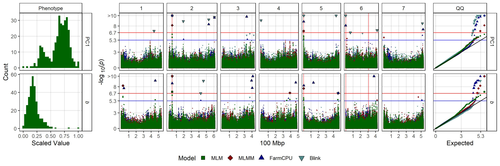
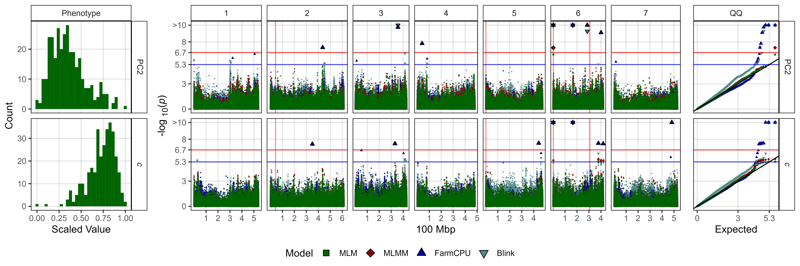
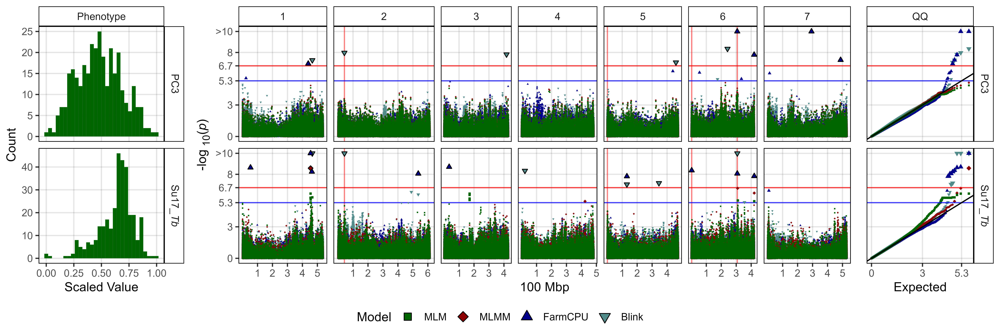
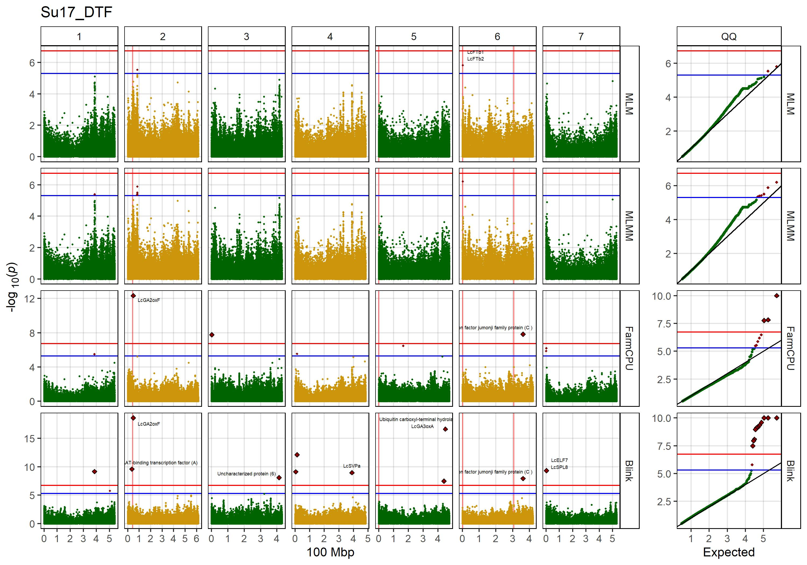
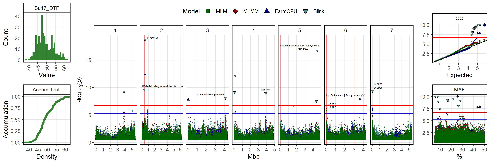

```{r setup, include=FALSE}
knitr::opts_chunk$set(eval = F, echo = T, message = F, warning = F, 
                      comment = NA, out.width = "100%")
```

---

# Introduction

This vignette contains the `r shiny::icon("r-project")` code and analysis done for the paper:

`r shiny::icon("newspaper")` [Sandesh Neupane, Derek Wright, Raul Martinez, Jakob Butler, Jim Weller, Kirstin Bett (2022) **Focusing the GWAS *Lens* on days to flower using latent variable phenotypes derived from global multi-environment trials**. *The Plant Genome*. e20269.](https://doi.org/10.1002/tpg2.20269) 

`r shiny::icon("github")` https://github.com/derekmichaelwright/AGILE_LDP_GWAS_Phenology

which is follow-up to:

`r shiny::icon("newspaper")` [Derek Wright, Sandesh Neupane, Taryn Heidecker, Teketel Haile, Clarice Coyne, Rebecca McGee, Sripada Udupa, Fatima Henkrar, Eleonora Barilli, Diego Rubiales, Tania Gioia, Giuseppina Logozzo, Stefania Marzario, Reena Mehra, Ashutosh Sarker, Rajeev Dhakal, Babul Anwar, Debashish Sarker, Albert Vandenberg, and Kirstin Bett. (2020) **Understanding photothermal interactions can help expand production range and increase genetic diversity of lentil (*Lens culinaris* Medik.)**. *Plants, People, Planet*. 00:1-11.](https://doi.org/10.1002/ppp3.10158)

`r shiny::icon("github")` https://github.com/derekmichaelwright/AGILE_LDP_Phenology

---

This work done as part of the AGILE project at the University of Saskatchewan.


```{r echo = F, eval = F}
# Prep phenotype data
library(agData)
#
names_Expt <- c("Rosthern, Canada 2016",    "Rosthern, Canada 2017",
                "Sutherland, Canada 2016",  "Sutherland, Canada 2017", 
                "Sutherland, Canada 2018",  "Central Ferry, USA 2018",
                "Bhopal, India 2016",       "Bhopal, India 2017",
                "Jessore, Bangladesh 2016", "Jessore, Bangladesh 2017",
                "Bardiya, Nepal 2016",      "Bardiya, Nepal 2017",
                "Cordoba, Spain 2016",      "Cordoba, Spain 2017",
                "Marchouch, Morocco 2016",  "Marchouch, Morocco 2017",
                "Metaponto, Italy 2016",    "Metaponto, Italy 2017" )
# Experiment short names
names_ExptShort <- c("Ro16", "Ro17", "Su16", "Su17", "Su18", "Us18",
                     "In16", "In17", "Ba16", "Ba17", "Ne16", "Ne17", 
                     "Sp16", "Sp17", "Mo16", "Mo17", "It16", "It17" )


# Phenology Data
y1 <- read.csv("C:/Google Drive/gitfolder/AGILE_LDP_Phenology/data/data_raw.csv") %>% 
  select(Name, Expt, DTF, DTS, DTM) %>% 
  mutate(REP = DTM - DTF,
         Expt = plyr::mapvalues(Expt, names_Expt, names_ExptShort)) %>%
  gather(Trait, Value, DTF, DTS, DTM, REP) %>%
  mutate(Trait = paste(Expt, Trait, sep = "_")) %>%
  group_by(Name, Trait) %>%
  summarise(Value = mean(Value, na.rm = T)) %>%
  spread(Trait, Value) %>%
  ungroup()
# DTF2 data for SA
y2 <- read.csv("C:/Google Drive/gitfolder/AGILE_LDP_Phenology/data/data_raw.csv") %>% 
  select(Name, Expt, DTF2) %>% 
  mutate(Expt = plyr::mapvalues(Expt, names_Expt, names_ExptShort)) %>%
   filter(Expt %in% names_ExptShort[7:10]) %>%
  gather(Trait, Value, DTF2) %>%
  mutate(Trait = paste(Expt, Trait, sep = "_")) %>%
  group_by(Name, Trait) %>%
  summarise(Value = mean(Value, na.rm = T)) %>%
  spread(Trait, Value) %>%
  ungroup()
# Photothermal Model coefficients
y3 <- read.csv("C:/Google Drive/gitfolder/AGILE_LDP_Phenology/data/model_t+p_coefs.csv") %>%
  select(Name, PTModel_a=a, PTModel_b=b, PTModel_c=c)
# Photothermal flowering data
y4 <- read.csv("C:/Google Drive/gitfolder/AGILE_LDP_Phenology/data/data_tb_pc.csv") %>% 
  select(Name, Expt, Tf, Pf, PTT) %>% 
  mutate(Expt = plyr::mapvalues(Expt, names_Expt, names_ExptShort)) %>%
  gather(Trait, Value, Tf, Pf, PTT) %>%
  mutate(Trait = paste(Expt, Trait, sep = "_")) %>%
  group_by(Name, Trait) %>%
  summarise(Value = mean(Value, na.rm = T)) %>%
  spread(Trait, Value) %>%
  ungroup()
# Base temp and critical photoperiod
y5 <- read.csv("C:/Google Drive/gitfolder/AGILE_LDP_Phenology/data/data_tb_pc.csv") %>% 
  select(Name, Expt, Tb, Pc) %>% 
  mutate(Expt = plyr::mapvalues(Expt, names_Expt, names_ExptShort)) %>%
  filter(Expt %in% c("Su17","Ba17","It17")) %>%
  gather(Trait, Value, Tb, Pc) %>%
  mutate(Trait = paste(Expt, Trait, sep = "_")) %>%
  group_by(Name, Trait) %>%
  summarise(Value = mean(Value, na.rm = T)) %>%
  spread(Trait, Value) %>%
  ungroup()
# Principal Components
y6 <- read.csv("C:/Google Drive/gitfolder/AGILE_LDP_Phenology/data/data_pca_results.csv") %>%
  select(Name, PCA_PC1=PC1, PCA_PC2=PC2, PCA_PC3=PC3, PCA_PC4=PC4, PCA_PC5=PC5, PCA_PC6=PC6)
myY <- y1 %>%
  left_join(y2, by = "Name") %>%
  left_join(y3, by = "Name") %>%
  left_join(y4, by = "Name") %>%
  left_join(y5, by = "Name") %>%
  left_join(y6, by = "Name")  %>%
  mutate(Name = gsub(" ", "_", Name),
         Name = gsub("-", "\\.", Name),
         Name = plyr::mapvalues(Name, "3156.11_AGL", "X3156.11_AGL"))
write.csv(myY, "myY_all.csv", row.names = F)
# Phenotype data
myY <- read.csv("myY_all.csv") %>%
  select(Name, PCA_PC1, PCA_PC2, PCA_PC3, 
         PTModel_a, PTModel_b, PTModel_c,
         Ro16_DTF, Ro17_DTF, Su16_DTF, Su17_DTF, Su18_DTF, Us18_DTF,
         In16_DTF, In17_DTF, Ba16_DTF, Ba17_DTF, Ne16_DTF, Ne17_DTF,
         Mo16_DTF, Mo17_DTF, Sp16_DTF, Sp17_DTF, It16_DTF, It17_DTF,
         Su17_Tf, Ba17_Tf, It17_Tf, 
         Su17_Tb, Ba17_Tb, It17_Tb, 
         Su17_Pf, Ba17_Pf, It17_Pf,
         Su17_Pc, Ba17_Pc, It17_Pc)
write.csv(myY, "myY.csv", row.names = F)
# Lentil Diversity Panel
myLDP <- read.csv("C:/Google Drive/gitfolder/AGILE_LDP_Phenology/data/data_pca_results.csv") %>%
  select(Entry, Name, Origin, Cluster) %>%
  mutate(Name = gsub(" ", "_", Name),
         Name = gsub("-", "\\.", Name),
         Name = plyr::mapvalues(Name, "3156.11_AGL", "X3156.11_AGL"))
write.csv(myLDP, "myLDP.csv", row.names = F)
```

---

# GWAS

```{r eval = T, echo = F}
downloadthis::download_link(
  link = "myG_LDP.zip",
  button_label = "myG_LDP.zip",
  button_type = "success",
  has_icon = TRUE,
  icon = "fa fa-save",
  self_contained = F
)
downloadthis::download_link(
  link = "myY.csv",
  button_label = "myY.csv",
  button_type = "success",
  has_icon = TRUE,
  icon = "fa fa-save",
  self_contained = F
)
downloadthis::download_link(
  link = "myLDP.csv",
  button_label = "myLDP.csv",
  button_type = "success",
  has_icon = TRUE,
  icon = "fa fa-save",
  self_contained = F
)
downloadthis::download_link(
  link = "Lentil_FT_Genes.csv",
  button_label = "Lentil_FT_Genes.csv",
  button_type = "success",
  has_icon = TRUE,
  icon = "fa fa-save",
  self_contained = F
)
```

```{r eval = F}
# Genotypes
myG <- read.csv("myG_LDP.csv", header = F)
# Phenotypes
myY <- read.csv("myY.csv")
# CoVariates
myCV <- myY[,c("Name","b","c")]
```

```{r eval = F}
# Load library
library(GAPIT3) # devtools::install_github("jiabowang/GAPIT3",force=TRUE)
# 
setwd("Results")
myGAPIT <- GAPIT(
  Y = myY,
  G = myG,
  model = c("MLM","MLMM","FarmCPU","Blink"),
  PCA.total = 4
)
# GWAS with b covariate (Results in `Results_b/`)
setwd("Results_b")
myGAPIT <- GAPIT(
  Y = myY %>% select(-PTModel_b),
  G = myG,
  CV = myCV[,c("Name","PTModel_b")]
  model = c("MLM","MLMM","FarmCPU","Blink"),
  PCA.total = 0
)
# GWAS with c covariate (Results in `Results_c/`)
setwd("Results_c")
myGAPIT <- GAPIT(
  Y = myY %>% select(-PTModel_c),
  G = myG,
  CV = myCV[,c("Name","PTModel_c")]
  model = c("MLM","MLMM","FarmCPU","Blink"),
  PCA.total = 0
)
```

---

# Prepare Post GWAS Data

```{r}
# Load libraries
library(tidyverse)
library(ggbeeswarm)
library(ggpubr)
library(ggtext)
library(GGally)
library(plotly)
library(htmlwidgets)
# Genotype and Phenotype 
myG <- read.csv("myG_LDP.csv", header = T)
myY <- read.csv("myY.csv")
# Genotype metadata - Cluster groups for the LDP (Wright et al., 2020)
myLDP <- read.csv("myLDP.csv") %>%
  mutate(Cluster = factor(Cluster))
# List of flowering time genes
myFTGenes <- read.csv("Lentil_FT_Genes.csv", fileEncoding = "UTF-8") %>% 
  rename(Chromosome=Chr) %>%
  mutate(Expt = "FT genes", Model = "MLM", Position = as.numeric(Start))
# Nucleotide symbols
#myN <- read.csv("IUPAC_Nucleotide_Code.csv")
# ggplot theme
theme_AGL <- theme_bw() + 
  theme(strip.background   = element_rect(colour = "black", fill = NA, size = 0.5),
        panel.background   = element_rect(colour = "black", fill = NA, size = 0.5),
        panel.border       = element_rect(colour = "black", size = 0.5),
        panel.grid         = element_line(color  = alpha("black", 0.1), size = 0.5),
        panel.grid.minor.x = element_blank(), 
        panel.grid.minor.y = element_blank())
#
threshold  <- -log10(0.05/nrow(myG))
threshold2 <- -log10(0.000005)
myModels <- c("MLM", "MLMM", "FarmCPU", "Blink")
myColors_Model <- c("darkgreen","darkred","darkblue","darkslategray4")
myColors_Macro <- c("azure4","darkgreen","darkorange3","darkblue")
myColors_Cluster <- c("darkred",   "darkorange3", "darkgoldenrod2", "deeppink3",
                  "steelblue", "darkorchid4", "cornsilk4",      "darkgreen")
myMs  <- c(
  "Lcu.2RBY.Chr2p42556949", #"Lcu.2RBY.Chr2p42543877", 
  "Lcu.2RBY.Chr5p1069654", #"Lcu.2RBY.Chr5p1063138",  
  "Lcu.2RBY.Chr6p2528817",  
  "Lcu.2RBY.Chr6p307256203")#"Lcu.2RBY.Chr6p306914970") # 
myGM <- read.csv("Results/GAPIT.MLM.Ro17_DTF.GWAS.Results.csv") %>% 
  filter(SNP %in% myMs) 
#
myLabels <- c(
  "PC1", "PC2", "PC3",
  "*a*", "*b*", "*c*",
  "Ro16_DTF", "Ro17_DTF", "Su16_DTF", "Su17_DTF", "Su18_DTF", "Us18_DTF",
  "In16_DTF", "In17_DTF", "Ba16_DTF", "Ba17_DTF", "Ne16_DTF", "Ne17_DTF",
  "Mo16_DTF", "Mo17_DTF", "Sp16_DTF", "Sp17_DTF", "It16_DTF", "It17_DTF",
  "Su17_*Tf*", "Ba17_*Tf*", "It17_*Tf*",
  "Su17_*Tb*", "Ba17_*Tb*", "It17_*Tb*",
  "Su17_*Pf*", "Ba17_*Pf*", "It17_*Pf*",
  "Su17_*Pc*", "Ba17_*Pc*", "It17_*Pc*")
myTraits <- c(
  "PCA_PC1", "PCA_PC2", "PCA_PC3",
  "PTModel_a", "PTModel_b", "PTModel_c",
  "Ro16_DTF", "Ro17_DTF", "Su16_DTF", "Su17_DTF", "Su18_DTF", "Us18_DTF", 
  "In16_DTF", "In17_DTF", "Ba16_DTF", "Ba17_DTF", "Ne16_DTF", "Ne17_DTF",
  "Mo16_DTF", "Mo17_DTF", "Sp16_DTF", "Sp17_DTF", "It16_DTF", "It17_DTF",
  "Su17_Tf", "Ba17_Tf", "It17_Tf",
  "Su17_Tb", "Ba17_Tb", "It17_Tb",
  "Su17_Pf", "Ba17_Pf", "It17_Pf",
  "Su17_Pc", "Ba17_Pc", "It17_Pc")
```

```{r echo = F}
dir.create("Additional/")
dir.create("Additional/CV/")
dir.create("Additional/LD/")
dir.create("Additional/Markers/")
dir.create("Additional/Man_Facet/")
dir.create("Additional/Man_Multi/")
dir.create("Additional/Man_Grouped/")
```

---

# Supplemental Table 1

```{r eval = T, echo = F}
downloadthis::download_link(
  link = "Supplemental_Table_01.csv",
  button_label = "Supplemental_Table_01.csv",
  button_type = "success",
  has_icon = TRUE,
  icon = "fa fa-save",
  self_contained = F
)
```

*Supplemental Table 1: GWAS results for SNPs significantly associated with the traits of interest used in this study. Traits include days from sowing to flower (DTF), the first three principal components from a principal component analysis (PCA) of the DTF data (PC1, PC2, PC3), the a, b and c coefficients from a photothermal model (PTModel), the nominal base temperature (Tb), nominal base photoperiod (Pc), thermal sum required for flowering (Tf) and the photoperiod sum required for flowering (Pf). Rosthern, Canada 2016 and 2017 (Ro16 and Ro17), Sutherland, Canada 2016, 2017 and 2018 (Su16, Su17 and Su18), Central Ferry, USA 2018 (Us18), Bhopal, India 2016 and 2017 (In16 and In17), Jessore, Bangladesh 2016 and 2017 (Ba16 and Ba17), Bardiya, Nepal 2016 and 2017 (Ne16 and Ne17), Marchouch, Morocco 2016 and 2017 (Mo16 and Mo17), Cordoba, Spain (Sp16 and Sp17), Metaponto, Italy 2016 and 2017 (It16 and It17). For further details see Wright et al. (2020). Traits run with the b or c coefficients as a covariate are indicated with the “-b” and “-c” suffix in the trait column.*

```{r echo = F, eval = T}
DT::datatable(read.csv("Supplemental_Table_01.csv"))
```

```{r}
# Create functions
dropNAcol <- function (x) { x[, colSums(is.na(x)) < nrow(x)] }
GWAS_PeakTable <- function(folder = NULL, file = NULL, 
                           g.range = 3000000, rowread = 2000) {
  # Prep data
  trait <- substr(file, gregexpr("GAPIT.", file)[[1]][1]+6,
                  gregexpr(".GWAS.Results.csv", file)[[1]][1]-1 )
  model <- substr(trait, 1, gregexpr("\\.", trait)[[1]][1]-1 )
  trait <- substr(trait, gregexpr("\\.", trait)[[1]][1]+1, nchar(trait) )
  expt  <- substr(trait, 1, gregexpr("_", trait)[[1]][1]-1)
  trait <- substr(trait, gregexpr("_", trait)[[1]][1]+1, nchar(trait) )
  #
  output <- NULL
  #
  rr <- read.csv(paste0(folder, file), nrows = rowread) %>%
    mutate(`-log10(p)` = -log10(P.value))
  #
  if(sum(colnames(rr)=="nobs")>0) { rr <- select(rr, -nobs) }
  #
  if(!is.null(threshold2)) {
    rx <- rr %>% filter(-log10(P.value) >= threshold2)
  } else{ rx <- rr %>% filter(-log10(P.value) > threshold) }
  #
  if(nrow(rx) == 0) {
    rx[1,] <- NA
    rx[1,"Chromosome"] <- 1
    output <- bind_rows(output, rx)
  } else {
    while(nrow(rx) > 0) {
      rp <- rx %>% group_by(Chromosome) %>%
        top_n(., n = 1, `-log10(p)`) %>% ungroup()
      output <- bind_rows(output, rp)
      for(i in 1:nrow(rp)) {
        g.range1 <- rp$Position[i] - g.range
        g.range2 <- rp$Position[i] + g.range
        if(g.range1 < 0) { g.range1 <- 0 }
        rx <- rx[rx$Chromosome != rp$Chromosome[i] | 
                   rx$Position < g.range1 | 
                   rx$Position > g.range2,]
      }
      if(!is.null(threshold2)) {
        rx <- rx %>% filter(-log10(P.value) > threshold2)
      } else{ rx <- rx %>% filter(-log10(P.value) > threshold) }
    }
  }
  output <- output %>%
    mutate(Model = model, Trait = trait, Expt = expt,
           FT_Genes = NA, FT_Pos = NA, FT_End = NA, 
           FT_Distance = NA, FT_Distances = NA)
  #
  if(sum(!is.na(output$Position)) > 0) {
    for(i in 1:nrow(output)) {
      g.range1 <- output$Position[i] - g.range
      g.range2 <- output$Position[i] + g.range
      ftg <- myFTGenes[myFTGenes$Chromosome == output$Chromosome[i] &
                       myFTGenes$Position > g.range1 & 
                       myFTGenes$Position < g.range2,]
      ftg <- ftg %>% 
        mutate(Distance = abs(Position - output$Position[i])) %>% 
        arrange(Distance)
      output$FT_Genes[i]     <- paste(ftg$Name,     collapse = " ; ")
      output$FT_Pos[i]       <- paste(ftg$Position, collapse = " ; ")
      output$FT_End[i]       <- paste(ftg$End,      collapse = " ; ")
      output$FT_Distances[i] <- paste(ftg$Distance, collapse = " ; ")
      output$FT_Distance[i]  <- ftg$Distance[1]
    }
  }
  output %>%
    select(SNP, Chromosome, Position, Model, Expt, Trait, 
           P.value, `-log10(p)`, effect, MAF=maf,
           Rsquare.of.Model.without.SNP, Rsquare.of.Model.with.SNP, 
           FDR_Adjusted_P.values, 
           FT_Genes, FT_Pos, FT_End, FT_Distance, FT_Distances) %>%
    filter(!(`-log10(p)` < threshold & Model != "MLM"))
}
# Table for significant markers
myP <- NULL
# No covariate
fnames <- grep(".GWAS.Results", list.files("Results"))
fnames <- list.files("Results")[fnames]
for(i in fnames) { 
  myP <- bind_rows(myP, GWAS_PeakTable(folder = "Results/", file = i) %>% dropNAcol())
}
# covariate = b
fnames <- grep(".GWAS.Results", list.files("Results_b"))
fnames <- list.files("Results_b")[fnames]
for(i in fnames) { 
  myP <- bind_rows(myP, GWAS_PeakTable(folder = "Results_b/", file = i) %>%
                        mutate(Trait = paste0(Trait,"-b")) %>% dropNAcol()) 
}
# covariate = c
fnames <- grep(".GWAS.Results", list.files("Results_c"))
fnames <- list.files("Results_c")[fnames]
for(i in fnames) { 
  myP <- bind_rows(myP, GWAS_PeakTable(folder = "Results_c/", file = i) %>%
                        mutate(Trait = paste0(Trait,"-c")) %>% dropNAcol()) 
}
#
myP <- myP %>% filter(!is.na(SNP)) %>%
  arrange(Chromosome, Position, P.value, Trait) %>%
  mutate(Chromosome = factor(Chromosome, levels = 1:7),
         Model = factor(Model, levels = myModels))
# Save
write.csv(myP, "Supplemental_Table_01.csv", row.names = F)
```

```{r eval = F, echo = F}
nrow(myP %>% filter(`-log10(p)` > threshold) %>% filter(!duplicated(SNP)))
```

---

# Figure 1


*Figure 1: Genome-wide association results for days from sowing to flower (DTF) in Sutherland, Canada 2017 (Su17), Jessore, Bangladesh 2017 (Ba17), Bardiya, Nepal 2017 (Ne17) and Metaponto, Italy 2017 (It17) for a lentil diversity panel. (a) Histograms of DTF. (b) Manhattan and QQ plots for GWAS results using MLM, MLMM, FarmCPU and Blink models. Vertical lines represent specific base pair locations to facilitate comparisons across traits.*

```{r}
# Prep data
expttraits <- c("Su17_DTF", "Ba17_DTF", "Ne17_DTF", "It17_DTF")
expts <- expttraits
for(i in 1:length(expts)) { 
  expts[i] <- substr(expts[i], 1, gregexpr("_", expts)[[i]][1]-1) 
}
#
yy <- myY %>% 
  gather(ExptTrait, Value, 2:ncol(.)) %>% 
  filter(ExptTrait %in% expttraits) %>%
  mutate(Model = factor("Days To Flower"),
         ExptTrait = factor(ExptTrait, levels = expttraits),
         Expt = plyr::mapvalues(ExptTrait, expttraits, expts),
         Expt = factor(Expt, levels = expts))
#
xx <- NULL
for(i in expttraits) {
  fnames <- grep(paste0(i,".GWAS.Results"), list.files("Results/"))
  fnames <- list.files("Results/")[fnames]
  for(j in fnames) {
    mod <- substr(j, gregexpr("\\.", j)[[1]][1]+1, nchar(j))
    mod <- substr(mod, 1, gregexpr("\\.", mod)[[1]][1]-1 )
    xj <- read.csv(paste0("Results/", j)) %>% 
      mutate(Model = mod, ExptTrait = i,
             `-log10(p)` = -log10(P.value),
             `-log10(p)_Exp` = -log10((rank(P.value, ties.method="first")-.5)/nrow(.)))
    xx <- bind_rows(xx, xj)
  }
}
#
xx <- xx %>% 
  mutate(Model = factor(Model, levels = myModels),
         ExptTrait = factor(ExptTrait, levels = expttraits),
         Expt = plyr::mapvalues(ExptTrait, expttraits, expts),
         Expt = factor(Expt, levels = expts)) %>%
  arrange(desc(Model))
#
xx <- xx %>% mutate(`-log10(p)` = ifelse(`-log10(p)` > 10, 10, `-log10(p)`))
#
x1 <- xx %>% filter(`-log10(p)` < threshold2)
x2 <- xx %>% filter(`-log10(p)` > threshold2, `-log10(p)` < threshold)
x3 <- xx %>% filter(`-log10(p)` > threshold)
# Plot phenotypes
mp1 <- ggplot(yy, aes(x = Value)) +
  geom_histogram(fill = "darkgreen", binwidth = 2) + 
  facet_grid(Expt ~ "DTF") +
  theme_AGL + 
  xlim(c(35,160)) +
  labs(x = "Days after planting", y = "Count")
#
mybreaks <- c(0, 3, threshold2, threshold, 8, 10)
mylabels <- c(0, 3, round(threshold2,1), round(threshold,1), 8, ">10")
# Plot GWAS
mp2 <- ggplot(x1, aes(x = Position / 100000000, y = `-log10(p)`, 
                      shape = Model, fill = Model)) +
  geom_vline(data = myGM, alpha = 0.5, color = "red",
             aes(xintercept = Position / 100000000)) +
  geom_hline(yintercept = threshold,  color = "red", alpha = 0.7) +
  geom_hline(yintercept = threshold2, color = "blue", alpha = 0.7) +
  geom_point(size = 0.3, color = alpha("white", 0)) +
  geom_point(data = x2, size = 0.75, color = alpha("white", 0)) +
  geom_point(data = x3, size = 1.25) +
  facet_grid(Expt ~ Chromosome, scales = "free", space = "free_x") +
  scale_x_continuous(breaks = 0:7) +
  scale_y_continuous(breaks = mybreaks, labels = mylabels) +
  scale_fill_manual(values = myColors_Model) +
  scale_shape_manual(values = 22:25) +
  theme_AGL +
  theme(legend.position = "none",
        strip.text.y = element_blank() , 
        strip.background.y = element_blank(),
        axis.title.y = ggtext::element_markdown()) +
  guides(shape = guide_legend(override.aes = list(size = 3))) +
  labs(y = "-log<sub>10</sub>(*p*)", x = "100 Mbp")
# Plot QQ
mp3 <- ggplot(x1, aes(x = `-log10(p)_Exp`, y = `-log10(p)`, 
                      shape = Model, fill = Model)) +
  geom_point(size = 0.5, color = alpha("white", 0)) +
  geom_point(data = x2, size = 0.75, color = alpha("white", 0)) +
  geom_point(data = x3, size = 1.25, color = alpha("white", 0)) +
  geom_hline(yintercept = threshold,  color = "red", alpha = 0.7) +
  geom_hline(yintercept = threshold2, color = "blue", alpha = 0.7) +
  geom_abline() +
  scale_x_continuous(breaks = mybreaks, labels = mylabels) +
  scale_y_continuous(breaks = mybreaks, labels = mylabels) +
  scale_fill_manual(values = myColors_Model) +
  scale_shape_manual(values = 22:25) +
  facet_grid(Expt ~ "QQ", scales = "free_y") +
  theme_AGL +
  theme(legend.position = "none",
        axis.text.y = element_blank(),
        axis.ticks.y = element_blank()) +
  labs(y = NULL, x = "Expected")
# Append
mpl <- get_legend(mp2, position = "bottom")
mp <- ggarrange(mp1, mp2, mp3, ncol = 3, align = "h", widths = c(2,7, 1.5),
                legend.grob = mpl, legend = "bottom", common.legend = T)
# Save
ggsave("Figure_01.jpg", mp, width = 12, height = 7, dpi = 600, bg = "white")
```

---

# Figure 2


*Figure 2: Summary of genome-wide association results using MLM, MLMM, FarmCPU and Blink models on single environment and multi-environment traits related to days from sowing to flower (DTF) in a lentil diversity panel. Larger points represent a significant association (-log10(p) > 6.7) with a trait of interest under one of the GWAS models, while smaller points represent a suggestive association (-log10(p) > 5.3). PC1, PC2, PC3, represent the first three principal components of an analysis of 18 site-years of DTF data (Wright et al., 2020) in Rosthern, Canada 2016 and 2017 (Ro16 and Ro17), Sutherland, Canada 2016, 2017 and 2018 (Su16, Su17 and Su18), Central Ferry, USA 2018 (Us18), Bhopal, India 2016 and 2017 (In16 and In17), Jessore, Bangladesh 2016 and 2017 (Ba16 and Ba17), Bardiya, Nepal 2016 and 2017 (Ne16 and Ne17), Marchouch, Morocco 2016 and 2017 (Mo16 and Mo17), Cordoba, Spain (Sp16 and Sp17), Metaponto, Italy 2016 and 2017 (It16 and It17). a, b and c are coefficients from a photothermal model (Wright et al., 2020) and used to calculate the nominal base temperature (Tb), nominal base photoperiod (Pc), thermal sum required for flowering (Tf) and the photoperiod sum required for flowering (Pf). Colors are representative of macroenvironments: Temperate (green), South Asian (orange) Mediterranean (blue) and multi-environment traits (grey). Vertical lines represent specific base pair locations to facilitate comparisons across traits.*

```{r echo = F, eval = T}
downloadthis::download_link(
  link = "https://derekmichaelwright.github.io/AGILE_LDP_GWAS_Phenology/Figure_02_plotly.html",
  button_label = "Figure_02_plotly.html",
  button_type = "success",
  has_icon = TRUE,
  icon = "fas fa-chart-bar",
  self_contained = FALSE
)
```

```{r}
# Create function
gg_gwas_summary <- function(traits, labels = traits,
                            hlines, width = 12, height = 8, 
                            title = NULL, filename) {
  # Prep data
  me <- c("<b style='color:black'>{ExptTrait}</b>",
          "<b style='color:darkgreen'>{ExptTrait}</b>",
          "<b style='color:darkorange3'>{ExptTrait}</b>",
          "<b style='color:darkblue'>{ExptTrait}</b>")
  #
  e1 <- c("Ro16","Ro17","Su16","Su17","Su18","Us18")
  e2 <- c("Mo16","Mo17","Sp16","Sp17","It16","It17")
  e3 <- c("In16","In17","Ba16","Ba17","Ne16","Ne17")
  myMacroEnvs <- c("Multi Environment","Temperate", "South Asia", "Mediterranean")
  #
  xx <- myP %>% 
    filter(paste(Expt, Trait, sep = "_") %in% traits) %>%
    mutate(ExptTrait = paste(Expt, Trait, sep = "_"),
           ExptTrait = plyr::mapvalues(ExptTrait, traits, labels),
           Model = factor(Model, levels = myModels),
           MacroEnv = NA,
           MacroEnv = ifelse(Expt %in% e1, "Temperate",     MacroEnv),
           MacroEnv = ifelse(Expt %in% e2, "Mediterranean", MacroEnv),
           MacroEnv = ifelse(Expt %in% e3, "South Asia",    MacroEnv),
           MacroEnv = ifelse(is.na(MacroEnv), "Multi Environment", MacroEnv),
           cat_col = NA,
           cat_col = ifelse(MacroEnv == "Multi Environment", glue::glue(me[1]), cat_col),
           cat_col = ifelse(MacroEnv == "Temperate",         glue::glue(me[2]), cat_col),
           cat_col = ifelse(MacroEnv == "South Asia",        glue::glue(me[3]), cat_col),
           cat_col = ifelse(MacroEnv == "Mediterranean",     glue::glue(me[4]), cat_col),
           cat_col = factor(cat_col, levels = rev(cat_col[match(labels, ExptTrait)])),
           ExptTrait = factor(ExptTrait, levels = rev(labels)),
           MacroEnv = factor(MacroEnv, levels = myMacroEnvs)) %>%
    arrange(ExptTrait)
  x1 <- xx %>% filter(`-log10(p)` > threshold)
  x2 <- xx %>% filter(`-log10(p)` < threshold)
  # Plot
  mp <- ggplot(x1, aes(x = Position / 100000000, y = cat_col, 
                       shape = Model, fill = MacroEnv)) + 
    geom_vline(data = myGM, alpha = 0.5, color = "red",
               aes(xintercept = Position / 100000000)) +
    geom_point(data = x2, size = 1, color = "black", alpha = 0.5,
               aes(key1 = SNP, key2 = FT_Genes, key3 = FT_Distances)) +
    geom_point(size = 2, color = "black", alpha = 0.5,
               aes(key1 = SNP, key2 = FT_Genes, key3 = FT_Distances)) + 
    geom_hline(yintercept = hlines, alpha = 0.7) +
    facet_grid(. ~ Chromosome, drop = F, scales = "free_x", space = "free_x") +
    scale_fill_manual(values = myColors_Macro, guide = "none") +
    scale_shape_manual(values = c(22:25), breaks = myModels) +
    scale_y_discrete(drop = F) +
    scale_x_continuous(breaks = 0:6, minor_breaks = 0:6) +
    theme_AGL +
    theme(legend.position = "bottom",
          axis.text.y = element_markdown(),
          strip.text.y = element_markdown(),
          plot.title = ggtext::element_markdown()) +
    guides(shape = guide_legend(override.aes = list(size = 4, fill = "black"))) +
    labs(title = title, y = NULL, x = "100 Mbp")
  # Save
  ggsave(paste0(filename, ".jpg"), mp, width = width, height = height, dpi = 600)
  # Save HTML
  mp <- ggplotly(mp) %>% layout(showlegend = FALSE)
  saveWidget(as_widget(mp),
             paste0(filename,"_plotly.html"),
             knitrOptions = list(fig.width = width, fig.height = height), 
             selfcontained = T)
}
# Plot GWAS results
gg_gwas_summary(traits = myTraits, labels = myLabels,
                hlines = c(3.5,6.5,9.5,12.5,18.5,24.5,30.5,33.5), 
                width = 12, height = 9, filename = "Figure_02")
```

---

## Additional Figure 1


```{r echo = F, eval = T}
downloadthis::download_link(
  link = "https://derekmichaelwright.github.io/AGILE_LDP_GWAS_Phenology/Additional/Additional_Figure_01_plotly.html",
  button_label = "Additional/Additional_Figure_01_plotly.html",
  button_type = "success",
  has_icon = TRUE,
  icon = "fas fa-chart-bar",
  self_contained = FALSE
)
```

```{r}
# Plot GWAS results with b covariate
gg_gwas_summary(title = "Covariate = *b*",
                traits = paste0(myTraits, "-b"),
                labels = myLabels,
                hlines = c(3.5,6.5,9.5,12.5,18.5,24.5,30.5,32.5), 
                width = 12, height = 9, filename = "Additional/Additional_Figure_01")
```

---

## Additional Figure 2


```{r echo = F}
downloadthis::download_link(
  link = "https://derekmichaelwright.github.io/AGILE_LDP_GWAS_Phenology/Additional/Additional_Figure_02_plotly.html",
  button_label = "Additional/Additional_Figure_02_plotly.html",
  button_type = "success",
  has_icon = TRUE,
  icon = "fas fa-chart-bar",
  self_contained = FALSE
)
```

```{r}
# Plot GWAS results with c covariate
gg_gwas_summary(title = "Covariatie = *c*",
                traits = paste0(myTraits, "-c"),
                labels = myLabels,
                hlines = c(3.5,6.5,9.5,12.5,18.5,24.5,30.5,32.5), 
                width = 12, height = 9, filename = "Additional/Additional_Figure_02")
```

---

# Figure 3


*Figure 3: Genome-wide association results for the first three principal components (PC1, PC2 and PC3) the b and c coefficients from the photothermal model developed by Wright et al., (2020), and the nominal base temperature (Tb) in Sutherland, Canada 2017 (Su17) for a lentil diversity panel. (a) Histograms of each trait, scaled from 0 to 1. (b) Manhattan and QQ plots for GWAS results using MLM, MLMM, FarmCPU and Blink models. Vertical lines represent specific base pair locations to facilitate comparisons across traits.*

```{r}
# Prep data
expttraits <- c("PCA_PC1", "PTModel_b", "PCA_PC2", "PTModel_c", "PCA_PC3", "Su17_Tb")
expts      <- c("PC1",     "*b*",       "PC2",     "*c*",       "PC3",     "Su17_*Tb*")
#
yy <- myY 
for(i in expttraits) { yy[,i] <- scales::rescale(yy[,i], c(0, 1)) }
yy <- yy %>% 
  gather(ExptTrait, Value, 2:ncol(.)) %>% 
  filter(ExptTrait %in% expttraits) %>% 
  mutate(ExptTrait = plyr::mapvalues(ExptTrait, expttraits, expts),
         ExptTrait = factor(ExptTrait, levels = expts))
#
xx <- NULL
for(i in expttraits) {
  fnames <- grep(paste0(i,".GWAS.Results"), list.files("Results/"))
  fnames <- list.files("Results/")[fnames]
  for(j in fnames) {
    mod <- substr(j, gregexpr("\\.", j)[[1]][1]+1, nchar(j))
    mod <- substr(mod, 1, gregexpr("\\.", mod)[[1]][1]-1 )
    xj <- read.csv(paste0("Results/", j)) %>% 
      mutate(Model = mod, ExptTrait = i,
             `-log10(p)` = -log10(P.value),
             `-log10(p)_Exp` = -log10((rank(P.value, ties.method="first")-.5)/nrow(.)))
    xx <- bind_rows(xx, xj)
  }
}
#
xx <- xx %>% 
  mutate(Model = factor(Model, levels = myModels),
         ExptTrait = plyr::mapvalues(ExptTrait, expttraits, expts),
         ExptTrait = factor(ExptTrait, levels = expts)) %>%
  arrange(desc(Model))
#
xx <- xx %>% mutate(`-log10(p)` = ifelse(`-log10(p)` > 10, 10, `-log10(p)`))
#
x1 <- xx %>% filter(`-log10(p)` < threshold2)
x2 <- xx %>% filter(`-log10(p)` > threshold2, `-log10(p)` < threshold)
x3 <- xx %>% filter(`-log10(p)` > threshold)
# Plot phenotypes
mp1 <- ggplot(yy, aes(x = Value)) +
  geom_histogram(fill = "darkgreen") + 
  facet_grid(ExptTrait ~ "Phenotype", scales = "free") +
  theme_AGL +
  theme(strip.text.y = ggtext::element_markdown()) + 
  labs(x = "Scaled Value", y = "Count")
# 
mybreaks <- c(0, 3, threshold2, threshold, 8, 10)
mylabels <- c(0, 3, round(threshold2,1), round(threshold,1), 8, ">10")
# Plot GWAS
mp2 <- ggplot(x1, aes(x = Position / 100000000, y = `-log10(p)`, 
                      shape = Model, fill = Model)) +
  geom_vline(data = myGM, alpha = 0.5, color = "red",
             aes(xintercept = Position / 100000000)) +
  geom_hline(yintercept = threshold,  color = "red", alpha = 0.7) +
  geom_hline(yintercept = threshold2, color = "blue", alpha = 0.7) +
  geom_point(size = 0.3, color = alpha("white", 0)) +
  geom_point(data = x2, size = 0.75, color = alpha("white", 0)) +
  geom_point(data = x3, size = 1.25) +
  facet_grid(ExptTrait ~ Chromosome, scales = "free", space = "free_x") +
  scale_x_continuous(breaks = 0:7) +
  scale_y_continuous(breaks = mybreaks, labels = mylabels) +
  scale_fill_manual(values = myColors_Model) +
  scale_shape_manual(values = 22:25) +
  theme_AGL +
  theme(legend.position = "none",
        strip.text.y = element_blank() , 
        strip.background.y = element_blank(),
        axis.title.y = ggtext::element_markdown()) +
  guides(shape = guide_legend(override.aes = list(size = 4))) +
  labs(y = "-log<sub>10</sub>(*p*)", x = "100 Mbp")
# Plot QQ
mp3 <- ggplot(x1, aes(x = `-log10(p)_Exp`, y = `-log10(p)`, 
                      shape = Model, fill = Model)) +
  geom_point(size = 0.5, color = alpha("white", 0)) +
  geom_point(data = x2, size = 0.75, color = alpha("white", 0)) +
  geom_point(data = x3, size = 1.25, color = alpha("white", 0)) +
  geom_hline(yintercept = threshold,  color = "red", alpha = 0.7) +
  geom_hline(yintercept = threshold2, color = "blue", alpha = 0.7) +
  geom_abline() +
  scale_x_continuous(breaks = mybreaks, labels = mylabels) +
  scale_y_continuous(breaks = mybreaks, labels = mylabels) +
  scale_fill_manual(values = myColors_Model) +
  scale_shape_manual(values = 22:25) +
  facet_grid(ExptTrait ~ "QQ", scales = "free_y") +
  theme_AGL +
  theme(legend.position = "none",
        axis.text.y = element_blank(),
        axis.ticks.y = element_blank(),
        strip.text.y = ggtext::element_markdown()) +
  labs(y = NULL, x = "Expected")
# Append
mpl <- get_legend(mp2, position = "bottom")
mp <- ggarrange(mp1, mp2, mp3, ncol = 3, widths = c(2,7,1.5), align = "h", 
                legend.grob = mpl, legend = "bottom", common.legend = T)
# Save
ggsave("Figure_03.jpg", mp, width = 12, height = 10, dpi = 600, bg = "white")
```

## Figure 3 Subplots







```{r}
# Create function
fig3_Subplot <- function(expttraits = c("PC1", "*b*")) {
  # Prep data
  x1 <- xx %>% filter(ExptTrait %in% expttraits, `-log10(p)` < threshold2)
  x2 <- xx %>% filter(ExptTrait %in% expttraits, `-log10(p)` > threshold2, `-log10(p)` < threshold)
  x3 <- xx %>% filter(ExptTrait %in% expttraits, `-log10(p)` > threshold)
  # Plot phenotypes
  mp1 <- ggplot(yy %>% filter(ExptTrait %in% expttraits), aes(x = Value)) +
    geom_histogram(fill = "darkgreen") + 
    facet_grid(ExptTrait ~ "Phenotype", scales = "free") +
    theme_AGL +
    theme(strip.text.y = ggtext::element_markdown()) + 
    labs(x = "Scaled Value", y = "Count")
  #
  mybreaks <- c(0, 3, threshold2, threshold, 8, 10)
  mylabels <- c(0, 3, round(threshold2,1), round(threshold,1), 8, ">10")
  # Plot GWAS
  mp2 <- ggplot(x1, aes(x = Position / 100000000, y = `-log10(p)`, 
                        shape = Model, fill = Model)) +
    geom_vline(data = myGM, alpha = 0.5, color = "red",
               aes(xintercept = Position / 100000000)) +
    geom_hline(yintercept = threshold,  color = "red", alpha = 0.7) +
    geom_hline(yintercept = threshold2, color = "blue", alpha = 0.7) +
    geom_point(size = 0.3, color = alpha("white", 0)) +
    geom_point(data = x2, size = 0.75, color = alpha("white", 0)) +
    geom_point(data = x3, size = 1.25) +
    facet_grid(ExptTrait ~ Chromosome, scales = "free", space = "free_x") +
    scale_x_continuous(breaks = 1:7) +
    scale_y_continuous(breaks = mybreaks, labels = mylabels) +
    scale_fill_manual(values = myColors_Model) +
    scale_shape_manual(values = 22:25) +
    theme_AGL +
    theme(legend.position = "none",
          strip.text.y = element_blank() , 
          strip.background.y = element_blank(),
          axis.title.y = ggtext::element_markdown()) +
    guides(shape = guide_legend(override.aes = list(size = 3))) +
    labs(y = "-log<sub>10</sub>(*p*)", x = "100 Mbp")
  # Plot QQ
  mp3 <- ggplot(x1, aes(x = `-log10(p)_Exp`, y = `-log10(p)`, shape = Model,
                        fill = Model)) +
    geom_point(size = 0.5, color = alpha("white", 0)) +
    geom_point(data = x2, size = 0.75, color = alpha("white", 0)) +
    geom_point(data = x3, size = 1.25, color = alpha("white", 0)) +
    geom_hline(yintercept = threshold,  color = "red", alpha = 0.7) +
    geom_hline(yintercept = threshold2, color = "blue", alpha = 0.7) +
    geom_abline() +
    scale_x_continuous(breaks = mybreaks, labels = mylabels) +
    scale_y_continuous(breaks = mybreaks, labels = mylabels) +
    scale_fill_manual(values = myColors_Model) +
    scale_shape_manual(values = 22:25) +
    facet_grid(ExptTrait ~ "QQ", scales = "free_y") +
    theme_AGL +
    theme(legend.position = "none",
          axis.text.y = element_blank(),
          axis.ticks.y = element_blank(),
          strip.text.y = ggtext::element_markdown()) +
    labs(y = NULL, x = "Expected")
  # Append
  mpl <- get_legend(mp2, position = "bottom")
  mp <- ggarrange(mp1, mp2, mp3, ncol = 3, widths = c(2,7,1.5), align = "h",
                  legend.grob = mpl, legend = "bottom", common.legend = T)
  mp
}
# Plot temperature related
ggsave("Additional/Figure_03_1.jpg", 
       fig3_Subplot(expttraits = c("PC1", "*b*")), 
       width = 12, height = 4, dpi = 600, bg = "white")
# Plot photoperiod related
ggsave("Additional/Figure_03_2.jpg", 
       fig3_Subplot(expttraits = c("PC2", "*c*")), 
       width = 12, height = 4, dpi = 600, bg = "white")
# Plot PC3
ggsave("Additional/Figure_03_3.jpg", 
       fig3_Subplot(expttraits = c("PC3", "Su17_*Tb*")), 
       width = 12, height = 4, dpi = 600, bg = "white")
```

---

# Figure 4

```{r eval = T, echo = F}
downloadthis::download_link(
  link = "https://github.com/derekmichaelwright/AGILE_LDP_GWAS_Phenology/tree/master/Additional/CV",
  button_label = "Additional/CV/",
  button_type = "success",
  has_icon = TRUE,
  icon = "fas fa-chart-bar",
  self_contained = FALSE
)
```

<br>


*Figure 4: Genome-wide association results for days from sowing to flower (DTF) with and without covariates for a lentil diversity panel. Manhattan and QQ plots for DTF in (a) Rosthern, Canada 2017 (Ro17) and (b) Cordoba, Spain 2017 (Sp17), using MLM, MLMM, FarmCPU and Blink models. The middle panel shows GWAS results without a covariate, while the top and bottom panel show GWAS results using the c and b (temperature and photoperiod) coefficients from the photothermal model developed by Wright et al. 2020, respectively. Vertical lines represent specific base pair locations to facilitate comparisons across traits.*

```{r}
# Prep data
expttraits <- myTraits
expts <- expttraits
for(i in 1:length(expts)) { 
  expts[i] <- substr(expts[i], 1, gregexpr("_", expts)[[i]][1]-1) 
}
# expttraits <- c("Sp17_DTF", "Ro17_DTF")
for(i in expttraits) {
  x1 <- NULL; xb <- NULL; xc <- NULL
  #
  fnames <- grep(paste0(i,".GWAS.Results"), list.files("Results/"))
  fnames <- list.files("Results/")[fnames]
  for(j in fnames) {
    mod <- substr(j, gregexpr("\\.", j)[[1]][1]+1, nchar(j))
    mod <- substr(mod, 1, gregexpr("\\.", mod)[[1]][1]-1 )
    xj <- read.csv(paste0("Results/", j)) %>% 
      mutate(Model = mod, Facet = i,
             `-log10(p)` = -log10(P.value),
             `-log10(p)_Exp` = -log10((rank(P.value, ties.method="first")-.5)/nrow(.)))
    x1 <- bind_rows(x1, xj)
  }
  #
  fnames <- grep(paste0(i,".GWAS.Results"), list.files("Results_b/"))
  fnames <- list.files("Results_b/")[fnames]
  for(j in fnames) {
    mod <- substr(j, gregexpr("\\.", j)[[1]][1]+1, nchar(j))
    mod <- substr(mod, 1, gregexpr("\\.", mod)[[1]][1]-1 )
    xj <- read.csv(paste0("Results_b/", j)) %>% 
      mutate(Model = mod, Facet = "CV = *b*",
             `-log10(p)` = -log10(P.value),
             `-log10(p)_Exp` = -log10((rank(P.value, ties.method="first")-.5)/nrow(.)))
    xb <- bind_rows(xb, xj)
  }
  #
  fnames <- grep(paste0(i,".GWAS.Results"), list.files("Results_c/"))
  fnames <- list.files("Results_c/")[fnames]
  for(j in fnames) {
    mod <- substr(j, gregexpr("\\.", j)[[1]][1]+1, nchar(j))
    mod <- substr(mod, 1, gregexpr("\\.", mod)[[1]][1]-1 )
    xj <- read.csv(paste0("Results_c/", j)) %>% 
      mutate(Model = mod, Facet = "CV = *c*",
             `-log10(p)` = -log10(P.value),
             `-log10(p)_Exp` = -log10((rank(P.value, ties.method="first")-.5)/nrow(.)))
    xc <- bind_rows(xc, xj)
  }
  #
  xx <- bind_rows(x1, xb, xc) %>%
    mutate(Model = factor(Model, levels = myModels),
           Facet = factor(Facet, levels = c("CV = *c*", i, "CV = *b*"))) %>% 
    arrange(Facet, desc(Model))
  #
  xx <- xx %>% mutate(`-log10(p)` = ifelse(`-log10(p)` > 10, 10, `-log10(p)`))
  #
  x1 <- xx %>% filter(`-log10(p)` < threshold2)
  x2 <- xx %>% filter(`-log10(p)` > threshold2, `-log10(p)` < threshold)
  x3 <- xx %>% filter(`-log10(p)` > threshold)
  #
  mybreaks <- c(0, 3, threshold2, threshold, 8, 10)
  mylabels <- c(0, 3, round(threshold2,1), round(threshold,1), 8, ">10")
  # Plot GWAS
  mp1 <- ggplot(x1, aes(x = Position / 100000000, y = `-log10(p)`,
                        shape = Model, fill = Model)) +
    geom_vline(data = myGM, alpha = 0.5, color = "red",
               aes(xintercept = Position / 100000000)) +
    geom_hline(yintercept = threshold,  color = "red", alpha = 0.7) +
    geom_hline(yintercept = threshold2, color = "blue", alpha = 0.7) +
    geom_point(size = 0.3, color = alpha("white", 0)) +
    geom_point(data = x2, size = 0.75, color = alpha("white", 0)) +
    geom_point(data = x3, size = 1.25) +
    facet_grid(Facet ~ Chromosome, scales = "free", space = "free_x") +
    scale_x_continuous(breaks = 0:7) +
    scale_y_continuous(breaks = mybreaks, labels = mylabels) +
    scale_fill_manual(values = myColors_Model) +
    scale_shape_manual(values = 22:25) +
    theme_AGL +
    theme(strip.text.y = element_blank() , 
          strip.background.y = element_blank(),
          axis.title.y = ggtext::element_markdown()) +
    guides(shape = guide_legend(override.aes = list(size = 4))) +
    labs(y = "-log<sub>10</sub>(*p*)", x = "100 Mbp")
  # Plot QQ
  mp2 <- ggplot(x1, aes(x = `-log10(p)_Exp`, y = `-log10(p)`,
                        shape = Model, fill = Model)) +
    geom_point(size = 0.5, color = alpha("white", 0)) +
    geom_point(data = x2, size = 0.75, color = alpha("white", 0)) +
    geom_point(data = x3, size = 1.25, color = alpha("white", 0)) +
    geom_hline(yintercept = threshold, color = "red", alpha = 0.7) +
    geom_hline(yintercept = threshold2, color = "blue", alpha = 0.7) +
    geom_abline() +
    scale_x_continuous(breaks = mybreaks, labels = mylabels) +
    scale_y_continuous(breaks = mybreaks, labels = mylabels) +
    scale_fill_manual(values = myColors_Model) +
    scale_shape_manual(values = 22:25) +
    facet_grid(Facet ~ "QQ", scales = "free_y") +
    theme_AGL +
    theme(legend.position = "none",
          axis.text.y = element_blank(),
          axis.ticks.y = element_blank(),
          strip.text.y = ggtext::element_markdown()) +
    labs(y = NULL, x = "Expected")
  # Append
  mp <- ggarrange(mp1, mp2, ncol = 2, widths = c(7,1.5), align = "h",
                  legend = "bottom", common.legend = T)
  # Save
  ggsave(paste0("Additional/CV/CV_", i, ".jpg"), mp, 
         width = 12, height = 6, dpi = 600, bg = "white")
}
```

```{r}
# Prep (a) 
im1 <- magick::image_read("Additional/CV/CV_Ro17_DTF.jpg") %>% 
  magick::image_annotate("(a)", size = 70, weight = 600, location = "+30+10")
# Prep (b)
im2 <- magick::image_read("Additional/CV/CV_Sp17_DTF.jpg") %>% 
  magick::image_annotate("(b)", size = 70, weight = 600, location = "+30+10")
# Append
im <- magick::image_append(c(im1, im2), stack = T)
# Save
magick::image_write(im, "Figure_04.jpg")
```

---

# Figure 5
 


*Figure 5: Allelic effects of selected markers on days from sowing to flower (DTF) across contrasting locations in a lentil diversity panel. Sutherland, Canada 2017 (Su17), Jessore, Bangladesh 2017 (Ba17), Bardiya, Nepal 2017 (Ne17) and Metaponto, Italy 2017 (It17). Colors are based on a hierarchical clustering of principal components done by Wright et al. (2020) using 18 site-years of DTF data across the three major lentil growing macroenvironments. (a), (b) and (c) correspond to SNPs at the vertical lines on Figures 1, 2, 3 & 4.*

```{r echo = F}
downloadthis::download_link(
  link = "https://derekmichaelwright.github.io/AGILE_LDP_GWAS_Phenology/Additional/Figure_05_a_plotly.html",
  button_label = "/Additional/Figure_05_a_plotly.html",
  button_type = "success",
  has_icon = TRUE,
  icon = "fas fa-chart-bar",
  self_contained = FALSE
)
```

<iframe
  src="Additional/Figure_05_a_plotly.html"
  style="width:100%; height:400px;"
  data-external="1"
></iframe>

```{r echo = F}
downloadthis::download_link(
  link = "https://derekmichaelwright.github.io/AGILE_LDP_GWAS_Phenology/Additional/Figure_05_b_plotly.html",
  button_label = "Additional/Figure_05_b_plotly.html",
  button_type = "success",
  has_icon = TRUE,
  icon = "fas fa-chart-bar",
  self_contained = FALSE
)
```

<iframe
  src="Additional/Figure_05_b_plotly.html"
  style="width:100%; height:400px;"
  data-external="1"
></iframe>

```{r echo = F}
downloadthis::download_link(
  link = "https://derekmichaelwright.github.io/AGILE_LDP_GWAS_Phenology/Additional/Figure_05_c_plotly.html",
  button_label = "Additional/Figure_05_c_plotly.html",
  button_type = "success",
  has_icon = TRUE,
  icon = "fas fa-chart-bar",
  self_contained = FALSE
)
```

<iframe
  src="Additional/Figure_05_c_plotly.html"
  style="width:100%; height:400px;"
  data-external="1"
></iframe>

```{r}
# Prep data chr 2 + 5 markers
expttraits <- c("Su17_DTF", "Ba17_DTF", "Ne17_DTF", "It17_DTF")
expts <- substr(expttraits, 1, 4)
markers <- myMs[c(1,2)]
gg <- myG %>% filter(rs %in% markers) %>% 
  column_to_rownames("rs") %>%
  select(11:ncol(.)) %>%
  t() %>% as.data.frame()
for(i in 1:nrow(gg)) { 
  gg$Markers[i] <- paste(gg[i,1:length(markers)], collapse = " - ") 
}
gg <- gg %>% rownames_to_column("Name")
#
yy <- myY %>% select(Name, expttraits) %>%
  gather(ExptTrait, Value, 2:ncol(.)) %>%
  separate(ExptTrait, c("Expt","Trait"), remove = F)
#
xx <- left_join(yy, gg, by = "Name") %>%
  left_join(myLDP, by = "Name") %>%
  mutate(Expt = factor(Expt, levels = expts))
#
x1 <- xx %>%
  filter(!grepl("M|R|W|S|Y|K|N", Markers), ExptTrait %in% expttraits) %>%
  arrange(Markers) %>%
  mutate(Markers = factor(Markers, levels = c("C - A","C - C","T - A","T - C")))
# Plot chr 2 + 5 markers
mp1 <- ggplot(x1, aes(x = Markers, y = Value)) + 
  geom_quasirandom(aes(color = Cluster, key1 = Name, key2 = Origin)) +
  facet_wrap(Expt ~ ., ncol = 6, scales = "free_y") +
  scale_color_manual(values = myColors_Cluster) +
  guides(color = guide_legend(nrow = 1, override.aes = list(size = 3))) +
  theme_AGL +
  theme(legend.position = "bottom",
        panel.grid.major.x = element_blank(),
        axis.text.x = element_text(angle = 90, vjust = 0.5)) +
  labs(x = "Lcu.2RBY.Chr2p42556949 - ( C | T )\nLcu.2RBY.Chr5p1069654 - ( A | C )",
       y = "DTF")
# Prep data FTb
markers <- myMs[3]
gg <- myG %>% filter(rs %in% markers) %>% 
  column_to_rownames("rs") %>%
  select(11:ncol(.)) %>%
  t() %>% as.data.frame()
for(i in 1:nrow(gg)) { 
  gg$Markers[i] <- paste(gg[i,1:length(markers)], collapse = " - ") 
}
gg <- gg %>% rownames_to_column("Name")
#
yy <- myY %>% select(Name, expttraits) %>%
  gather(ExptTrait, Value, 2:ncol(.)) %>%
  separate(ExptTrait, c("Expt","Trait"), remove = F)
#
xx <- left_join(yy, gg, by = "Name") %>%
  left_join(myLDP, by = "Name") %>%
  mutate(Expt = factor(Expt, levels = expts))
#
x1 <- xx %>%
  filter(!grepl("M|R|W|S|Y|K|N", Markers)) %>%
  arrange(Markers)
# Plot FTb
mp2 <- ggplot(x1 %>% filter(ExptTrait %in% expttraits), aes(x = Markers, y = Value)) + 
  geom_quasirandom(aes(color = Cluster, key1 = Name, key3 = Origin)) +
  facet_wrap(Expt ~ ., ncol = 6, scales = "free_y") +
  scale_color_manual(values = myColors_Cluster) +
  guides(color = guide_legend(nrow = 1, override.aes = list(size = 3))) +
  theme_AGL +
  theme(legend.position = "bottom",
        panel.grid.major.x = element_blank(),
        axis.text.x = element_text(angle = 90, vjust = 0.5)) +
  labs(x = "Lcu.2RBY.Chr6p2528817",
       y = "DTF")
# Prep data FTa
markers <- myMs[4]
gg <- myG %>% filter(rs %in% markers) %>% 
  column_to_rownames("rs") %>%
  select(11:ncol(.)) %>%
  t() %>% as.data.frame()
for(i in 1:nrow(gg)) { 
  gg$Markers[i] <- paste(gg[i,1:length(markers)], collapse = " - ") 
}
gg <- gg %>% rownames_to_column("Name")
#
yy <- myY %>% select(Name, expttraits) %>%
  gather(ExptTrait, Value, 2:ncol(.)) %>%
  separate(ExptTrait, c("Expt","Trait"), remove = F)
#
xx <- left_join(yy, gg, by = "Name") %>%
  left_join(myLDP, by = "Name") %>%
  mutate(Expt = factor(Expt, levels = expts))
#
x1 <- xx %>%
  filter(!grepl("M|R|W|S|Y|K|N", Markers)) %>%
  arrange(Markers) 
# Plot FTa
mp3 <- ggplot(x1 %>% filter(ExptTrait %in% expttraits), aes(x = Markers, y = Value)) + 
  geom_quasirandom(aes(color = Cluster, key1 = Name, key3 = Origin)) +
  facet_wrap(Expt ~ ., ncol = 6, scales = "free_y") +
  scale_color_manual(values = myColors_Cluster) +
  guides(color = guide_legend(nrow = 1, override.aes = list(size = 3))) +
  theme_AGL +
  theme(legend.position = "bottom",
        panel.grid.major.x = element_blank(),
        axis.text.x = element_text(angle = 90, vjust = 0.5)) +
  labs(x = "Lcu.2RBY.Chr6p307256203",
       y = "DTF")
# Append
mp <- ggarrange(mp1, mp2, mp3, ncol = 1, labels = c("(a)","(b)","(c)"), 
                heights = c(1.2,1,1), legend = "bottom", common.legend = T)
# Save
ggsave("Figure_05.jpg", mp, width = 8, height = 8, dpi = 600, bg = "white")
ggsave("Additional/Figure_05_a.jpg", mp1, width = 8, height = 4, dpi = 600)
ggsave("Additional/Figure_05_b.jpg", mp2, width = 8, height = 4, dpi = 600)
ggsave("Additional/Figure_05_c.jpg", mp3, width = 8, height = 4, dpi = 600)
# Plot chr 2 + 5 markers
mp1 <- ggplotly(mp1)
saveWidget(as_widget(mp1),
           paste0("Additional/Figure_05_a_plotly.html"), 
           selfcontained = T)
# Plot FTb
mp2 <- ggplotly(mp2)
saveWidget(as_widget(mp2),
           paste0("Additional/Figure_05_b_plotly.html"), 
           selfcontained = T)
# Plot FTa
mp3 <- ggplotly(mp3)
saveWidget(as_widget(mp3), 
           paste0("Additional/Figure_05_c_plotly.html"), 
           selfcontained = T)
```

---

# Supplemental Figure 1


*Supplemental Figure 1: Summary of genome-wide association results using MLM, MLMM, FarmCPU and Blink models on days from sowing to flower (DTF) in a lentil diversity panel using no covariates or with the either the b or c coefficient as a covariate. Larger points represent a significant association (-log10(p) > 6.7) with a trait of interest under one of the GWAS models, while smaller points represent a suggestive association (-log10(p) > 5.3). Rosthern, Canada 2016 and 2017 (Ro16 and Ro17), Sutherland, Canada 2016, 2017 and 2018 (Su16, Su17 and Su18), Central Ferry, USA 2018 (Us18), Bhopal, India 2016 and 2017 (In16 and In17), Jessore, Bangladesh 2016 and 2017 (Ba16 and Ba17), Bardiya, Nepal 2016 and 2017 (Ne16 and Ne17), Marchouch, Morocco 2016 and 2017 (Mo16 and Mo17), Cordoba, Spain (Sp16 and Sp17), Metaponto, Italy 2016 and 2017 (it16 and It17). b and c are coefficients derived from a photothermal model (Wright et al. (2020). Colors are representative of macroenvironments: Temperate (green), South Asian (orange) and Mediterranean (blue). Vertical lines represent specific base pair locations to facilitate comparisons across traits.*

```{r echo = F}
downloadthis::download_link(
  link = "https://derekmichaelwright.github.io/AGILE_LDP_GWAS_Phenology/Supplemental_Figure_01_plotly.html",
  button_label = "Supplemental_Figure_01_plotly.html",
  button_type = "success",
  has_icon = TRUE,
  icon = "fas fa-chart-bar",
  self_contained = FALSE
)
```

```{r}
# Create function
gg_gwas_cv_summary <- function(filename, myTs, hlines, width, height) {
  # Prep data
  myTs <- c(myTs, paste0(myTs,"-b"), paste0(myTs, "-c"))
  myLs <- gsub("-b","-*b*", myTs)
  myLs <- gsub("-c","-*c*", myLs)
  #
  me <- c("<b style='color:black'>{ExptTrait}</b>",
          "<b style='color:darkgreen'>{ExptTrait}</b>",
          "<b style='color:darkorange3'>{ExptTrait}</b>",
          "<b style='color:darkblue'>{ExptTrait}</b>")
  #
  e1 <- c("Ro16","Ro17","Su16","Su17","Su18","Us18")
  e2 <- c("Mo16","Mo17","Sp16","Sp17","It16","It17")
  e3 <- c("In16","In17","Ba16","Ba17","Ne16","Ne17")
  myMacroEnvs <- c("Temperate", "South Asia", "Mediterranean")
  #
  xx <- myP %>% 
    filter(paste(Expt, Trait, sep = "_") %in% myTs) %>%
    mutate(ExptTrait = paste(Expt, Trait, sep = "_"),
           CV = "No Covariate",
           CV = ifelse(grepl("-b", Trait), "CV = *b*", CV),
           CV = ifelse(grepl("-c", Trait), "CV = *c*", CV),
           CV = factor(CV, levels = c("CV = *c*","No Covariate","CV = *b*")),
           Trait = gsub("-b|-c", "", Trait),
           ExptTrait = gsub("-b|-c", "", ExptTrait),
           Model = factor(Model, levels = myModels),
           MacroEnv = NA,
           MacroEnv = ifelse(Expt %in% e1, "Temperate",     MacroEnv),
           MacroEnv = ifelse(Expt %in% e2, "Mediterranean", MacroEnv),
           MacroEnv = ifelse(Expt %in% e3, "South Asia",    MacroEnv),
           MacroEnv = ifelse(is.na(MacroEnv), "Multi Environment", MacroEnv),
           cat_col = NA,
           cat_col = ifelse(MacroEnv == "Multi Environment", glue::glue(me[1]), cat_col),
           cat_col = ifelse(MacroEnv == "Temperate",         glue::glue(me[2]), cat_col),
           cat_col = ifelse(MacroEnv == "South Asia",        glue::glue(me[3]), cat_col),
           cat_col = ifelse(MacroEnv == "Mediterranean",     glue::glue(me[4]), cat_col),
           cat_col = factor(cat_col, levels = rev(cat_col[match(myTs, ExptTrait)])),
           MacroEnv = factor(MacroEnv, levels = myMacroEnvs)) %>%
    arrange(ExptTrait)
  #
  x1 <- xx %>% filter(`-log10(p)` > threshold)
  x2 <- xx %>% filter(`-log10(p)` < threshold)
  # Plot
  mp <- ggplot(x1, aes(x = Position / 100000000, y = cat_col, 
                       shape = Model, fill = MacroEnv)) + 
    geom_vline(data = myGM, alpha = 0.5, color = "red",
               aes(xintercept = Position / 100000000)) +
    geom_point(data = x2, size = 1, color = "black", alpha = 0.5,
               aes(key1 = SNP, key2 = FT_Genes, key3 = FT_Distances)) +
    geom_point(size = 2, alpha = 0.5, 
               aes(key1 = SNP, key2 = FT_Genes, key3 = FT_Distances)) + 
    geom_hline(yintercept = hlines, alpha = 0.5) +
    facet_grid(CV ~ Chromosome, drop = F, scales = "free_x", space = "free_x") +
    scale_fill_manual(values = myColors_Macro[2:4], guide = "none") +
    scale_shape_manual(values = c(22:25)) +
    scale_y_discrete(drop = F) +
    theme_AGL +
    theme(legend.position = "bottom",
          axis.text.y = element_markdown(),
          strip.text.y = element_markdown()) +
    guides(shape = guide_legend(override.aes = list(size = 4, fill = "black"))) +
    labs(y = NULL, x = "100 Mbp")
  # Save
  ggsave(paste0(filename, ".jpg"), mp, width = width, height = height, dpi = 600)
  # Save HTML
  mp <- ggplotly(mp) %>% layout(showlegend = FALSE)
  saveWidget(as_widget(mp),
             paste0(filename, "_plotly.html"), 
             knitrOptions = list(fig.width = width, fig.height = height), 
             selfcontained = T)
}
# Plot GWAS results 
gg_gwas_cv_summary(filename = "Supplemental_Figure_01", 
  myTs = c("Ro16_DTF", "Ro17_DTF", "Su16_DTF", "Su17_DTF", "Su18_DTF", "Us18_DTF",
           "In16_DTF", "In17_DTF", "Ba16_DTF", "Ba17_DTF", "Ne16_DTF", "Ne17_DTF",
           "Mo16_DTF", "Mo17_DTF", "Sp16_DTF", "Sp17_DTF", "It16_DTF", "It17_DTF"),
  hlines = c(6.5,12.5), width = 12, height = 9)
```

---

## Additional Figure 3


```{r echo = F}
downloadthis::download_link(
  link = "https://derekmichaelwright.github.io/AGILE_LDP_GWAS_Phenology/Additional/Additional_Figure_03_plotly.html",
  button_label = "Additional/Additional_Figure_03_plotly.html",
  button_type = "success",
  has_icon = TRUE,
  icon = "fas fa-chart-bar",
  self_contained = FALSE
)
```

```{r}
# Plot GWAS results 
gg_gwas_cv_summary(filename = "Additional/Additional_Figure_03",
  myTs = c("Su17_Tf", "Ba17_Tf", "It17_Tf",
           "Su17_Tb", "Ba17_Tb", "It17_Tb",
           "Su17_Pf", "Ba17_Pf", "It17_Pf",
           "Su17_Pc", "Ba17_Pc", "It17_Pc"),
  hlines = c(3.5,6.5,9.6), width = 12, height = 9)
```

---

## Additional Figure 4


```{r echo = F}
downloadthis::download_link(
  link = "https://derekmichaelwright.github.io/AGILE_LDP_GWAS_Phenology/Additional/Additional_Figure_04_plotly.html",
  button_label = "Additional/Additional_Figure_04_plotly.html",
  button_type = "success",
  has_icon = TRUE,
  icon = "fas fa-chart-bar",
  self_contained = FALSE
)
```

```{r}
# Plot GWAS results 
gg_gwas_cv_summary(filename = "Additional/Additional_Figure_04",
  myTs = c("PCA_PC1", "PCA_PC2", "PCA_PC3",
           "PTModel_a", "PTModel_b", "PTModel_c"),
  hlines = c(3.5), width = 12, height = 6)
```

---

# Supplemental Figure 2


*Supplemental Figure 2: Correlations along with the corresponding correlation coefficients (R2) for the first three principal components (PC1, PC2 & PC3) of an analysis of 18 site-years of days from sowing to flower (DTF) data (Wright et al., 2020), coefficients from a photothermal model (a, b & c), DTF, photoperiod sum required for flowering (Pf), nominal base photoperiod (Pc), thermal sum required for flowering (Tf) and nominal base temperature (Tb) in Sutherland, Canada 2017 (SU17), Jessore, Bangladesh 2017 (Ba17) and Metaponto, Italy 2017 (It17). Colors are based on a hierarchical clustering of the PCAs.*

```{r}
# Create plotting functions
my_lower <- function(data, mapping, cols = myColors_Cluster, ...) {
  ggplot(data = data, mapping = mapping) +
    geom_point(alpha = 0.5, size = 0.5, aes(color = Cluster)) +
    scale_color_manual(values = cols) +
    theme_bw() +
    theme(axis.text = element_blank(),
          axis.ticks = element_blank())
}
my_middle <- function(data, mapping, cols = myColors_Cluster, ...) {
  ggplot(data = data, mapping = mapping) + 
    geom_density(alpha = 0.5) + 
    scale_color_manual(name = NULL, values = cols) +
    scale_fill_manual(name = NULL, values = cols) +
    guides(color = F, fill = guide_legend(nrow = 3, byrow = T)) +
    theme_bw() +
    theme(axis.text = element_blank(),
          axis.ticks = element_blank())
}
# See: https://github.com/ggobi/ggally/issues/139
my_upper <- function(data, mapping, color = I("black"), sizeRange = c(1,5), ...) {
  # Prep data
  x <- eval_data_col(data, mapping$x) 
  y <- eval_data_col(data, mapping$y)
  #
  r2 <- cor(x, y, method = "pearson", use = "complete.obs")^2
  rt <- format(r2, digits = 2)[1]
  cex <- max(sizeRange)
  tt <- as.character(rt)
  # plot the cor value
  p <- ggally_text(label = tt, mapping = aes(), color = color, 
                   xP = 0.5, yP = 0.5, size = 4,  ... ) + theme_bw() 
  # Create color palette
  corColors <- RColorBrewer::brewer.pal(n = 10, name = "RdBu")[2:9]
  if        (r2 <= -0.9)              { corCol <- alpha(corColors[1], 0.5) 
  } else if (r2 >= -0.9 & r2 <= -0.6) { corCol <- alpha(corColors[2], 0.5)
  } else if (r2 >= -0.6 & r2 <= -0.3) { corCol <- alpha(corColors[3], 0.5)
  } else if (r2 >= -0.3 & r2 <= 0)    { corCol <- alpha(corColors[4], 0.5)
  } else if (r2 >= 0    & r2 <= 0.3)  { corCol <- alpha(corColors[5], 0.5) 
  } else if (r2 >= 0.3  & r2 <= 0.6)  { corCol <- alpha(corColors[6], 0.5)
  } else if (r2 >= 0.6  & r2 <= 0.9)  { corCol <- alpha(corColors[7], 0.5) 
  } else                              { corCol <- alpha(corColors[8], 0.5) }
  # Plot
  p <- p +
    theme(panel.background = element_rect(fill = corCol),
          panel.grid.major = element_blank(), 
          panel.grid.minor = element_blank())
  p
}
# Prep data
myTraits1 <- c("PCA_PC1", "PCA_PC2", "PCA_PC3", "PTModel_a", "PTModel_b", "PTModel_c",
               "Su17_DTF", "It17_DTF", "Ba17_DTF",
               "Su17_Pf", "It17_Pf", "Ba17_Pf", "Su17_Pc", "It17_Pc", "Ba17_Pc",
               "Su17_Tf", "It17_Tf", "Ba17_Tf", "Su17_Tb", "It17_Tb", "Ba17_Tb")
myTraits2 <- c("PC1", "PC2", "PC3", "*a*", "*b*", "*c*",
               "Su17_DTF", "It17_DTF", "Ba17_DTF",
               "Su17_*Pf*", "It17_*Pf*", "Ba17_*Pf*", "Su17_*Pc*", "It17_*Pc*", "Ba17_*Pc*",
               "Su17_*Tf*", "It17_*Tf*", "Ba17_*Tf*", "Su17_*Tb*", "It17_*Tb*", "Ba17_*Tb*")
xx <- myY %>% left_join(myLDP, by = "Name")
colnames(xx) <- plyr::mapvalues(colnames(xx), myTraits1, myTraits2)
# Plot
mp <- ggpairs(xx, columns = myTraits2, 
              upper  = list(continuous = my_upper), 
              diag   = list(continuous = my_middle),
              lower  = list(continuous = wrap(my_lower))) + 
  theme(strip.background = element_rect(fill = "White"),
        strip.text.x = element_markdown(),
        strip.text.y = element_markdown())
ggsave("Supplemental_Figure_02.jpg", 
       mp, width = 16, height = 16, dpi = 600)
```

---

## Additional Figure 5


```{r}
# Prep data
myTraits1 <- c("PCA_PC1",   "PCA_PC2",   "PCA_PC3")
myTraits2 <- c("PTModel_a", "PTModel_b", "PTModel_c",
               "Su17_DTF",  "It17_DTF",  "Ba17_DTF",
               "Su17_Tf",   "It17_Tf",   "Ba17_Tf",
               "Su17_Tb",   "It17_Tb",   "Ba17_Tb",
               "Su17_Pf",   "It17_Pf",   "Ba17_Pf",
               "Su17_Pc",   "It17_Pc",   "Ba17_Pc")
xx <- myY %>% left_join(myLDP, by = "Name") %>%
  select(Name, Cluster, myTraits2) %>%
  gather(Trait, Value, 3:ncol(.)) %>%
  mutate(Trait = factor(Trait, levels = myTraits2)) %>%
  left_join(select(myY, Name, myTraits1), by = "Name")
# Plot
mp1 <- ggplot(xx, aes(x = Value, y = PCA_PC1, color = Cluster)) +
  geom_point(alpha = 0.7, size = 0.5) +
  facet_grid(. ~ Trait, scales = "free_x") +
  scale_color_manual(values = myColors_Cluster) +
  theme_AGL + labs(x = NULL) +
  theme(axis.text = element_blank(),
        axis.ticks = element_blank()) +
  guides(colour = guide_legend(override.aes = list(size = 2)))
mp2 <- ggplot(xx, aes(x = Value, y = PCA_PC2, color = Cluster)) +
  geom_point(alpha = 0.7, size = 0.5) +
  facet_grid(. ~ Trait, scales = "free_x") +
  scale_color_manual(values = myColors_Cluster) +
  theme_AGL + labs(x = NULL) +
  theme(axis.text = element_blank(),
        axis.ticks = element_blank()) +
  guides(colour = guide_legend(override.aes = list(size = 2)))
mp3 <- ggplot(xx, aes(x = Value, y = PCA_PC3, color = Cluster)) +
  geom_point(alpha = 0.7, size = 0.5) +
  facet_grid(. ~ Trait, scales = "free_x") +
  scale_color_manual(values = myColors_Cluster) +
  theme_AGL + labs(x = NULL) +
  theme(axis.text = element_blank(),
        axis.ticks = element_blank()) +
  guides(colour = guide_legend(override.aes = list(size = 2)))
mp <- ggarrange(mp1, mp2, mp3, ncol = 1, nrow = 3, 
                common.legend = T, legend = "right")
ggsave("Additional/Additional_Figure_05.jpg", 
       mp, width = 16, height = 4, dpi = 600, bg = "white")
```

---

# Supplemental Figure 3

{width=70%}

*Supplemental Figure 3: Regional genome-wide association results from 35 Mpb to 50 Mbp on chromosome 2 for selected traits with a lentil diversity panel using MLM, MLMM, FarmCPU and Blink models. Traits include days from sowing to flower (DTF) in Sutherland, Canada 2017 (Su17), with and without the c coefficient used as a covariate (CV=c), DTF in Jessore, Bangladesh 2017 (Ba17), DTF in Bardiya, Nepal 2017 (Ne17), DTF in Metaponto, Italy 2017 (It17), the first principal component (PC1) from a principal component analysis of an analysis of 18 site-years of DTF data, and the b coefficient derived from a photothermal model done by Wright et al. (2020). The vertical line represents a specific base pair location to facilitate comparisons across traits.*

```{r}
# Prep data
expttraits <- c("Su17_DTF", "Ba17_DTF", "Ne17_DTF", 
                "Sp17_DTF", "PCA_PC1", "PTModel_b")
chr <- 2
pos1 <- 35000000
pos2 <- 50000000
#
xx <- NULL
for(i in expttraits) {
  fnames <- grep(paste0(i,".GWAS.Results"), list.files("Results/"))
  fnames <- list.files("Results/")[fnames]
  for(j in fnames) {
    mod <- substr(j, gregexpr("\\.", j)[[1]][1]+1, nchar(j))
    mod <- substr(mod, 1, gregexpr("\\.", mod)[[1]][1]-1 )
    xj <- read.csv(paste0("Results/", j)) %>% 
      filter(Chromosome == chr, Position > pos1, Position < pos2) %>%
      mutate(Model = mod, ExptTrait = i,
             `-log10(p)` = -log10(P.value),
             `-log10(p)_Exp` = -log10((rank(P.value, ties.method="first")-.5)/nrow(.)))
    xx <- bind_rows(xx, xj)
  }
}
i <- "Su17_DTF"
fnames <- grep(paste0(i,".GWAS.Results"), list.files("Results_c/"))
fnames <- list.files("Results_c/")[fnames]
for(j in fnames) {
  mod <- substr(j, gregexpr("\\.", j)[[1]][1]+1, nchar(j))
  mod <- substr(mod, 1, gregexpr("\\.", mod)[[1]][1]-1 )
  xj <- read.csv(paste0("Results_c/", j)) %>% 
     filter(Chromosome == chr, Position > pos1, Position < pos2) %>%
    mutate(Model = mod, ExptTrait = paste0(i,"-c"),
           `-log10(p)` = -log10(P.value),
           `-log10(p)_Exp` = -log10((rank(P.value, ties.method="first")-.5)/nrow(.)))
  xx <- bind_rows(xx, xj)
}
#
expttraits <- c("Su17_DTF", "Su17_DTF (CV=*c*)", 
                "Ba17_DTF", "Ne17_DTF", "Sp17_DTF", "PC1", "*b*")
xx <- xx %>% 
  mutate(ExptTrait = plyr::mapvalues(ExptTrait, 
                       c("Su17_DTF-c",        "PCA_PC1", "PTModel_b"), 
                       c("Su17_DTF (CV=*c*)", "PC1",     "*b*")),
         ExptTrait = factor(ExptTrait, levels = expttraits),
         Model = factor(Model, levels = myModels)) %>%
  mutate(Chromosome = paste("Chromosome", Chromosome)) %>%
  arrange(desc(Model))
#
x1 <- xx %>% filter(`-log10(p)` < threshold2)
x2 <- xx %>% filter(`-log10(p)` > threshold2, `-log10(p)` < threshold)
x3 <- xx %>% filter(`-log10(p)` > threshold)
#
vi <- myGM %>% filter(Chromosome == 2) %>%
  mutate(Chromosome = paste("Chromosome",Chromosome))
# Plot
mp <- ggplot() +
  geom_hline(yintercept = threshold,  color = "red") +
  geom_hline(yintercept = threshold2, color = "blue") +
  geom_vline(data = vi, alpha = 0.5, color = "red",
             aes(xintercept = Position / 1000000)) +
  geom_point(data = x1, size = 0.75, color = alpha("white", 0),
             aes(x = Position / 1000000, y = `-log10(p)`, shape = Model, fill = Model)) + 
  geom_point(data = x2, size = 1, color = alpha("white", 0),
             aes(x = Position / 1000000, y = `-log10(p)`, shape = Model, fill = Model)) +
  geom_point(data = x3, size = 1.5,
             aes(x = Position / 1000000, y = `-log10(p)`, shape = Model, fill = Model)) +
  facet_grid(ExptTrait ~ Chromosome, scales = "free", space = "free_x") +
  scale_fill_manual(values = myColors_Model) +
  scale_shape_manual(values = 22:25) +
  theme_AGL +
  theme(legend.position = "bottom",
        legend.box = "vertical",
        panel.grid = element_blank(),
        axis.title.y = ggtext::element_markdown(),
        strip.text.y = ggtext::element_markdown()) +
  guides(shape = guide_legend(override.aes = list(size = 3))) +
  labs(y = "-log<sub>10</sub>(*p*)", x = "Mbp")
# Save
ggsave("Supplemental_Figure_03.jpg", mp, width = 5, height = 10, dpi = 600)
```

---

# Supplemental Figure 4

{width=70%}

*Supplemental Figure 4: Regional genome-wide association results from 300 Mbp to 315 Mbp on chromosome 6 for selected traits with a lentil diversity panel using MLM, MLMM, FarmCPU and Blink models. Traits include days from sowing to flower (DTF) in Marchouch, Morocco 2016 (Mo16), thermal sum required for flowering (Tf) in Sutherland, Canada 2017 (Su17) and Metaponto, Italy 2017 (It17), nominal base temperature (Tb) in Su17 and It17, and the third principal component (PC3) from a principal component analysis of an analysis of 18 site-years of DTF data (Wright et al., 2020). Vertical lines represent the locations of selected flowering time genes within the associated QTL.*

```{r}
# Prep data
expttraits <- c("PCA_PC3", "Su17_Tb", "It17_Tb", "Su17_Tf", "It17_Tf", "Mo16_DTF")
markers <- c("Lcu.2RBY.Chr6p307256203",
             "Lcu.2RBY.Chr6p309410465",
             "Lcu.2RBY.Chr6p306914970")
chr <- 6
pos1 <- 300000000
pos2 <- 315000000
colors <- c("darkgreen","darkred","darkblue","darkslategray4","khaki4")
#
xx <- NULL
for(i in expttraits) {
  fnames <- grep(paste0(i,".GWAS.Results"), list.files("Results/"))
  fnames <- list.files("Results/")[fnames]
  for(j in fnames) {
    mod <- substr(j, gregexpr("\\.", j)[[1]][1]+1, nchar(j))
    mod <- substr(mod, 1, gregexpr("\\.", mod)[[1]][1]-1 )
    xj <- read.csv(paste0("Results/", j)) %>% 
      filter(Chromosome == chr, Position > pos1, Position < pos2) %>%
      mutate(Model = mod, ExptTrait = i,
             `-log10(p)` = -log10(P.value),
             `-log10(p)_Exp` = -log10((rank(P.value, ties.method="first")-.5)/nrow(.)))
    xx <- bind_rows(xx, xj)
  }
}
#
expttraits <- c("PC3", "Su17_*Tb*", "It17_*Tb*", "Su17_*Tf*", "It17_*Tf*", "Mo16_DTF")
xx <- xx %>% 
  mutate(Model = factor(Model, levels = myModels),
         ExptTrait = plyr::mapvalues(ExptTrait, 
            c("PCA_PC3", "Su17_Tb",   "It17_Tb",   "Su17_Tf",   "It17_Tf"),
            c("PC3",     "Su17_*Tb*", "It17_*Tb*", "Su17_*Tf*", "It17_*Tf*")),
         ExptTrait = factor(ExptTrait, levels = expttraits)) %>%
  mutate(Chromosome = paste("Chromosome",Chromosome)) %>%
  arrange(desc(Model))
#
x1 <- xx %>% filter(`-log10(p)` < threshold2)
x2 <- xx %>% filter(`-log10(p)` > threshold2, `-log10(p)` < threshold)
x3 <- xx %>% filter(`-log10(p)` > threshold)
#
myGenes <- c("LcLWD1", "LcFTa1", "LcFTc")
vg <- myFTGenes %>% 
  filter(Name %in% myGenes) %>% 
  mutate(Name = plyr::mapvalues(Name, myGenes, paste0("*",myGenes,"*")),
         Name = factor(Name, levels = paste0("*",myGenes,"*")),
         Chromosome = paste("Chromosome",Chromosome))
# Plot
mp <- ggplot() +
  geom_hline(yintercept = threshold,  color = "red") +
  geom_hline(yintercept = threshold2, color = "blue") +
  geom_vline(data = vg, alpha = 0.5, color = "red",
             aes(xintercept = Position / 1000000, lty = Name)) +
  geom_point(data = x1, size = 0.75, color = alpha("white", 0),
             aes(x = Position / 1000000, y = -log10(P.value), 
                 shape = Model, fill = Model)) + 
  geom_point(data = x2, size = 1, color = alpha("white", 0),
             aes(x = Position / 1000000, y = -log10(P.value), 
                 shape = Model, fill = Model)) +
  geom_point(data = x3, size = 1.5,
             aes(x = Position / 1000000, y = -log10(P.value), 
                 shape = Model, fill = Model)) +
  facet_grid(ExptTrait ~ Chromosome, scales = "free", space = "free_x") +
  scale_fill_manual(values = myColors_Model) +
  scale_shape_manual(values = 22:25) +
  scale_linetype_manual(name = "Genes", values = c(4,1,3)) +
  theme_AGL +
  theme(legend.position = "bottom",
        legend.box = "vertical",
        panel.grid = element_blank(),
        axis.title.y = ggtext::element_markdown(),
        strip.text.y = ggtext::element_markdown(),
        legend.text = ggtext::element_markdown()) +
  guides(shape = guide_legend(override.aes = list(size = 3))) +
  labs(y = "-log<sub>10</sub>(*p*)", x = "Mbp")
# Save
ggsave("Supplemental_Figure_04.jpg", mp, width = 5, height = 10, dpi = 600)
```

---

# Supplemental Figure 5

```{r eval = T, echo = F}
downloadthis::download_link(
  link = "https://github.com/derekmichaelwright/AGILE_LDP_GWAS_Phenology/tree/master/Additional/LD",
  button_label = "Additional/LD/",
  button_type = "success",
  has_icon = TRUE,
  icon = "fas fa-chart-bar",
  self_contained = FALSE
)
```

<br>


*Supplemental Figure 5: Linkage disequilibrium decay across the 7 chromosomes in the lentil genome. (a) Linkage disequilibrium decay for all marker combinations. (b) Linkage disequilibrium decay for marker combinations within a 1 Mbp distance. For each chromosome, 1000 SNP were randomly selected for pairwise LD calculations. Shaded lines represent the moving average of 100 pair-wise marker comparisons. Solid line represents a loess regression used to determine the value (vertical dashed line) in which R2 reaches the 0.2 threshold (blue dashed line). Red dashed lines represent the average R2 for each chromosome.* 

```{r eval = F}
library(genetics)
dna <- data.frame(stringsAsFactors = F,
                  Symbol = c("A", "C", "G", "T", "U", 
                             "R", "Y", "S", "W", "K", "M", "N"),
                  Value  = c("A/A","C/C","G/G","T/T","U/U",
                             "A/G","C/T","G/C","A/T","G/T","A/C","N/N") )
xx <- myG[,c(-2,-5,-6,-7,-8,-9,-10,-11)]
for(i in 4:ncol(xx)) {
  xx[xx[,i]=="N", i] <- NA 
  xx[,i] <- plyr::mapvalues(xx[,i], dna$Symbol, dna$Value)
}
#
LD_Decay <- function(x, folder = "Additional/LD/", Chr = 1, Num = 200) {
  xc <- x %>% filter(chrom == Chr) 
  xr <- xc %>% column_to_rownames("rs")
  xr <- xr[,c(-1,-2)]
  rr <- round(runif(Num, 1, nrow(xr)))
  while(sum(duplicated(rr))>0) {
    ra <- round(runif(sum(duplicated(rr)), 1, nrow(xr)))
    rr <- rr[!duplicated(rr)]
    rr <- c(rr, ra)
  }
  rr <- rr[order(rr)]
  xr <- xr[rr,]
  #
  xi <- xr %>% t() %>% as.data.frame()
  myLD <- genetics::LD(genetics::makeGenotypes(xi))
  save(myLD, file = paste0(folder, "LD_Chrom_", Chr, "_", Num, ".Rdata"))
}
# Calculate LD per chromosome
LD_Decay(x = xx, Chr = 1, Num = 1000)
LD_Decay(x = xx, Chr = 2, Num = 1000)
LD_Decay(x = xx, Chr = 3, Num = 1000)
LD_Decay(x = xx, Chr = 4, Num = 1000)
LD_Decay(x = xx, Chr = 5, Num = 1000)
LD_Decay(x = xx, Chr = 6, Num = 1000)
LD_Decay(x = xx, Chr = 7, Num = 1000)
```


```{r}
# Create function
movingAverage <- function(x, n = 5) {
  stats::filter(x, rep(1 / n, n), sides = 2)
}
# Prep data
xx <- NULL
for(i in 1:7) {
  xc <- myG %>% filter(chrom == i) 
  load(paste0("Additional/LD/LD_Chrom_",i,"_1000.Rdata"))
  xi <- myLD$`R^2` %>% as.data.frame() %>% 
    rownames_to_column("SNP1") %>% 
    gather(SNP2, LD, 2:ncol(.)) %>% 
    filter(!is.na(LD)) %>%
    mutate(Chr = i,
           SNP1_d = plyr::mapvalues(SNP1, xc$rs, xc$pos, warn_missing = F),
           SNP2_d = plyr::mapvalues(SNP2, xc$rs, xc$pos, warn_missing = F),
           Distance = as.numeric(SNP2_d) - as.numeric(SNP1_d)) %>%
    arrange(Distance, rev(LD))
  #
  xii <- xi %>% filter(Distance < 1000000)
  myloess <- stats::loess(LD ~ Distance, data = xii, span=0.50)
  #
  xi <- xi %>% 
    mutate(Moving_Avg = movingAverage(LD, n = 100),
           Loess = ifelse(Distance < 1000000, predict(myloess), NA))
  #
  xx <- bind_rows(xx, xi)
}
#
x1 <- xx %>% group_by(Chr) %>%
  summarise(Mean_LD = mean(Moving_Avg, na.rm = T))
x2 <- xx %>% filter(Loess < 0.2) %>% group_by(Chr) %>% 
  summarise(Threshold_0.2 = min(Distance, na.rm = T))
x3 <- xx %>% left_join(x1, by = "Chr") %>%
  group_by(Chr) %>% filter(Moving_Avg < Mean_LD) %>%
  summarise(Threshold_0.1 = min(Distance, na.rm = T))
myChr <-  x1 %>%
  left_join(x2, by = "Chr") %>%
  left_join(x3, by = "Chr")
#
xx <- left_join(xx, myChr, by = "Chr") %>%
  mutate(Chr = as.factor(Chr))
# Plot full chromsomes
mp1 <- ggplot(xx, aes(x = Distance/1000000, y = Moving_Avg)) +
  geom_line(size = 0.5, alpha = 0.5) +
  geom_hline(data = myChr, aes(yintercept = Mean_LD), color = "red", lty = 2) +
  geom_hline(yintercept = 0.2, color = "blue", lty = 2) +
  scale_y_continuous(breaks = seq(0, 0.5, by = 0.1), limits = c(0,0.5)) +
  facet_wrap(paste("Chr =", Chr) ~ ., ncol = 7, scales = "free_x") +
  theme_AGL + 
  theme(legend.position = "none",
        axis.title.y = ggtext::element_markdown()) +
  labs(y = "R^2", x = "Mbp")
# Plot first 1 Mbp
yy <- xx %>% filter(Distance < 1000000)
mp2 <- ggplot(yy, aes(x = Distance/1000, y = Loess)) +
  geom_line(aes(y = Moving_Avg), alpha = 0.5) +
  geom_line() +
  geom_hline(data = myChr, aes(yintercept = Mean_LD), color = "red", lty = 2) +
  geom_hline(yintercept = 0.2, color = "blue", lty = 2) +
  scale_y_continuous(breaks = seq(0, 0.5, by = 0.1), limits = c(0,0.5)) +
  facet_wrap(paste("Chr =", Chr) + paste("Threshold =", Threshold_0.2) ~ ., 
             ncol = 7, scales = "free_x") +
  geom_vline(data = myChr, lty = 2, size = 0.3, alpha = 0.8,
             aes(xintercept = Threshold_0.2/1000)) +
  theme_AGL + 
  theme(legend.position = "none",
        axis.title.y = ggtext::element_markdown()) +
  labs(y = "R^2", x = "Kbp")
# Append
mp <- ggarrange(mp1, mp2, ncol = 1, labels = c("(a)", "(b)"))
# Save
ggsave(paste0("Supplemental_Figure_05.jpg"), mp , width = 12, height = 8, dpi = 600)
```

---

# Supplemental Figure 6


*Supplemental Figure 6: Diagram of a 290 kb region of lentil chromosome 2 (A) and a 215 kb region of lentil chromosome 5 (B) containing the relevant SNPs Lcu.2RBY.Chr2p42543877, Lcu.2RBY.Chr2p42556949 and Lcu.2RBY.Chr5p1063138 (highlighted in red). The syntenic regions in chickpea and Medicago genomes are also shown for comparison.  The length of the relevant interval for each chromosome was calculated according to the SNP position ± chromosome-specific linkage disequilibrium decay. Numbers over or besides each gene correspond to those shown in Supplemental Table 2.*

---

# Supplemental Figure 7

```{r echo = F}
downloadthis::download_link(
  link = "https://derekmichaelwright.github.io/AGILE_LDP_GWAS_Phenology/Supplemental_Figure_07.html",
  button_label = "Supplemental_Figure_07.html",
  button_type = "success",
  has_icon = TRUE,
  icon = "fas fa-chart-bar",
  self_contained = FALSE
)
```

<iframe
  src="Supplemental_Figure_07.html"
  style="width:100%; height:600px;"
  data-external="1"
></iframe>


*Supplemental Figure 7: Pair-wise plots of a principal component analysis of genetic marker data from a lentil diversity panel. Colors are based on a hierarchical clustering of principal components done by Wright et al. (2020) using 18 site-years of days from sowing to flower data across the three major lentil growing macroenvironments.*

```{r}
# Prep data
pca <- read.csv("Results/GAPIT.PCA.csv") %>%
  rename(Name=taxa) %>%
  left_join(myLDP, by = "Name")
# Plot PCs
mp1 <- ggplot(pca, aes(x = PC1, y = PC2, color = Cluster)) +
  geom_point() +
  scale_color_manual(name = "DTF Cluster", values = myColors_Cluster) +
  guides(colour = guide_legend(nrow = 1, override.aes = list(size=2))) +
  theme_AGL
mp2 <- ggplot(pca, aes(x = PC1, y = PC3, color = Cluster)) +
  geom_point() +
  scale_color_manual(name = "DTF Cluster", values = myColors_Cluster) +
  theme_AGL
mp3 <- ggplot(pca, aes(x = PC2, y = PC3, color = Cluster)) +
  geom_point() +
  scale_color_manual(name = "DTF Cluster", values = myColors_Cluster) +
  theme_AGL
# Append
mp <- ggarrange(mp1, mp2, mp3, nrow = 1, ncol = 3,
                common.legend = T, legend = "bottom")
# Save
ggsave("Supplemental_Figure_07.jpg", mp, width = 8, height = 3, dpi = 600, bg = "white")
# Plotly
mp <- plot_ly(pca, x = ~PC1, y = ~PC2, z = ~PC3, 
        color = ~Cluster, colors = myColors_Cluster, 
        hoverinfo = "text",
        text = ~paste(Entry, "|", Name,
                      "\nOrigin:", Origin, 
                      "\nDTF_Cluster:", Cluster)) %>%
  add_markers()
# Save
saveWidget(as_widget(mp), "Supplemental_Figure_07.html")
```

---

# Supplemental Table 2

```{r eval = T, echo = F}
downloadthis::download_link(
  link = "Supplemental_Table_02.xlsx",
  button_label = "Supplemental_Table_02.xlsx",
  button_type = "success",
  has_icon = TRUE,
  icon = "fa fa-save",
  self_contained = F
)
```

*Supplemental Table 2: List of genes in the regions associated with flowering time in lentils chromosomes 2 and 5, and the syntenic regions of chickpea (Cicer arietinum) and Medicago truncatula.*

---

# Additional Plots

## Phenotype Data


```{r}
# Prep data
xx <- myY %>% 
  gather(ExptTrait, Value, 2:ncol(.)) %>%
  mutate(ExptTrait = factor(ExptTrait, levels = colnames(myY)[-1]))
# Plot
mp <- ggplot(xx, aes(x = Value)) + 
  geom_histogram(fill = "darkgreen", color = "black", alpha = 0.7) + 
  facet_wrap(ExptTrait~., ncol = 9, scales = "free") +
  theme_AGL
# Save
ggsave("Additional/Additional_Figure_06.jpg", mp, width = 14, height = 7, dpi = 600)
```

---

## Grouped Manhattan Plots

```{r eval = T, echo = F}
downloadthis::download_link(
  link = "https://github.com/derekmichaelwright/AGILE_LDP_GWAS_Phenology/tree/master/Additional/Man_Grouped/",
  button_label = "Additional/Man_Grouped/",
  button_type = "success",
  has_icon = TRUE,
  icon = "fas fa-chart-bar",
  self_contained = FALSE
)
```

<br>


```{r eval = F}
# Create function
gg_Custom_Man <- function(expttraits = c("Su17_DTF", "Ba17_DTF", "Ne17_DTF", "It17_DTF"),
                          folder = "Results/", filename = "Fig01.jpg", title = filename,
                          markers = myMs, height = 10) {
  # Prep data
  xx <- NULL
  xs <- NULL
  for(i in expttraits) {
    fnames <- grep(paste0(i,".GWAS.Results"), list.files(folder))
    fnames <- list.files(folder)[fnames]
    for(j in fnames) {
      mod <- substr(j, gregexpr("\\.", j)[[1]][1]+1, nchar(j))
      mod <- substr(mod, 1, gregexpr("\\.", mod)[[1]][1]-1 )
      xsi <- GWAS_PeakTable(folder = folder, file = j) %>%
        arrange(P.value) %>%
        filter(!duplicated(paste(FT_Genes, Model))) %>%
        mutate(FT_Genes = gsub(" ; ", "\n", FT_Genes))
      xj <- read.csv(paste0(folder, j)) %>% 
        mutate(Model = mod, ExptTrait = i,
               `-log10(p)` = -log10(P.value),
               `-log10(p)_Exp` = -log10((rank(P.value, ties.method="first")-.5)/nrow(.)))
      xx <- bind_rows(xx, xj)
      if(nrow(xsi)>0) { xs <- bind_rows(xs, xsi) }
    }
  }
  #
  xx <- xx %>% 
    mutate(Model = factor(Model, levels = myModels),
           ExptTrait = factor(ExptTrait, levels = expttraits)) %>%
    arrange(desc(Model))
  #
  xx <- xx %>% mutate(`-log10(p)` = ifelse(`-log10(p)` > 10, 10, `-log10(p)`))
  xs <- xs %>% mutate(`-log10(p)` = ifelse(`-log10(p)` > 10, 10, `-log10(p)`),
                      ExptTrait = paste(Expt, Trait, sep = "_")) 
  #
  x1 <- xx %>% filter(`-log10(p)` < threshold2)
  x2 <- xx %>% filter(`-log10(p)` > threshold2, `-log10(p)` < threshold)
  x3 <- xx %>% filter(`-log10(p)` > threshold)
  # Plot
  mp <- ggplot(x1, aes(x = Position / 100000000, y = `-log10(p)`, 
                       shape = Model, fill = Model)) +
    geom_vline(data = myGM, color = "red", alpha = 0.6,
               aes(xintercept = Position / 100000000)) +
    geom_hline(yintercept = threshold,  color = "red") +
    geom_hline(yintercept = threshold2, color = "blue") +
    geom_point(size = 0.3, color = alpha("white", 0)) +
    geom_point(data = x2, size = 0.75, color = alpha("white", 0)) +
    geom_point(data = x3, size = 1.25) +
    ggrepel::geom_text_repel(data = xs, aes(label = FT_Genes, ggroup = ExptTrait), 
                             size = 1.5, nudge_y = 0.5) +
    facet_grid(ExptTrait ~ Chromosome, scales = "free_x", space = "free_x") +
    scale_x_continuous(breaks = 1:7) +
    scale_fill_manual(values = myColors_Model) +
    scale_shape_manual(values = 22:25) +
    theme_AGL +
    theme(legend.position = "bottom") +
    guides(shape = guide_legend(override.aes = list(size = 3))) +
    labs(title = title, y = NULL, x = "100 Mbp")
  # Save
  ggsave(paste0("Additional/Man_Grouped/", filename, ".jpg"), 
         mp, width = 10, height = height)
}
# DTF
gg_Custom_Man(expttraits = c("Ro16_DTF", "Ro17_DTF", "Su16_DTF", 
                             "Su17_DTF", "Su18_DTF", "Us18_DTF"),
              filename = "Man_DTF_Temperate")
gg_Custom_Man(expttraits = c("It16_DTF", "It17_DTF", "Sp16_DTF", 
                             "Sp17_DTF", "Mo16_DTF", "Mo17_DTF"),
              filename = "Man_DTF_Mediterranean")
gg_Custom_Man(expttraits = c("Ne16_DTF", "Ne17_DTF", "Ba16_DTF", 
                             "Ba17_DTF", "In16_DTF", "In17_DTF"),
              filename = "Man_DTF_SouthAsia")
# Tf & Tb
gg_Custom_Man(expttraits = c("Su17_Tf", "Ba17_Tf", "It17_Tf", 
                             "Su17_Tb", "Ba17_Tb", "It17_Tb"),
              filename = "Man_Tf_Tb")
# Pf & Pc
gg_Custom_Man(expttraits = c("Su17_Pf", "Ba17_Pf", "It17_Pf", 
                             "Su17_Pc", "Ba17_Pc", "It17_Pc"),
              filename = "Man_Pf_Pc")
# PCA & abc
gg_Custom_Man(expttraits = c("PCA_PC1",   "PCA_PC2",   "PCA_PC3", 
                             "PTModel_a", "PTModel_b", "PTModel_c"),
              filename = "Man_PCA_abc")
# DTF - c
gg_Custom_Man(expttraits = c("Ro16_DTF", "Ro17_DTF", "Su16_DTF", 
                             "Su17_DTF", "Su18_DTF", "Us18_DTF"),
              folder = "Results_c/",
              filename = "Man_DTF_c_Temperate")
gg_Custom_Man(expttraits = c("It16_DTF", "It17_DTF", "Sp16_DTF", 
                             "Sp17_DTF", "Mo16_DTF", "Mo17_DTF"),
              folder = "Results_c/",
              filename = "Man_DTF_c_Mediterranean")
gg_Custom_Man(expttraits = c("Ne16_DTF", "Ne17_DTF", "Ba16_DTF", 
                             "Ba17_DTF", "In16_DTF", "In17_DTF"),
              folder = "Results_c/",
              filename = "Man_DTF_c_SouthAsia")
# DTF - b
gg_Custom_Man(expttraits = c("Ro16_DTF", "Ro17_DTF", "Su16_DTF", 
                             "Su17_DTF", "Su18_DTF", "Us18_DTF"),
              folder = "Results_b/",
              filename = "Man_DTF_b_Temperate")
gg_Custom_Man(expttraits = c("It16_DTF", "It17_DTF", "Sp16_DTF", 
                             "Sp17_DTF", "Mo16_DTF", "Mo17_DTF"),
              folder = "Results_b/",
              filename = "Man_DTF_b_Mediterranean")
gg_Custom_Man(expttraits = c("Ne16_DTF", "Ne17_DTF", "Ba16_DTF", 
                             "Ba17_DTF", "In16_DTF", "In17_DTF"),
              folder = "Results_b/",
              filename = "Man_DTF_b_SouthAsia")
```

---

## Facetted & Multi-Modeled Manhattan Plots

```{r eval = T, echo = F}
downloadthis::download_link(
  link = "https://github.com/derekmichaelwright/AGILE_LDP_GWAS_Phenology/tree/master/Additional/Man_Facet",
  button_label = "Additional/Man_Facet/",
  button_type = "success",
  has_icon = TRUE,
  icon = "fas fa-chart-bar",
  self_contained = FALSE
)
```

<br>




```{r eval = T, echo = F}
downloadthis::download_link(
  link = "https://github.com/derekmichaelwright/AGILE_LDP_GWAS_Phenology/tree/master/Additional/Man_Multi",
  button_label = "Additional/Man_Multi/",
  button_type = "success",
  has_icon = TRUE,
  icon = "fas fa-chart-bar",
  self_contained = FALSE
)
```

<br>



```{r eval = F}
# Create function
gg_Man <- function(folder = "Results/", expttrait = "Ro17_DTF", suffix = NULL,
                   colors = c("darkgreen","darkgoldenrod3","darkgreen","darkgoldenrod3",
                              "darkgreen", "darkgoldenrod3","darkgreen")) {
  # Prep data
  expt <- substr(expttrait, 1, gregexpr("_", expttrait)[[1]][1]-1 )
  trait <- substr(expttrait, gregexpr("_", expttrait)[[1]][1]+1, nchar(expttrait) )
  fnames <- grep(paste0(expttrait, ".GWAS.Results"), list.files(folder))
  fnames <- list.files(folder)[fnames]
  xx <- NULL
  xs <- NULL
  for(i in fnames) {
    trt <- substr(i, gregexpr("GAPIT.", i)[[1]][1]+6,
                  gregexpr(".GWAS.Results.csv", i)[[1]][1]-1 )
    mod <- substr(trt, 1, gregexpr("\\.", trt)[[1]][1]-1 )
    trt <- substr(trt, gregexpr("\\.", trt)[[1]][1]+1, nchar(trt) )
    #
    xsi <- GWAS_PeakTable(folder = folder, file = i) %>%
      arrange(P.value) %>%
      filter(!duplicated(paste(FT_Genes, Model))) %>%
      mutate(FT_Genes = gsub(" ; ", "\n", FT_Genes))
    xi <- read.csv(paste0(folder, i))
    #
    if(sum(colnames(xi)=="nobs")>0) { xi <- select(xi, -nobs) }
    xi <- xi %>%
      mutate(Model = mod,
             `-log10(p)`     = -log10(P.value),
             `-log10(p)_Exp` = -log10((rank(P.value, ties.method="first")-.5)/nrow(.)),
             `-log10(p)_FDR` = -log10(FDR_Adjusted_P.values))
    xx <- bind_rows(xx, xi)
    if(nrow(xsi)>0) { xs <- bind_rows(xs, xsi) }
  }
  #
  xs2 <- xs %>% select(SNP, Model, FT_Genes)
  xx <- xx %>% 
    mutate(Sig = ifelse(-log10(P.value) > threshold2, "Suggested", "Not Significant"),
           Sig = ifelse(-log10(P.value) > threshold, "Significant", Sig)) %>% 
    left_join(xs2, by = c("SNP", "Model")) %>% 
    mutate(Model = factor(Model, levels = myModels)) %>%
    arrange(desc(Model))
  #
  xx <- xx %>% mutate(`-log10(p)` = ifelse(`-log10(p)` > 10, 10, `-log10(p)`))
  #
  x1 <- xx %>% filter(-log10(P.value) > 0.5, -log10(P.value) < threshold2)
  x2 <- xx %>% filter(-log10(P.value) > threshold2 & -log10(P.value) < threshold)
  x3 <- xx %>% filter(-log10(P.value) > threshold)
  # Plot GWAS
  mp1 <- ggplot(xx, aes(x = Position / 100000000, y = -log10(P.value))) +
    geom_vline(data = myGM, alpha = 0.5, color = "red",
             aes(xintercept = Position / 100000000)) +
    geom_hline(yintercept = threshold,  color = "red") +
    geom_hline(yintercept = threshold2, color = "blue") +
    geom_point(aes(color = factor(Chromosome)), pch = 16, size = 0.5) +
    geom_point(data = x2, pch = 18, size = 0.75, color = "darkred") +
    geom_point(data = x3, pch = 23, size = 1.25, color = "black", fill = "darkred") +
    ggrepel::geom_text_repel(aes(label = FT_Genes), size = 1.5, nudge_y = 0.5) +
    facet_grid(Model ~ Chromosome, scales = "free") +
    scale_x_continuous(breaks = 0:7) +
    scale_color_manual(values = colors) +
    theme_AGL +
    theme(legend.position = "none",
          axis.title.y = ggtext::element_markdown()) +
    labs(title = paste0(expttrait, suffix), 
         y = "-log<sub>10</sub>(*p*)", x = "100 Mbp")
  # Plot QQ
  mp2 <- ggplot(x1, aes(y = `-log10(p)`, x = `-log10(p)_Exp`)) +
    geom_point(pch = 16, size = 0.75, color = colors[1]) +
    geom_point(data = x2, pch = 18, size = 1,    color = "darkred") +
    geom_point(data = x3, pch = 23, size = 1.25, color = "black", fill = "darkred") +
    geom_hline(yintercept = threshold,  color = "red") +
    geom_hline(yintercept = threshold2, color = "blue") +
    geom_abline() +
    facet_grid(Model ~ "QQ", scales = "free_y") +
    theme_AGL +
    labs(title = "", y = NULL, x = "Expected")
  # Append and save plots
  mp <- ggarrange(mp1, mp2, ncol = 2, widths = c(4,1), align = "h")
  ggsave(paste0("Additional/Man_Facet/ManQQ_", expt, "_", trait, suffix, ".jpg"), 
         mp, width = 10, height = 7)
  #
  xs <- xs %>% arrange(P.value) %>% filter(!duplicated(FT_Genes))
  # Plot phenotypes
  mp1.1 <- ggplot(myY %>% select(Name, Value=expttrait)) +
    geom_histogram(aes(x = Value), fill = colors[1], alpha = 0.8) +
    facet_grid(. ~ paste0(expttrait, suffix)) +
    theme_AGL +
    theme(axis.text.x = element_text(angle = 90, vjust = 0.5)) +
    labs(x = "Value", y = "Count")
  mp1.2 <- ggplot(myY %>% select(Name, Value=expttrait)) +
    stat_ecdf(aes(x = Value), color = colors[1], alpha = 0.8, lwd = 1.5) +
    facet_grid(. ~ "Accum. Dist.") +
    theme_AGL +
    labs(x = "Density", y = "Accumulation")
  # Plot GWAS
  mp2 <- ggplot(x1, aes(x = Position / 100000000, y = -log10(P.value), 
                        shape = Model, fill = Model)) +
    geom_vline(data = myGM, alpha = 0.5, color = "red",
             aes(xintercept = Position / 100000000)) +
    geom_hline(yintercept = threshold,  color = "red") +
    geom_hline(yintercept = threshold2, color = "blue") +
    geom_point(size = 0.3, color = alpha("white", 0)) +
    geom_point(data = x2, size = 0.75, color = alpha("white", 0)) +
    geom_point(data = x3, size = 1.25) +
    ggrepel::geom_text_repel(data = xs, aes(label = FT_Genes), size = 1.5, nudge_y = 0.5) +
    facet_grid(. ~ Chromosome, scales = "free") +
    scale_x_continuous(breaks = 0:7) +
    scale_fill_manual(values = myColors_Model) +
    scale_shape_manual(values = 22:25) +
    theme_AGL +
    theme(axis.title.y = ggtext::element_markdown()) +
    guides(shape = guide_legend(override.aes = list(size = 3))) +
    labs(y = "-log<sub>10</sub>(*p*)", x = "Mbp")
  # Plot QQ
  mp3.1 <- ggplot(x1, aes(y = `-log10(p)`, x = `-log10(p)_Exp`, shape = Model, fill = Model)) +
    geom_point(size = 0.5, color = alpha("white", 0)) +
    geom_point(data = x2, size = 0.75, color = alpha("white", 0)) +
    geom_point(data = x3, size = 1.25) +
    geom_hline(yintercept = threshold,  color = "red") +
    geom_hline(yintercept = threshold2, color = "blue") +
    geom_point(size = 0.3, color = alpha("white", 0)) +
    geom_abline() +
    scale_fill_manual(name = NULL, values = myColors_Model) +
    scale_shape_manual(name = NULL, values = 22:25) +
    facet_grid(. ~ "QQ", scales = "free_y") +
    theme_AGL +
    theme(legend.position = "none") +
    labs(title = "", y = NULL, x = "Expected")
  # Plot MAF
  mp3.2 <- ggplot(x1, aes(y = `-log10(p)`, x = maf * 100, shape = Model, fill = Model)) +
    geom_point(size = 0.3, color = alpha("white", 0)) +
    geom_point(data = x2, size = 0.75, color = alpha("white", 0)) +
    geom_point(data = x3, size = 1.25) +
    geom_hline(yintercept = threshold,  color = "red") +
    geom_hline(yintercept = threshold2, color = "blue") +
    geom_point(size = 0.3, color = alpha("white", 0)) +
    facet_grid(. ~ "MAF", scales = "free_y") +
    scale_fill_manual(name = NULL, values = myColors_Model) +
    scale_shape_manual(name = NULL, values = 22:25) +
    theme_AGL +
    theme(legend.position = "none") +
    labs(y = NULL, x = "%")
  # Append
  mp1 <- ggarrange(mp1.1, mp1.2, ncol = 1, align = "v")
  mp3 <- ggarrange(mp3.1, mp3.2, ncol = 1, align = "v")
  mp <- ggarrange(mp1, mp2, mp3, ncol = 3, align = "h",
                  widths = c(1.5,7,1.5), legend = "top")
  # Save
  ggsave(paste0("Additional/Man_Multi/ManQQ_", expt, "_", trait, suffix, ".jpg"), 
         mp, width = 12, height = 4)
}
# Plot
expttraits <- colnames(myY)[2:ncol(myY)]
for(i in expttraits) {
  gg_Man(folder = "Results/", expttrait = i)
}
for(i in expttraits[!grepl("PTModel_b", expttraits)]) {
  gg_Man(folder = "Results_b/", expttrait = i, suffix = "-b")
}
for(i in expttraits[!grepl("PTModel_c", expttraits)]) {
  gg_Man(folder = "Results_c/", expttrait = i, suffix = "-c")
}
```

---

## Marker Plots

```{r eval = T, echo = F}
downloadthis::download_link(
  link = "Additional/Markers/Markers_Chr_1.pdf",
  button_label = "Additiona/Markers/Markers_Chr_1.pdf",
  button_type = "success",
  has_icon = TRUE,
  icon = "fa fa-file-pdf",
  self_contained = FALSE
)
downloadthis::download_link(
  link = "Additional/Markers/Markers_Chr_2.pdf",
  button_label = "Additiona/Markers/Markers_Chr_2.pdf",
  button_type = "success",
  has_icon = TRUE,
  icon = "fa fa-file-pdf",
  self_contained = FALSE
)
downloadthis::download_link(
  link = "Additional/Markers/Markers_Chr_3.pdf",
  button_label = "Additiona/Markers/Markers_Chr_3.pdf",
  button_type = "success",
  has_icon = TRUE,
  icon = "fa fa-file-pdf",
  self_contained = FALSE
)
downloadthis::download_link(
  link = "Additional/Markers/Markers_Chr_4.pdf",
  button_label = "Additiona/Markers/Markers_Chr_4.pdf",
  button_type = "success",
  has_icon = TRUE,
  icon = "fa fa-file-pdf",
  self_contained = FALSE
)
downloadthis::download_link(
  link = "Additional/Markers/Markers_Chr_5.pdf",
  button_label = "Additiona/Markers/Markers_Chr_5.pdf",
  button_type = "success",
  has_icon = TRUE,
  icon = "fa fa-file-pdf",
  self_contained = FALSE
)
downloadthis::download_link(
  link = "Additional/Markers/Markers_Chr_6.pdf",
  button_label = "Additiona/Markers/Markers_Chr_6.pdf",
  button_type = "success",
  has_icon = TRUE,
  icon = "fa fa-file-pdf",
  self_contained = FALSE
)
downloadthis::download_link(
  link = "Additional/Markers/Markers_Chr_7.pdf",
  button_label = "Additiona/Markers/Markers_Chr_7.pdf",
  button_type = "success",
  has_icon = TRUE,
  icon = "fa fa-file-pdf",
  self_contained = FALSE
)
```

<br>


```{r eval = F}
# Create function
gg_Marker <- function(marker = myMs[1],
                      expttraits = c("Su17_DTF", "Ba17_DTF", "Ne17_DTF", "It17_DTF",
                                     "Su17_Tf", "Su17_Pf", "PTModel_b", "PTModel_c")) {
  # Prep data
  gg <- myG %>% filter(rs == marker) %>% 
    column_to_rownames("rs") %>%
    select(11:ncol(.)) %>%
    t() %>% as.data.frame() %>%
    rownames_to_column("Name") %>%
    rename(Marker=2)
  #
  yy <- myY %>% select(Name, expttraits) %>%
    gather(ExptTrait, Value, 2:ncol(.)) 
  #
  xx <- left_join(yy, gg, by = "Name") %>%
    left_join(myLDP, by = "Name") %>%
    mutate(ExptTrait = factor(ExptTrait, levels = expttraits))
  #
  x1 <- xx %>%
    filter(!grepl("M|R|W|S|Y|K|N", Marker), ExptTrait %in% expttraits) %>%
    arrange(Marker) 
  #
  fg <- myP %>% filter(SNP == marker) %>% slice(1)
  fg <- paste(fg$FT_Genes, fg$FT_Distances, sep = "\n")
  # Plot
  mp <- ggplot(x1, aes(x = Marker, y = Value)) + 
    geom_quasirandom(aes(color = Cluster)) +
    facet_wrap(ExptTrait ~ ., ncol = 4, scales = "free_y") +
    scale_color_manual(values = myColors_Cluster) +
    guides(color = guide_legend(nrow = 1, override.aes = list(size = 3))) +
    theme_AGL +
    theme(legend.position = "bottom",
          panel.grid.major.x = element_blank(),
          axis.text.x = element_text(angle = 90, vjust = 0.5)) +
    labs(title = marker, caption = fg,
         x = NULL, y = "DTF")
  mp
}
# Plot Markers
for(i in myMs) {
  mp <- gg_Marker(marker = i)
  ggsave(paste0("Additional/Markers/Markers_",i,".jpg"), mp, width = 8, height = 6)
}
# Chr 1
pdf("Additional/Markers/Markers_Chr_1.pdf", width = 8, height = 6)
myPi <- myP %>% filter(Chromosome == 1)
for(i in unique(myPi$SNP)) { print(gg_Marker(marker = i)) }
dev.off()
# Chr 2
pdf("Additional/Markers/Markers_Chr_2.pdf", width = 8, height = 6)
myPi <- myP %>% filter(Chromosome == 2)
for(i in unique(myPi$SNP)) { print(gg_Marker(marker = i)) }
dev.off()
# Chr 3
pdf("Additional/Markers/Markers_Chr_3.pdf", width = 8, height = 6)
myPi <- myP %>% filter(Chromosome == 3)
for(i in unique(myPi$SNP)) { print(gg_Marker(marker = i)) }
dev.off()
# Chr 4
pdf("Additional/Markers/Markers_Chr_4.pdf", width = 8, height = 6)
myPi <- myP %>% filter(Chromosome == 4)
for(i in unique(myPi$SNP)) { print(gg_Marker(marker = i)) }
dev.off()
# Chr 5
pdf("Additional/Markers/Markers_Chr_5.pdf", width = 8, height = 6)
myPi <- myP %>% filter(Chromosome == 5)
for(i in unique(myPi$SNP)) { print(gg_Marker(marker = i)) }
dev.off()
# Chr 6
pdf("Additional/Markers/Markers_Chr_6.pdf", width = 8, height = 6)
myPi <- myP %>% filter(Chromosome == 6)
for(i in unique(myPi$SNP)) { print(gg_Marker(marker = i)) }
dev.off()
# Chr 7
pdf("Additional/Markers/Markers_Chr_7.pdf", width = 8, height = 6)
myPi <- myP %>% filter(Chromosome == 7)
for(i in unique(myPi$SNP)) { print(gg_Marker(marker = i)) }
dev.off()
```

---

## Flowering Time Genes GWAS Results

```{r eval = T, echo = F}
downloadthis::download_link(
  link = "Additional/LcFTa1.pdf",
  button_label = "Additional/LcFTa1.pdf",
  button_type = "success",
  has_icon = TRUE,
  icon = "fa fa-file-pdf",
  self_contained = F
)
downloadthis::download_link(
  link = "Additional/LcFTb1.pdf",
  button_label = "Additional/LcFTb1.pdf",
  button_type = "success",
  has_icon = TRUE,
  icon = "fa fa-file-pdf",
  self_contained = F
)
downloadthis::download_link(
  link = "Additional/LcELF3a.pdf",
  button_label = "Additional/LcELF3a.pdf",
  button_type = "success",
  has_icon = TRUE,
  icon = "fa fa-file-pdf",
  self_contained = F
)
downloadthis::download_link(
  link = "Additional/LcGI.pdf",
  button_label = "Additional/LcGI.pdf",
  button_type = "success",
  has_icon = TRUE,
  icon = "fa fa-file-pdf",
  self_contained = F
)
```

```{r}
# Create function
pdfGenePlots <- function(GeneName = "LcELF3a") {
  # Prep data
  myGene <- myFTGenes %>% filter(Name == GeneName)
  expttraits <- c(
    "PCA_PC1", "PCA_PC2", "PCA_PC3",
    "PTModel_a", "PTModel_b", "PTModel_c",
    "Ro16_DTF", "Ro17_DTF", "Su16_DTF", "Su17_DTF", "Su18_DTF", "Us18_DTF", 
    "In16_DTF", "In17_DTF", "Ba16_DTF", "Ba17_DTF", "Ne16_DTF", "Ne17_DTF",
    "Mo16_DTF", "Mo17_DTF", "Sp16_DTF", "Sp17_DTF", "It16_DTF", "It17_DTF",
    "Su17_Tf", "Ba17_Tf", "It17_Tf",
    "Su17_Tb", "Ba17_Tb", "It17_Tb",
    "Su17_Pf", "Ba17_Pf", "It17_Pf",
    "Su17_Pc", "Ba17_Pc", "It17_Pc")
  #
  pdf(paste0("Additional/",myGene$Name, ".pdf"), width = 10, height = 6)
  for(i in expttraits) {
    x1 <- NULL; xb <- NULL; xc <- NULL
    #
    fnames <- grep(paste0(i,".GWAS.Results"), list.files("Results/"))
    fnames <- list.files("Results/")[fnames]
    for(j in fnames) {
      mod <- substr(j, gregexpr("\\.", j)[[1]][1]+1, nchar(j))
      mod <- substr(mod, 1, gregexpr("\\.", mod)[[1]][1]-1 )
      xj <- read.csv(paste0("Results/", j)) %>% 
        mutate(Model = mod, Facet = i,
               `-log10(p)_Exp` = -log10((rank(P.value, ties.method="first")-.5)/nrow(.)))
      x1 <- bind_rows(x1, xj)
      }
    #
    fnames <- grep(paste0(i,".GWAS.Results"), list.files("Results_b/"))
    fnames <- list.files("Results_b/")[fnames]
    for(j in fnames) {
      mod <- substr(j, gregexpr("\\.", j)[[1]][1]+1, nchar(j))
      mod <- substr(mod, 1, gregexpr("\\.", mod)[[1]][1]-1 )
      xj <- read.csv(paste0("Results_b/", j)) %>% 
        mutate(Model = mod, Facet = "CV = *b*",
               `-log10(p)_Exp` = -log10((rank(P.value, ties.method="first")-.5)/nrow(.)))
      xb <- bind_rows(xb, xj)
      }
    #
    fnames <- grep(paste0(i,".GWAS.Results"), list.files("Results_c/"))
    fnames <- list.files("Results_c/")[fnames]
    for(j in fnames) {
      mod <- substr(j, gregexpr("\\.", j)[[1]][1]+1, nchar(j))
      mod <- substr(mod, 1, gregexpr("\\.", mod)[[1]][1]-1 )
      xj <- read.csv(paste0("Results_c/", j)) %>% 
        mutate(Model = mod, Facet = "CV = *c*",
               `-log10(p)_Exp` = -log10((rank(P.value, ties.method="first")-.5)/nrow(.)))
      xc <- bind_rows(xc, xj)
      }
    #
    xx <- bind_rows(x1, xb, xc) %>%
      filter(Chromosome == myGene$Chromosome, 
             Position > myGene$Start - 10000000, 
             Position < myGene$Start + 10000000) %>%
      mutate(Model = factor(Model, levels = myModels),
             Facet = factor(Facet, levels = c("CV = *c*", i, "CV = *b*"))) %>% 
      arrange(Facet, rev(Model))
    #
    x1 <- xx %>% filter(-log10(P.value) < threshold2)
    x2 <- xx %>% filter(-log10(P.value) > threshold2, -log10(P.value) < threshold)
    x3 <- xx %>% filter(-log10(P.value) > threshold)
    # Plot
    print(ggplot(x1, aes(x = Position / 100000000, y = -log10(P.value),
                         shape = Model, fill = Model)) +
            geom_vline(data = myGene, xintercept = myGene$Start / 100000000) +
            geom_hline(yintercept = threshold,  color = "red", alpha = 0.7) +
            geom_hline(yintercept = threshold2, color = "blue", alpha = 0.7) +
            geom_point(size = 0.5, color = alpha("white", 0)) +
            geom_point(data = x2, size = 0.75, color = alpha("white", 0)) +
            geom_point(data = x3, size = 1.25) +
            facet_grid(Facet ~ Chromosome, scales = "free", space = "free_x") +
            scale_fill_manual(values = myColors_Model) +
            scale_shape_manual(values = 22:25) +
            theme_AGL +
            theme(axis.title.y = ggtext::element_markdown(),
                  strip.text.y = ggtext::element_markdown()) +
            labs(title = i, subtitle = GeneName,
                 y = "-log<sub>10</sub>(*p*)", x = "100 Mbp")
          )
    }
  dev.off()
}
# Plot genes
pdfGenePlots(GeneName = "LcELF3a")
pdfGenePlots(GeneName = "LcFTb1")
pdfGenePlots(GeneName = "LcFTa1")
pdfGenePlots(GeneName = "LcGI")
```

---

&copy; Derek Michael Wright