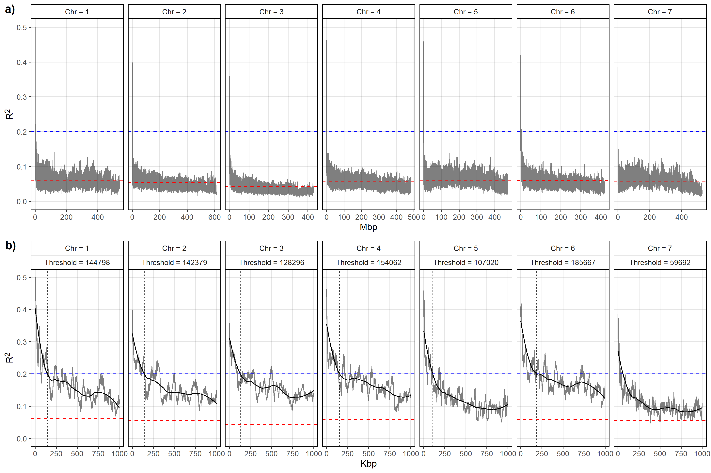
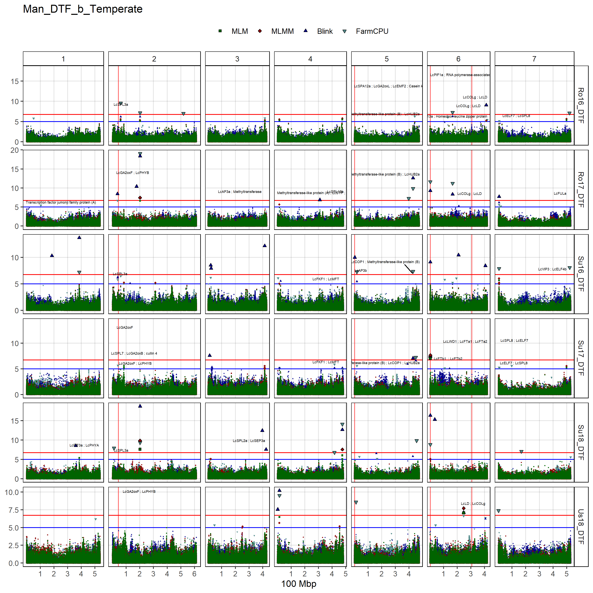
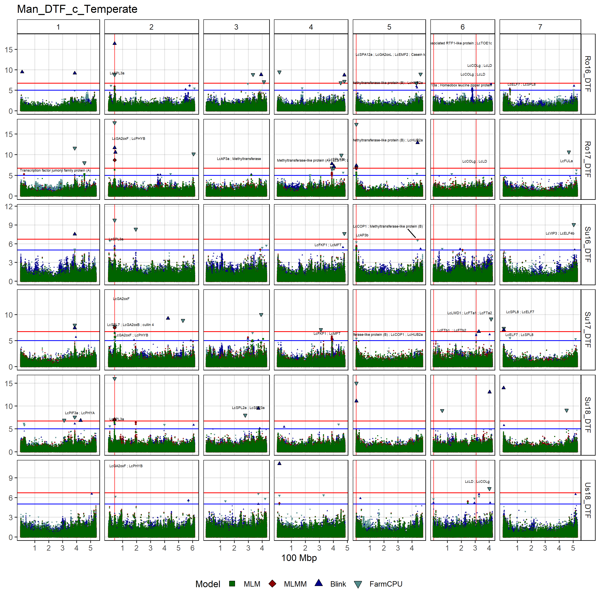
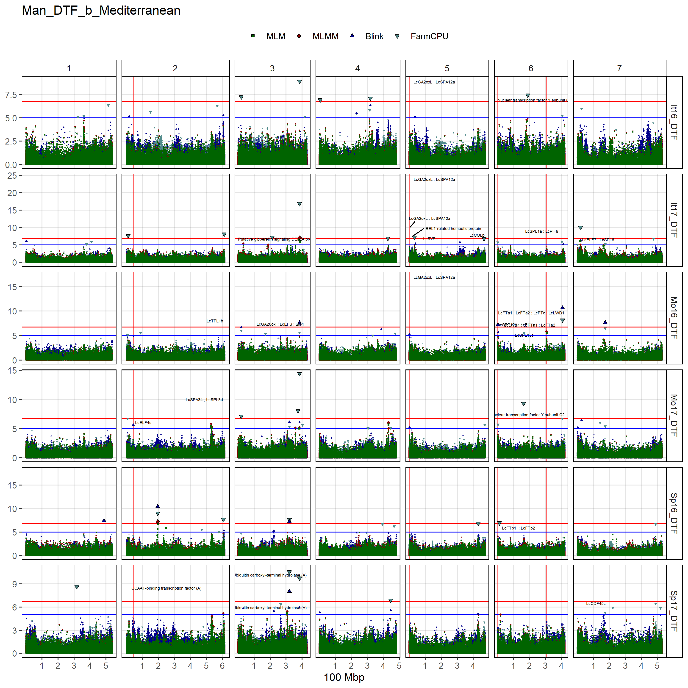
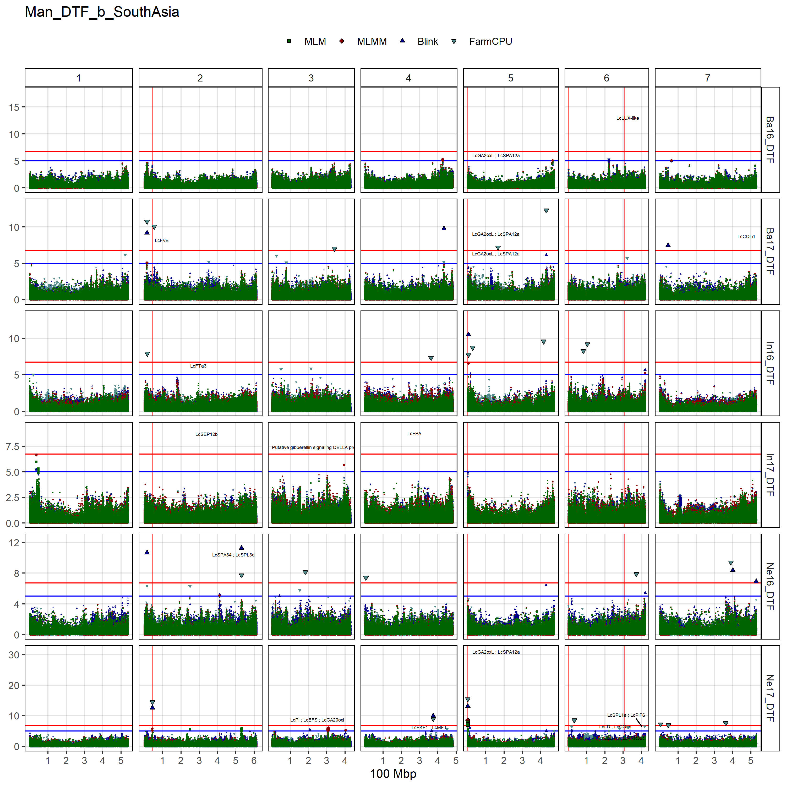
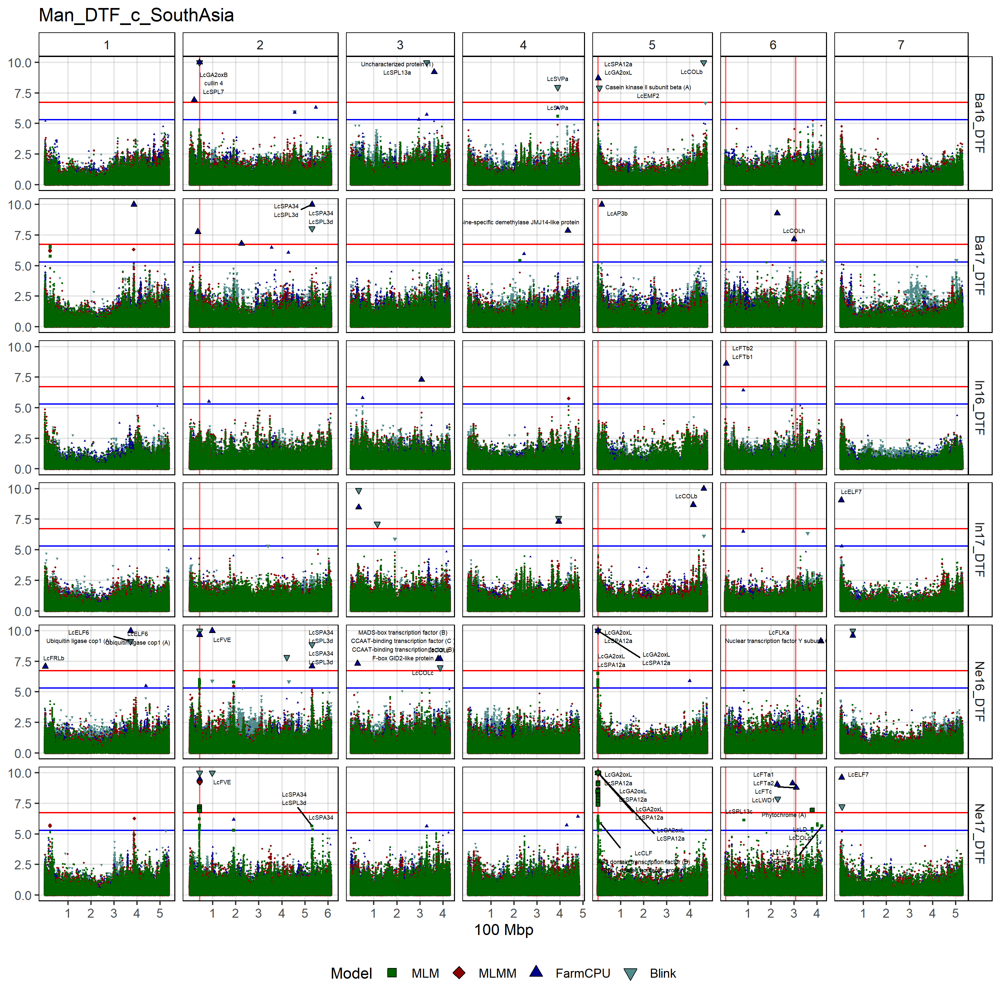
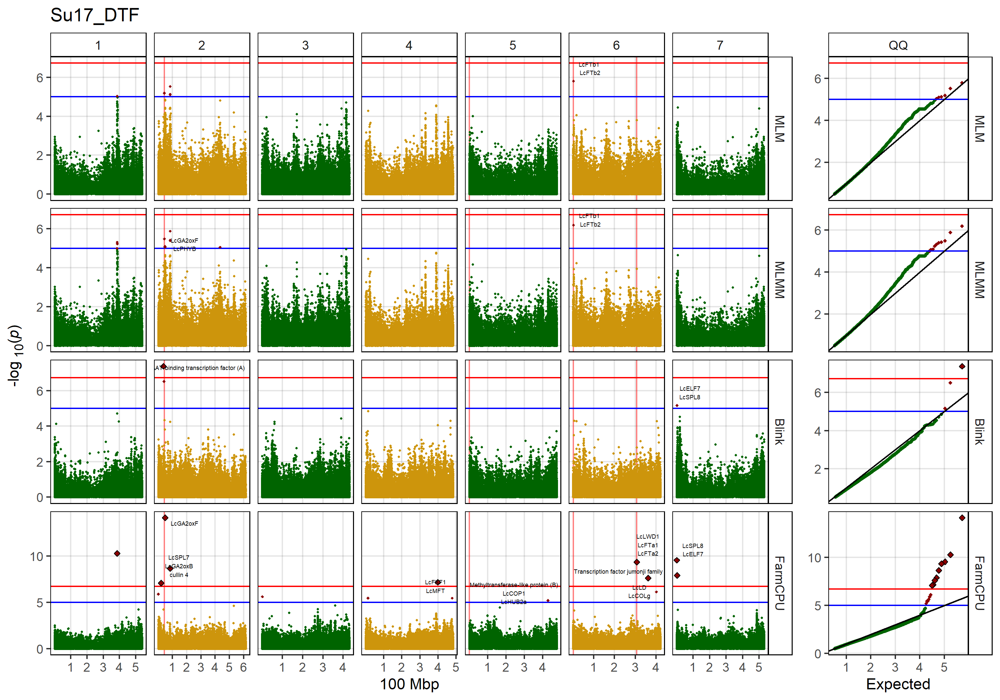
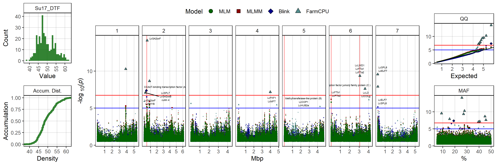

```{r setup, include=FALSE}
knitr::opts_chunk$set(eval = F, echo = T, message = F, warning = F, comment = NA, out.width = "100%")
```

---

# GWAS

```{r echo = F, eval = F}
library(agiler)
myY <- read.csv("myY_all.csv") %>%
  select(Name, PC1_PCA, PC2_PCA, PC3_PCA, a.TP_Model, b.TP_Model, c.TP_Model,
         Ro16_DTF, Ro17_DTF, Su16_DTF, Su17_DTF, Su18_DTF, Us18_DTF,
         In16_DTF, In17_DTF, Ba16_DTF, Ba17_DTF, Ne16_DTF, Ne17_DTF,
         Mo16_DTF, Mo17_DTF, Sp16_DTF, Sp17_DTF, It16_DTF, It17_DTF,
         Ro17_DTS, Su18_DTM,
         Su17_Tf, Ba17_Tf, It17_Tf, 
         Su17_Tb, Ba17_Tb, It17_Tb, 
         Su17_Pf, Ba17_Pf, It17_Pf,
         Su17_Pc, Ba17_Pc, It17_Pc)
write.csv(myY, "myY.csv", row.names = F)
```

```{r eval = F}
# Genotypes
myG <- read.csv("myG.hmp.csv", header = F)
# Phenotypes
myY <- read.csv("myY.csv")
# CoVariates
myCV <- myY[,c("Name","b","c")]
```

```{r eval = F}
# Load library
library(GAPIT3) # devtools::install_github("jiabowang/GAPIT3",force=TRUE)
# Run GWAS (Results moved to folder `Results/`)
myGAPIT <- GAPIT(
  Y = myY,
  G = myG,
  model = c("MLM","MLMM","FarmCPU","Blink"),
  PCA.total = 4
)
# DTF traits
dtf_traits <- c(
  "Ro16_DTF", "Ro17_DTF", "Su16_DTF", "Su17_DTF", "Su18_DTF", "Us18_DTF",
  "In16_DTF", "In17_DTF", "Ba16_DTF", "Ba17_DTF", "Ne16_DTF", "Ne17_DTF",
  "Mo16_DTF", "Mo17_DTF", "Sp16_DTF", "Sp17_DTF", "It16_DTF", "It17_DTF"
)
# GWAS with b covariate (Results moved to folder `Results_b/`)
myGAPIT <- GAPIT(
  Y = myY[,c("Name",dtf_traits)],
  G = myG,
  CV = myCV[,c("Name","b")]
  model = c("MLM","MLMM","FarmCPU","Blink"),
  PCA.total = 4
)
# GWAS with c covariate (Results moved to folder `Results_c/`)
myGAPIT <- GAPIT(
  Y = myY[,,c("Name",dtf_traits)],
  G = myG,
  CV = myCV[,c("Name","c")]
  model = c("MLM","MLMM","FarmCPU","Blink"),
  PCA.total = 4
)
```

---

# Prepare Post GWAS Data

```{r}
# Load libraries
library(tidyverse)
library(ggpubr)
library(ggbeeswarm)
library(ggtext)
# Genotype and Phenotype 
myG <- read.csv("myG.hmp.csv", header = T)
myY <- read.csv("myY.csv")
# Genotype metadata - Cluster groups for the LDP (Wright et al., 2020)
myLDP <- read.csv("myLDP.csv") %>%
  mutate(Cluster = factor(Cluster))
# List of flowering time genes
myFTGenes <- read.csv("Lentil_FT_Genes.csv") %>% rename(Chromosome=Chr) %>%
  mutate(Expt = "FT genes", Model = "MLM", Position = as.numeric(Start))
# Nucleotide symbols
zz <- read.csv("IUPAC_Nucleotide_Code.csv")
# ggplot theme
theme_AGL <- theme_bw() + 
  theme(strip.background   = element_rect(colour = "black", fill = NA, size = 0.5),
        panel.background   = element_rect(colour = "black", fill = NA, size = 0.5),
        panel.border       = element_rect(colour = "black", size = 0.5),
        panel.grid         = element_line(color  = alpha("black", 0.1), size = 0.5),
        panel.grid.minor.x = element_blank(), 
        panel.grid.minor.y = element_blank())
#
threshold  <- -log10(0.05/nrow(myG))
threshold2 <- 5
myModels <- c("MLM","MLMM","Blink","FarmCPU")
myModelColors <- c("darkgreen","darkred","darkblue","darkslategray4")
myMacroColors <- c("azure4","darkgreen","darkorange3","darkblue")
myClusterColors <- c("darkred",   "darkorange3", "darkgoldenrod2", "deeppink3",
                  "steelblue", "darkorchid4", "cornsilk4",      "darkgreen")
myMarkers  <- c(
  "SLCU.2RBY.CHR2_42543877", # SLCU.2RBY.CHR2_42556949
  "SLCU.2RBY.CHR5_1063138",  
  "SLCU.2RBY.CHR6_2528817",  
  "SLCU.2RBY.CHR6_306914970" # SLCU.2RBY.CHR6_307256203
  #SLCU.2RBY.CHR1_356800518
)
vv <- read.csv("Results/GAPIT.MLM.Ro17_DTF.GWAS.Results.csv") %>% 
  filter(SNP %in% myMarkers) 
```

---

# Phenotype Data


```{r}
#
expttraits <- c(
  "PC1_PCA", "PC2_PCA", "PC3_PCA",
  "a.TP_Model", "b.TP_Model",  "c.TP_Model",
  "Ro16_DTF", "Ro17_DTF", "Su16_DTF", "Su17_DTF", "Su18_DTF", "Us18_DTF",
  "In16_DTF", "In17_DTF", "Ba16_DTF", "Ba17_DTF", "Ne16_DTF", "Ne17_DTF",
  "Mo16_DTF", "Mo17_DTF", "Sp16_DTF", "Sp17_DTF", "It16_DTF", "It17_DTF",
  "Su17_Tf", "Ba17_Tf",  "It17_Tf",
  "Su17_Tb", "Ba17_Tb", "It17_Tb",
  "Su17_Pf", "Ba17_Pf",  "It17_Pf",
  "Su17_Pc", "Ba17_Pc", "It17_Pc",
  "Ro17_DTS", "Su18_DTM")
#
myYY <- myY %>% 
  gather(ExptTrait, Value, 2:ncol(.)) %>%
  mutate(ExptTrait = factor(ExptTrait, levels = expttraits))
#
mp <- ggplot(myYY, aes(x = Value)) + 
  geom_histogram(fill = "darkgreen", color = "black", alpha = 0.7) + 
  facet_wrap(ExptTrait~., ncol = 6, scales = "free") +
  theme_AGL
#
ggsave("Additional/myYs.png", mp, width = 12, height = 16)
```

---

# Supplemental Table 01

```{r echo = F, eval = T}
DT::datatable(read.csv("Supplemental_Table_01.csv"))
```

```{r}
GWAS_PeakTable <- function(folder = NULL, file = NULL, 
                           g.range = 3000000, rowread = 2000) {
  #
  trait <- substr(file, gregexpr("GAPIT.", file)[[1]][1]+6,
                  gregexpr(".GWAS.Results.csv", file)[[1]][1]-1 )
  model <- substr(trait, 1, gregexpr("\\.", trait)[[1]][1]-1 )
  trait <- substr(trait, gregexpr("\\.", trait)[[1]][1]+1, nchar(trait) )
  expt  <- substr(trait, 1, gregexpr("_", trait)[[1]][1]-1)
  trait <- substr(trait, gregexpr("_", trait)[[1]][1]+1, nchar(trait) )
  #
  output <- NULL
  #
  rr <- read.csv(paste0(folder, file), nrows = rowread) %>%
    mutate(`Neg_log10(p)` = -log10(P.value))
  #
  if(sum(colnames(rr)=="nobs")>0) { rr <- select(rr, -nobs) }
  #
  if(!is.null(threshold2)) {
    rx <- rr %>% filter(-log10(P.value) >= threshold2)
  } else{ rx <- rr %>% filter(-log10(P.value) > threshold) }
  #
  if(nrow(rx) == 0) {
    rx[1,] <- NA
    rx[1,"Chromosome"] <- 1
    output <- bind_rows(output, rx)
  } else {
    while(nrow(rx) > 0) {
      rp <- rx %>% group_by(Chromosome) %>%
        top_n(., n = 1, `Neg_log10(p)`) %>% ungroup()
      output <- bind_rows(output, rp)
      # i<-2
      for(i in 1:nrow(rp)) {
        g.range1 <- rp$Position[i] - g.range
        g.range2 <- rp$Position[i] + g.range
        if(g.range1 < 0) { g.range1 <- 0 }
        rx <- rx[rx$Chromosome != rp$Chromosome[i] | 
                   rx$Position < g.range1 | 
                   rx$Position > g.range2,]
      }
      if(!is.null(threshold2)) {
        rx <- rx %>% filter(-log10(P.value) > threshold2)
      } else{ rx <- rx %>% filter(-log10(P.value) > threshold) }
    }
  }
  output <- output %>%
    mutate(Model = model, Trait = trait, Expt = expt,
           FT_Genes = NA, FT_Pos = NA, FT_End = NA, 
           FT_Distance = NA, FT_Distances = NA)
  #
  if(sum(!is.na(output$Position)) > 0) {
    for(i in 1:nrow(output)) {
      g.range1 <- output$Position[i] - g.range
      g.range2 <- output$Position[i] + g.range
      ftg <- myFTGenes[myFTGenes$Chromosome == output$Chromosome[i] &
                       myFTGenes$Position > g.range1 & 
                       myFTGenes$Position < g.range2,]
      ftg <- ftg %>% 
        mutate(Distance = abs(Position - output$Position[i])) %>% 
        arrange(Distance)
      output$FT_Genes[i]     <- paste(ftg$Name,     collapse = " ; ")
      output$FT_Pos[i]       <- paste(ftg$Position, collapse = " ; ")
      output$FT_End[i]       <- paste(ftg$End,      collapse = " ; ")
      output$FT_Distances[i] <- paste(ftg$Distance, collapse = " ; ")
      output$FT_Distance[i]  <- ftg$Distance[1]
    }
  }
  output %>%
    select(SNP, Chromosome, Position, Model, Expt, Trait, 
           P.value, `Neg_log10(p)`, effect, MAF=maf,
           Rsquare.of.Model.without.SNP, Rsquare.of.Model.with.SNP, 
           FDR_Adjusted_P.values, 
           FT_Genes, FT_Pos, FT_End, FT_Distance, FT_Distances)
}
#
ww <- NULL
#
fnames <- grep(".GWAS.Results", list.files("Results"))
fnames <- list.files("Results")[fnames]
for(i in fnames) { 
  ww <- bind_rows(ww, GWAS_PeakTable(folder = "Results/", file = i)) 
}
#
fnames <- grep(".GWAS.Results", list.files("Results_b"))
fnames <- list.files("Results_b")[fnames]
for(i in fnames) { 
  ww <- bind_rows(ww, GWAS_PeakTable(folder = "Results_b/", file = i) %>%
                        mutate(Trait = paste0(Trait,"-b"))) 
}
#
fnames <- grep(".GWAS.Results", list.files("Results_c"))
fnames <- list.files("Results_c")[fnames]
for(i in fnames) { 
  ww <- bind_rows(ww, GWAS_PeakTable(folder = "Results_c/", file = i) %>%
                        mutate(Trait = paste0(Trait,"-c"))) 
}
#
ww <- ww %>% filter(!is.na(SNP)) %>%
  arrange(Chromosome, Position, P.value, Trait) %>%
  mutate(Chromosome = factor(Chromosome, levels = 1:7),
         Model = factor(Model, levels = myModels))
#
write.csv(ww, "Supplemental_Table_01.csv", row.names = F)
```

---

# Figure 1


```{r}
traits <- c(
  "PC1_PCA", "PC2_PCA", "PC3_PCA",
  "a.TP_Model", "b.TP_Model",  "c.TP_Model",
  "Ro16_DTF", "Ro17_DTF", "Su16_DTF", "Su17_DTF", "Su18_DTF", "Us18_DTF",
  "In16_DTF", "In17_DTF", "Ba16_DTF", "Ba17_DTF", "Ne16_DTF", "Ne17_DTF",
  "Mo16_DTF", "Mo17_DTF", "Sp16_DTF", "Sp17_DTF", "It16_DTF", "It17_DTF",
  "Su17_Tf", "Ba17_Tf",  "It17_Tf",
  "Su17_Tb", "Ba17_Tb", "It17_Tb",
  "Su17_Pf", "Ba17_Pf",  "It17_Pf",
  "Su17_Pc", "Ba17_Pc", "It17_Pc")
#
traits2 <- c(
  "PC1", "PC2", "PC3","*a*", "*b*",  "*c*",
  "Ro16_DTF", "Ro17_DTF", "Su16_DTF", "Su17_DTF", "Su18_DTF", "Us18_DTF",
  "In16_DTF", "In17_DTF", "Ba16_DTF", "Ba17_DTF", "Ne16_DTF", "Ne17_DTF",
  "Mo16_DTF", "Mo17_DTF", "Sp16_DTF", "Sp17_DTF", "It16_DTF", "It17_DTF",
  "Su17_*Tf*", "Ba17_*Tf*",  "It17_*Tf*",
  "Su17_*Tb*", "Ba17_*Tb*", "It17_*Tb*",
  "Su17_*Pf*", "Ba17_*Pf*",  "It17_*Pf*",
  "Su17_*Pc*", "Ba17_*Pc*", "It17_*Pc*")
#
me <- c("<b style='color:black'>{ExptTrait}</b>",
        "<b style='color:darkgreen'>{ExptTrait}</b>",
        "<b style='color:darkorange3'>{ExptTrait}</b>",
        "<b style='color:darkblue'>{ExptTrait}</b>")
#
hlines <- c(3.5,6.5,9.5,12.5,18.5,24.5,30.5)
e1 <- c("Ro16","Ro17","Su16","Su17","Su18","Us18")
e2 <- c("Mo16","Mo17","Sp16","Sp17","It16","It17")
e3 <- c("In16","In17","Ba16","Ba17","Ne16","Ne17")
myMacroEnvs <- c("Multi Environment","Temperate", "South Asia", "Mediterranean")
#
wi <- ww %>% 
  filter(paste(Expt, Trait, sep = "_") %in% traits, -log10(P.value) > threshold) %>%
  mutate(ExptTrait = paste(Expt, Trait, sep = "_"),
         ExptTrait = plyr::mapvalues(ExptTrait, traits, traits2),
         Model = factor(Model, levels = myModels),
         MacroEnv = NA,
         MacroEnv = ifelse(Expt %in% e1, "Temperate",     MacroEnv),
         MacroEnv = ifelse(Expt %in% e2, "Mediterranean", MacroEnv),
         MacroEnv = ifelse(Expt %in% e3, "South Asia",    MacroEnv),
         MacroEnv = ifelse(is.na(MacroEnv), "Multi Environment", MacroEnv),
         cat_col = NA,
         cat_col = ifelse(MacroEnv == "Multi Environment", glue::glue(me[1]), cat_col),
         cat_col = ifelse(MacroEnv == "Temperate",         glue::glue(me[2]), cat_col),
         cat_col = ifelse(MacroEnv == "South Asia",        glue::glue(me[3]), cat_col),
         cat_col = ifelse(MacroEnv == "Mediterranean",     glue::glue(me[4]), cat_col),
         cat_col = factor(cat_col, levels = rev(cat_col[match(traits2, ExptTrait)])),
         ExptTrait = factor(ExptTrait, levels = rev(traits2)),
         MacroEnv = factor(MacroEnv, levels = myMacroEnvs)) %>%
  arrange(ExptTrait) 
#
mp <- ggplot(wi, aes(x = Position / 100000000, y = cat_col, shape = Model)) + 
  geom_vline(data = vv, alpha = 0.5, color = "red",
             aes(xintercept = Position / 100000000)) +
  geom_point(size = 2, color = "black", alpha = 0.5,
             aes(fill = MacroEnv, key2 = SNP, key3 = FT_Genes, key4 = FT_Distances)) + 
  geom_hline(yintercept = hlines, alpha = 0.7) +
  facet_grid(. ~ Chromosome, drop = F, scales = "free_x", space = "free_x") +
  scale_fill_manual(values = myMacroColors, guide = F) +
  scale_shape_manual(values = c(22:25)) +
  scale_y_discrete(drop = F) +
  theme_AGL +
  theme(legend.position = "bottom",
        axis.text.y = element_markdown(),
        strip.text.y = element_markdown()) +
  labs(y = NULL, x = "100 Mbp")
#
ggsave(paste0("Figure_01.png"), mp, width = 12, height = 9)
#
mp <- plotly::ggplotly(mp)
htmlwidgets::saveWidget(plotly::as_widget(mp),
   paste0("Additional/Figure_01_plotly.html"),
   knitrOptions = list(fig.width = 12, fig.height = 9), 
   selfcontained = T)
```

```{r echo = F}
save(mp, file = "Additional/Figure_01_plotly.RData")
```

[Additional/Figure_01_plotly.html](https://derekmichaelwright.github.io/AGILE_LDP_GWAS_Phenology/Additional/Figure_01_plotly.html)

```{r echo = F, eval = T}
load("Additional/Figure_01_plotly.RData")
mp
```

---

# Figure 2


```{r}
expttraits <- c("Su17_DTF", "Ba17_DTF", "Ne17_DTF", "It17_DTF")
expts <- expttraits
for(i in 1:length(expts)) { 
  expts[i] <- substr(expts[i], 1, gregexpr("_", expts)[[i]][1]-1) 
}
#
yy <- myY %>% 
  gather(ExptTrait, Value, 2:ncol(.)) %>% 
  filter(ExptTrait %in% expttraits) %>%
  mutate(Model = factor("Days To Flower"),
         ExptTrait = factor(ExptTrait, levels = expttraits),
         Expt = plyr::mapvalues(ExptTrait, expttraits, expts),
         Expt = factor(Expt, levels = expts))
#
xx <- NULL
for(i in expttraits) {
  fnames <- grep(paste0(i,".GWAS.Results"), list.files("Results/"))
  fnames <- list.files("Results/")[fnames]
  for(j in fnames) {
    mod <- substr(j, gregexpr("\\.", j)[[1]][1]+1, nchar(j))
    mod <- substr(mod, 1, gregexpr("\\.", mod)[[1]][1]-1 )
    xj <- read.csv(paste0("Results/", j)) %>% 
      mutate(Model = mod, ExptTrait = i,
             `-log10(p)_Exp` = -log10((rank(P.value, ties.method="first")-.5)/nrow(.)))
    xx <- bind_rows(xx, xj)
  }
}
#
xx <- xx %>% 
  mutate(Model = factor(Model, levels = myModels),
         ExptTrait = factor(ExptTrait, levels = expttraits),
         Expt = plyr::mapvalues(ExptTrait, expttraits, expts),
         Expt = factor(Expt, levels = expts)) %>%
  arrange(rev(Model))
#
x1 <- xx %>% filter(-log10(P.value) < threshold2)
x2 <- xx %>% filter(-log10(P.value) > threshold2, -log10(P.value) < threshold)
x3 <- xx %>% filter(-log10(P.value) > threshold)
#
mp1 <- ggplot(yy, aes(x = Value)) +
  geom_histogram(fill = "darkgreen", binwidth = 2) + 
  facet_grid(Expt ~ "DTF") +
  theme_AGL + 
  xlim(c(35,160)) +
  labs(x = "Days after planting", y = "Count")
#
mp2 <- ggplot(x1, aes(x = Position / 100000000, y = -log10(P.value), 
                      shape = Model, fill = Model)) +
  geom_vline(data = vv, alpha = 0.5, color = "red",
             aes(xintercept = Position / 100000000)) +
  geom_hline(yintercept = threshold,  color = "red", alpha = 0.7) +
  geom_hline(yintercept = threshold2, color = "blue", alpha = 0.7) +
  geom_point(size = 0.3, color = alpha("white", 0)) +
  geom_point(data = x2, size = 0.75, color = alpha("white", 0)) +
  geom_point(data = x3, size = 1.25) +
  facet_grid(Expt ~ Chromosome, scales = "free", space = "free_x") +
  scale_x_continuous(breaks = 1:7) +
  scale_fill_manual(values = myModelColors) +
  scale_shape_manual(values = 22:25) +
  theme_AGL +
  theme(legend.position = "none",
        strip.text.y = element_blank() , 
        strip.background.y = element_blank(),
        axis.title.y = ggtext::element_markdown()) +
  labs(y = "-log<sub>10</sub>(*p*)", x = "100 Mbp")
#
mp3 <- ggplot(x1, aes(x = `-log10(p)_Exp`, y = -log10(P.value), 
                      shape = Model, fill = Model)) +
  geom_point(size = 0.5, color = alpha("white", 0)) +
  geom_point(data = x2, size = 0.75, color = alpha("white", 0)) +
  geom_point(data = x3, size = 1.25, color = alpha("white", 0)) +
  geom_hline(yintercept = threshold,  color = "red", alpha = 0.7) +
  geom_hline(yintercept = threshold2, color = "blue", alpha = 0.7) +
  geom_abline() +
  scale_fill_manual(values = myModelColors) +
  scale_shape_manual(values = 22:25) +
  facet_grid(Expt ~ "QQ", scales = "free_y") +
  theme_AGL +
  theme(legend.position = "none",
        axis.text.y = element_blank(),
        axis.ticks.y = element_blank()) +
  labs(y = NULL, x = "Expected")
#
mpl <- get_legend(mp2, position = "bottom")
mp <- ggarrange(mp1, mp2, mp3, ncol = 3, align = "h",
                widths = c(2,7, 1.5), labels = c("a)", "b)", NULL),
                legend.grob = mpl,legend = "bottom", common.legend = T)
#
ggsave("Figure_02.png", mp, width = 12, height = 7)
```

---

# Figure 3


```{r}
expttraits <- c("PC1_PCA", "b.TP_Model", "PC2_PCA", "c.TP_Model", "PC3_PCA", "Su17_Tb")
expts <- c("PC1", "b.TP","PC2", "c.TP", "PC3", "Su17_Tb")
#
yy <- myY 
for(i in expttraits) { yy[,i] <- scales::rescale(yy[,i], c(0, 1)) }
yy <- yy %>% 
  gather(ExptTrait, Value, 2:ncol(.)) %>% 
  filter(ExptTrait %in% expttraits) %>% 
  mutate(ExptTrait = factor(ExptTrait, levels = expttraits),
         Expt = plyr::mapvalues(ExptTrait, expttraits, expts),
         Expt = factor(Expt, levels = expts),
         Expt = plyr::mapvalues(Expt, c("b.TP","c.TP","Su17_Tb"), 
                                      c("*b*","*c*","Su17_*Tb*")))
#
xx <- NULL
for(i in expttraits) {
  fnames <- grep(paste0(i,".GWAS.Results"), list.files("Results/"))
  fnames <- list.files("Results/")[fnames]
  for(j in fnames) {
    mod <- substr(j, gregexpr("\\.", j)[[1]][1]+1, nchar(j))
    mod <- substr(mod, 1, gregexpr("\\.", mod)[[1]][1]-1 )
    xj <- read.csv(paste0("Results/", j)) %>% 
      mutate(Model = mod, ExptTrait = i,
             `-log10(p)_Exp` = -log10((rank(P.value, ties.method="first")-.5)/nrow(.)))
    xx <- bind_rows(xx, xj)
  }
}
#
xx <- xx %>% 
  mutate(Model = factor(Model, levels = myModels),
         ExptTrait = factor(ExptTrait, levels = expttraits),
         Expt = plyr::mapvalues(ExptTrait, expttraits, expts),
         Expt = factor(Expt, levels = expts),
         Expt = plyr::mapvalues(Expt, c("b.TP", "c.TP", "Su17_Tb"), 
                                      c("*b*", "*c*", "Su17_*Tb*"))) %>%
  arrange(rev(Model))
#
x1 <- xx %>% filter(-log10(P.value) < threshold2)
x2 <- xx %>% filter(-log10(P.value) > threshold2, -log10(P.value) < threshold)
x3 <- xx %>% filter(-log10(P.value) > threshold)
#
mp1 <- ggplot(yy, aes(x = Value)) +
  geom_histogram(fill = "darkgreen") + 
  facet_grid(Expt ~ "Phenotype", scales = "free") +
  theme_AGL +
  theme(strip.text.y = ggtext::element_markdown()) + 
  labs(x = "Scaled Value", y = "Count")
#
mp2 <- ggplot(x1, aes(x = Position / 100000000, y = -log10(P.value), 
                      shape = Model, fill = Model)) +
  geom_vline(data = vv, alpha = 0.5, color = "red",
             aes(xintercept = Position / 100000000)) +
  geom_hline(yintercept = threshold,  color = "red", alpha = 0.7) +
  geom_hline(yintercept = threshold2, color = "blue", alpha = 0.7) +
  geom_point(size = 0.3, color = alpha("white", 0)) +
  geom_point(data = x2, size = 0.75, color = alpha("white", 0)) +
  geom_point(data = x3, size = 1.25) +
  facet_grid(Expt ~ Chromosome, scales = "free", space = "free_x") +
  scale_x_continuous(breaks = 1:7) +
  scale_fill_manual(values = myModelColors) +
  scale_shape_manual(values = 22:25) +
  theme_AGL +
  theme(legend.position = "none",
        strip.text.y = element_blank() , 
        strip.background.y = element_blank(),
        axis.title.y = ggtext::element_markdown()) +
  labs(y = "-log<sub>10</sub>(*p*)", x = "100 Mbp")
#
mp3 <- ggplot(x1, aes(x = `-log10(p)_Exp`, y = -log10(P.value), shape = Model, fill = Model)) +
  geom_point(size = 0.5, color = alpha("white", 0)) +
  geom_point(data = x2, size = 0.75, color = alpha("white", 0)) +
  geom_point(data = x3, size = 1.25, color = alpha("white", 0)) +
  geom_hline(yintercept = threshold,  color = "red", alpha = 0.7) +
  geom_hline(yintercept = threshold2, color = "blue", alpha = 0.7) +
  geom_abline() +
  scale_fill_manual(values = myModelColors) +
  scale_shape_manual(values = 22:25) +
  facet_grid(Expt ~ "QQ", scales = "free_y") +
  theme_AGL +
  theme(legend.position = "none",
        axis.text.y = element_blank(),
        axis.ticks.y = element_blank(),
        strip.text.y = ggtext::element_markdown()) +
  labs(y = NULL, x = "Expected")
#
mpl <- get_legend(mp2, position = "bottom")
mp <- ggarrange(mp1, mp2, mp3, ncol = 3, widths = c(2,7,1.5), 
                align = "h", labels = c("a)", "b)", NULL),
                legend.grob = mpl, legend = "bottom", common.legend = T)
#
ggsave("Figure_03.png", mp, width = 12, height = 10)
```

---

# Figure 4


```{r eval = F}
expttraits <- c("Ro16_DTF","Ro17_DTF","Su16_DTF","Su17_DTF","Su18_DTF","Us18_DTF",
                "In16_DTF","In17_DTF","Ba16_DTF","Ba17_DTF","Ne16_DTF","Ne17_DTF",
                "Mo16_DTF","Mo17_DTF","Sp16_DTF","Sp17_DTF","It16_DTF","It17_DTF")
expts <- expttraits
for(i in 1:length(expts)) { 
  expts[i] <- substr(expts[i], 1, gregexpr("_", expts)[[i]][1]-1) 
}
#
# i<-"Ro17_DTF"
# expttraits <- c("Ro17_DTF","Sp17_DTF")
for(i in expttraits) {
  x1 <- NULL; xb <- NULL; xc <- NULL
  #
  fnames <- grep(paste0(i,".GWAS.Results"), list.files("Results/"))
  fnames <- list.files("Results/")[fnames]
  for(j in fnames) {
    mod <- substr(j, gregexpr("\\.", j)[[1]][1]+1, nchar(j))
    mod <- substr(mod, 1, gregexpr("\\.", mod)[[1]][1]-1 )
    xj <- read.csv(paste0("Results/", j)) %>% 
      mutate(Model = mod, Facet = i,
             `-log10(p)_Exp` = -log10((rank(P.value, ties.method="first")-.5)/nrow(.)))
    x1 <- bind_rows(x1, xj)
  }
  #
  fnames <- grep(paste0(i,".GWAS.Results"), list.files("Results_b/"))
  fnames <- list.files("Results_b/")[fnames]
  for(j in fnames) {
    mod <- substr(j, gregexpr("\\.", j)[[1]][1]+1, nchar(j))
    mod <- substr(mod, 1, gregexpr("\\.", mod)[[1]][1]-1 )
    xj <- read.csv(paste0("Results_b/", j)) %>% 
      mutate(Model = mod, Facet = "CV = *b*",
             `-log10(p)_Exp` = -log10((rank(P.value, ties.method="first")-.5)/nrow(.)))
    xb <- bind_rows(xb, xj)
  }
  #
  fnames <- grep(paste0(i,".GWAS.Results"), list.files("Results_c/"))
  fnames <- list.files("Results_c/")[fnames]
  for(j in fnames) {
    mod <- substr(j, gregexpr("\\.", j)[[1]][1]+1, nchar(j))
    mod <- substr(mod, 1, gregexpr("\\.", mod)[[1]][1]-1 )
    xj <- read.csv(paste0("Results_c/", j)) %>% 
      mutate(Model = mod, Facet = "CV = *c*",
             `-log10(p)_Exp` = -log10((rank(P.value, ties.method="first")-.5)/nrow(.)))
    xc <- bind_rows(xc, xj)
  }
  #
  xx <- bind_rows(x1, xb, xc) %>%
    mutate(Model = factor(Model, levels = myModels),
           Facet = factor(Facet, levels = c("CV = *c*", i, "CV = *b*"))) %>% 
    arrange(Facet, rev(Model))
  #
  x1 <- xx %>% filter(-log10(P.value) < threshold2)
  x2 <- xx %>% filter(-log10(P.value) > threshold2, -log10(P.value) < threshold)
  x3 <- xx %>% filter(-log10(P.value) > threshold)
  #
  mp1 <- ggplot(x1, aes(x = Position / 100000000, y = -log10(P.value),
                        shape = Model, fill = Model)) +
    geom_vline(data = vv, alpha = 0.5, color = "red",
               aes(xintercept = Position / 100000000)) +
    geom_hline(yintercept = threshold,  color = "red", alpha = 0.7) +
    geom_hline(yintercept = threshold2, color = "blue", alpha = 0.7) +
    geom_point(size = 0.3, color = alpha("white", 0)) +
    geom_point(data = x2, size = 0.75, color = alpha("white", 0)) +
    geom_point(data = x3, size = 1.25) +
    facet_grid(Facet ~ Chromosome, scales = "free", space = "free_x") +
    scale_x_continuous(breaks = 1:7) +
    scale_fill_manual(values = myModelColors) +
    scale_shape_manual(values = 22:25) +
    theme_AGL +
    theme(strip.text.y = element_blank() , 
          strip.background.y = element_blank(),
          axis.title.y = ggtext::element_markdown()) +
    labs(y = "-log<sub>10</sub>(*p*)", x = "100 Mbp")
  #
  mp2 <- ggplot(x1, aes(x = `-log10(p)_Exp`, y = -log10(P.value),
                        shape = Model, fill = Model)) +
    geom_point(size = 0.5, color = alpha("white", 0)) +
    geom_point(data = x2, size = 0.75, color = alpha("white", 0)) +
    geom_point(data = x3, size = 1.25, color = alpha("white", 0)) +
    geom_hline(yintercept = threshold, color = "red", alpha = 0.7) +
    geom_hline(yintercept = threshold2, color = "blue", alpha = 0.7) +
    geom_abline() +
    scale_fill_manual(values = myModelColors) +
    scale_shape_manual(values = 22:25) +
    facet_grid(Facet ~ "QQ", scales = "free_y") +
    theme_AGL +
    theme(legend.position = "none",
          axis.text.y = element_blank(),
          axis.ticks.y = element_blank(),
          strip.text.y = ggtext::element_markdown()) +
    labs(y = NULL, x = "Expected")
  #
  mp <- ggarrange(mp1, mp2, ncol = 2, widths = c(7,1.5), align = "h",
                        legend = "bottom", common.legend = T)
  #
  ggsave(paste0("Additional/CV/CV_", i, ".png"), mp, width = 12, height = 6)
}
```

```{r}
im1 <- magick::image_read("Additional/CV/CV_Ro17_DTF.png") %>% 
  magick::image_annotate("a)", size = 70, weight = 600, location = "+30+10")
im2 <- magick::image_read("Additional/CV/CV_Sp17_DTF.png") %>% 
  magick::image_annotate("b)", size = 70, weight = 600, location = "+30+10")
im <- magick::image_append(c(im1, im2), stack = T)
magick::image_write(im, "Figure_04.png")
```

---

# Figure 5


```{r}
expttraits <- c("Su17_DTF", "Ba17_DTF", "Ne17_DTF", "It17_DTF")
expts <- substr(expttraits,1,4)
#
markers <- myMarkers[c(1,2)]
gg <- myG %>% filter(rs %in% markers) %>% 
  column_to_rownames("rs") %>%
  select(11:ncol(.)) %>%
  t() %>% as.data.frame()
for(i in 1:nrow(gg)) { 
  gg$Markers[i] <- paste(gg[i,1:length(markers)], collapse = " - ") 
}
gg <- gg %>% rownames_to_column("Name")
#
yy <- myY %>% select(Name, expttraits) %>%
  gather(ExptTrait, Value, 2:ncol(.)) %>%
  separate(ExptTrait, c("Expt","Trait"), remove = F)
#
xx <- left_join(yy, gg, by = "Name") %>%
  left_join(myLDP, by = "Name") %>%
  mutate(Expt = factor(Expt, levels = expts))
#
x1 <- xx %>%
  filter(!grepl("M|R|W|S|Y|K|N", Markers), ExptTrait %in% expttraits) %>%
  arrange(Markers) %>%
  mutate(Markers = factor(Markers, levels = c("C - G","C - A","T - G","T - A")))
#
mp1 <- ggplot(x1, aes(x = Markers, y = Value)) + 
  geom_quasirandom(aes(color = Cluster, key1 = Entry, key2 = Name, 
                       key3 = Origin, key4 = SampStat)) +
  facet_wrap(Expt ~ ., ncol = 6, scales = "free_y") +
  scale_color_manual(values = myClusterColors) +
  guides(color = guide_legend(nrow = 1)) +
  theme_AGL +
  theme(panel.grid.major.x = element_blank(),
        axis.text.x = element_text(angle = 90, vjust = 0.5)) +
  labs(x = "SLCU.2RBY.CHR2_42543877 - ( C | T )\nSLCU.2RBY.CHR5_1063138 - ( G | A )",
       y = "DTF")
#
markers <- myMarkers[3]
gg <- myG %>% filter(rs %in% markers) %>% 
  column_to_rownames("rs") %>%
  select(11:ncol(.)) %>%
  t() %>% as.data.frame()
for(i in 1:nrow(gg)) { 
  gg$Markers[i] <- paste(gg[i,1:length(markers)], collapse = " - ") 
}
gg <- gg %>% rownames_to_column("Name")
#
yy <- myY %>% select(Name, expttraits) %>%
  gather(ExptTrait, Value, 2:ncol(.)) %>%
  separate(ExptTrait, c("Expt","Trait"), remove = F)
#
xx <- left_join(yy, gg, by = "Name") %>%
  left_join(myLDP, by = "Name") %>%
  mutate(Expt = factor(Expt, levels = expts))
#
x1 <- xx %>%
  filter(!grepl("M|R|W|S|Y|K|N", Markers)) %>%
  arrange(Markers)
#
mp2 <- ggplot(x1 %>% filter(ExptTrait %in% expttraits), aes(x = Markers, y = Value)) + 
  geom_quasirandom(aes(color = Cluster, key1 = Entry, key2 = Name, 
                       key3 = Origin, key4 = SampStat)) +
  facet_wrap(Expt ~ ., ncol = 6, scales = "free_y") +
  scale_color_manual(values = myClusterColors) +
  guides(color = guide_legend(nrow = 1)) +
  theme_AGL +
  theme(panel.grid.major.x = element_blank(),
        axis.text.x = element_text(angle = 90, vjust = 0.5)) +
  labs(x = "SLCU.2RBY.CHR6_2528817",
       y = "DTF")
#
markers <- myMarkers[4]
gg <- myG %>% filter(rs %in% markers) %>% 
  column_to_rownames("rs") %>%
  select(11:ncol(.)) %>%
  t() %>% as.data.frame()
for(i in 1:nrow(gg)) { 
  gg$Markers[i] <- paste(gg[i,1:length(markers)], collapse = " - ") 
}
gg <- gg %>% rownames_to_column("Name")
#
yy <- myY %>% select(Name, expttraits) %>%
  gather(ExptTrait, Value, 2:ncol(.)) %>%
  separate(ExptTrait, c("Expt","Trait"), remove = F)
#
xx <- left_join(yy, gg, by = "Name") %>%
  left_join(myLDP, by = "Name") %>%
  mutate(Expt = factor(Expt, levels = expts))
#
x1 <- xx %>%
  filter(!grepl("M|R|W|S|Y|K|N", Markers)) %>%
  arrange(Markers) 
#
mp3 <- ggplot(x1 %>% filter(ExptTrait %in% expttraits), aes(x = Markers, y = Value)) + 
  geom_quasirandom(aes(color = Cluster, key1 = Entry, key2 = Name, 
                       key3 = Origin, key4 = SampStat)) +
  facet_wrap(Expt ~ ., ncol = 6, scales = "free_y") +
  scale_color_manual(values = myClusterColors) +
  guides(color = guide_legend(nrow = 1)) +
  theme_AGL +
  theme(panel.grid.major.x = element_blank(),
        axis.text.x = element_text(angle = 90, vjust = 0.5)) +
  labs(x = "SLCU.2RBY.CHR6_306914970",
       y = "DTF")
#
mp <- ggarrange(mp1, mp2, mp3, ncol = 1, labels = c("a)","b)","c)"), 
                heights = c(1.2,1,1), legend = "bottom", common.legend = T)
#
ggsave("Figure_05.png", mp, width = 8, height = 8)
#
mp1 <- plotly::ggplotly(mp1)
htmlwidgets::saveWidget(plotly::as_widget(mp1), 
                        paste0("Additional/Figure_05_a_plotly.html"), 
                        selfcontained = T)
#
mp2 <- plotly::ggplotly(mp2)
htmlwidgets::saveWidget(plotly::as_widget(mp2), 
                        paste0("Additional/Figure_05_b_plotly.html"), 
                        selfcontained = T)
#
mp3 <- plotly::ggplotly(mp3)
htmlwidgets::saveWidget(plotly::as_widget(mp3), 
                        paste0("Additional/Figure_05_c_plotly.html"), 
                        selfcontained = T)
```

```{r echo = F}
save(mp1, file = "Additional/Figure_05_a_plotly.RData")
save(mp2, file = "Additional/Figure_05_b_plotly.RData")
save(mp3, file = "Additional/Figure_05_c_plotly.RData")
```

[Additional/Figure_05_a_plotly.html](https://derekmichaelwright.github.io/AGILE_LDP_GWAS_Phenology/Additional/Figure_05_a_plotly.html)

[Additional/Figure_05_b_plotly.html](https://derekmichaelwright.github.io/AGILE_LDP_GWAS_Phenology/Additional/Figure_05_b_plotly.html)

[Additional/Figure_05_c_plotly.html](https://derekmichaelwright.github.io/AGILE_LDP_GWAS_Phenology/Additional/Figure_05_c_plotly.html)

```{r echo = F, eval = T}
load("Additional/Figure_05_a_plotly.RData")
load("Additional/Figure_05_b_plotly.RData")
load("Additional/Figure_05_c_plotly.RData")
mp1
mp2
mp3
```

---

# Figure 6


```{r}
marker <- "SLCU.2RBY.CHR1_356800518"
expttraits <- c("Ro17_DTS","Su18_DTM")
expts <- expttraits
for(i in 1:length(expts)) { 
  expts[i] <- substr(expts[i], 1, gregexpr("_", expts)[[i]][1]-1) 
}
#
yy <- myY %>% 
  gather(ExptTrait, Value, 2:ncol(.)) %>% 
  filter(ExptTrait %in% expttraits) %>% 
  mutate(ExptTrait = factor(ExptTrait, levels = expttraits))
#
mp1 <- ggplot(yy, aes(x = Value)) +
  geom_histogram(fill = "darkgreen") + 
  facet_grid(ExptTrait ~ "Phenotype", scales = "free") +
  theme_AGL +
  labs(x = "Days", y = "Count")
#
xx <- NULL
fnames <- grep("Ro17_DTS.GWAS.Results", list.files("Results/"))
fnames <- list.files("Results/")[fnames]
for(j in fnames) {
  mod <- substr(j, gregexpr("\\.", j)[[1]][1]+1, nchar(j))
  mod <- substr(mod, 1, gregexpr("\\.", mod)[[1]][1]-1 )
  xj <- read.csv(paste0("Results/", j)) %>% 
    mutate(Model = mod, Facet = "Ro17_DTS",
           `-log10(p)_Exp` = -log10((rank(P.value, ties.method="first")-.5)/nrow(.)))
  xx <- bind_rows(xx, xj)
}
#
fnames <- grep("Su18_DTM.GWAS.Results", list.files("Results/"))
fnames <- list.files("Results/")[fnames]
for(j in fnames) {
  mod <- substr(j, gregexpr("\\.", j)[[1]][1]+1, nchar(j))
  mod <- substr(mod, 1, gregexpr("\\.", mod)[[1]][1]-1 )
  xj <- read.csv(paste0("Results/", j)) %>% 
    mutate(Model = mod, Facet = "Su18_DTM",
           `-log10(p)_Exp` = -log10((rank(P.value, ties.method="first")-.5)/nrow(.)))
  xx <- bind_rows(xx, xj)
}
#
xx <- xx %>%
  mutate(Model = factor(Model, levels = myModels)) %>% 
  arrange(rev(Model))
#
x1 <- xx %>% filter(-log10(P.value) < threshold2)
x2 <- xx %>% filter(-log10(P.value) > threshold2, -log10(P.value) < threshold)
x3 <- xx %>% filter(-log10(P.value) > threshold)
#
vi <- read.csv("Results/GAPIT.MLM.Ro17_DTS.GWAS.Results.csv") %>%
  filter(SNP == marker)
#
mp2 <- ggplot(x1, aes(x = Position / 100000000, y = -log10(P.value), 
                      shape = Model, fill = Model)) +
  geom_vline(data = vi, alpha = 0.5, color = "red",
             aes(xintercept = Position / 100000000)) +
  geom_hline(yintercept = threshold,  color = "red") +
  geom_hline(yintercept = threshold2, color = "blue") +
  geom_point(size = 0.3, color = alpha("white", 0)) +
  geom_point(data = x2, size = 0.75, color = alpha("white", 0)) +
  geom_point(data = x3, size = 1.25) +
  facet_grid(Facet ~ Chromosome, scales = "free", space = "free_x") +
  scale_x_continuous(breaks = 1:7) +
  scale_fill_manual(values = myModelColors) +
  scale_shape_manual(values = 22:25) +
  theme_AGL +
  theme(strip.text.y = element_blank() , 
        strip.background.y = element_blank(),
        axis.title.y = ggtext::element_markdown()) +
  labs(y = "-log<sub>10</sub>(*p*)", x = "100 Mbp")
#
mp3 <- ggplot(x1, aes(x = `-log10(p)_Exp`, y = -log10(P.value), shape = Model, fill = Model)) +
  geom_point(size = 0.5, color = alpha("white", 0)) +
  geom_point(data = x2, size = 0.75, color = alpha("white", 0)) +
  geom_point(data = x3, size = 1.25, color = alpha("white", 0)) +
  geom_hline(yintercept = threshold,  color = "red") +
  geom_hline(yintercept = threshold2, color = "blue") +
  geom_abline() +
  scale_fill_manual(values = myModelColors) +
  scale_shape_manual(values = 22:25) +
  facet_grid(Facet ~ "QQ", scales = "free_y") +
  theme_AGL +
  theme(legend.position = "none",
        axis.text.y = element_blank(),
        axis.ticks.y = element_blank()) +
  labs(y = NULL, x = "Expected")
#
expttraits <- c("Su17_DTF", "Ba17_DTF", "Ne17_DTF", "It17_DTF")
markers <- "SLCU.2RBY.CHR1_356800518"
gg <- myG %>% filter(rs %in% markers) %>% 
  column_to_rownames("rs") %>%
  select(11:ncol(.)) %>%
  t() %>% as.data.frame()
for(i in 1:nrow(gg)) { 
  gg$Markers[i] <- paste(gg[i,1:length(markers)], collapse = " - ") 
}
gg <- gg %>% rownames_to_column("Name")
#
yy <- myY %>% select(Name, expttraits) %>%
  gather(ExptTrait, Value, 2:ncol(.)) %>%
  separate(ExptTrait, c("Expt","Trait"), remove = F)
#
xx <- left_join(yy, gg, by = "Name") %>%
  left_join(myLDP, by = "Name") %>%
  mutate(Expt = factor(Expt, levels = c("Su17","Ba17","Ne17","It17")))
#
x1 <- xx %>%
  filter(!grepl("M|R|W|S|Y|K|N", Markers)) %>%
  arrange(Markers)
#
mp4 <- ggplot(x1 %>% filter(ExptTrait %in% expttraits), aes(x = Markers, y = Value)) + 
  geom_quasirandom(aes(color = Cluster, key1 = Entry, key2 = Name, 
                       key3 = Origin, key4 = SampStat)) +
  facet_wrap(Expt ~ ., ncol = 6, scales = "free_y") +
  scale_color_manual(values = myClusterColors) +
  guides(color = guide_legend(nrow = 1)) +
  theme_AGL +
  theme(legend.position = "bottom",
        panel.grid.major.x = element_blank(),
        axis.text.x = element_text(angle = 90, vjust = 0.5)) +
  labs(x = "SLCU.2RBY.CHR1_356800518",
       y = "DTF")
#
mp <- ggarrange(mp1, mp2, mp3, ncol = 3, align = "h",
                widths = c(2,7,1.5), labels = c("a)", "b)", NULL),
                legend = "bottom", common.legend = T)
mp <- ggarrange(mp, mp4, ncol = 1, labels = c("","c)"), heights = c(1.5,1))
#
ggsave("Figure_06.png", mp, width = 12, height = 8)
#
mp4 <- plotly::ggplotly(mp4)
htmlwidgets::saveWidget(plotly::as_widget(mp4), 
                        paste0("Additional/Figure_06_c_plotly.html"), 
                        selfcontained = T)
```

```{r echo = F}
save(mp4, file = "Additional/Figure_06_c_plotly.RData")
```

[Additional/Figure_06_c_plotly.html](https://derekmichaelwright.github.io/AGILE_LDP_GWAS_Phenology/Additional/Figure_06_c_plotly.html)

```{r echo = F, eval = T}
load("Additional/Figure_06_c_plotly.RData")
mp4
```

---

# Supplemental Figure 1


```{r}
traits <- c(
  "Ro16_DTF", "Ro17_DTF", "Su16_DTF", "Su17_DTF", "Su18_DTF", "Us18_DTF",
  "In16_DTF", "In17_DTF", "Ba16_DTF", "Ba17_DTF", "Ne16_DTF", "Ne17_DTF",
  "Mo16_DTF", "Mo17_DTF", "Sp16_DTF", "Sp17_DTF", "It16_DTF", "It17_DTF",
  
  "Ro16_DTF-c", "Ro17_DTF-c", "Su16_DTF-c", "Su17_DTF-c", "Su18_DTF-c", "Us18_DTF-c",
  "In16_DTF-c", "In17_DTF-c", "Ba16_DTF-c", "Ba17_DTF-c", "Ne16_DTF-c", "Ne17_DTF-c",
  "Mo16_DTF-c", "Mo17_DTF-c", "Sp16_DTF-c", "Sp17_DTF-c", "It16_DTF-c", "It17_DTF-c",
  
  "Ro16_DTF-b", "Ro17_DTF-b", "Su16_DTF-b", "Su17_DTF-b", "Su18_DTF-b", "Us18_DTF-b",
  "In16_DTF-b", "In17_DTF-b", "Ba16_DTF-b", "Ba17_DTF-b", "Ne16_DTF-b", "Ne17_DTF-b",
  "Mo16_DTF-b", "Mo17_DTF-b", "Sp16_DTF-b", "Sp17_DTF-b", "It16_DTF-b", "It17_DTF-b"
)
#
traits2 <- c(
  "Ro16_DTF", "Ro17_DTF", "Su16_DTF", "Su17_DTF", "Su18_DTF", "Us18_DTF",
  "In16_DTF", "In17_DTF", "Ba16_DTF", "Ba17_DTF", "Ne16_DTF", "Ne17_DTF",
  "Mo16_DTF", "Mo17_DTF", "Sp16_DTF", "Sp17_DTF", "It16_DTF", "It17_DTF",
  
  "Ro16_DTF-*c*", "Ro17_DTF-*c*", "Su16_DTF-*c*", "Su17_DTF-*c*", "Su18_DTF-*c*", "Us18_DTF-*c*",
  "In16_DTF-*c*", "In17_DTF-*c*", "Ba16_DTF-*c*", "Ba17_DTF-*c*", "Ne16_DTF-*c*", "Ne17_DTF-*c*",
  "Mo16_DTF-*c*", "Mo17_DTF-*c*", "Sp16_DTF-*c*", "Sp17_DTF-*c*", "It16_DTF-*c*", "It17_DTF-*c*",
  
  "Ro16_DTF-*b*", "Ro17_DTF-*b*", "Su16_DTF-*b*", "Su17_DTF-*b*", "Su18_DTF-*b*", "Us18_DTF-*b*",
  "In16_DTF-*b*", "In17_DTF-*b*", "Ba16_DTF-*b*", "Ba17_DTF-*b*", "Ne16_DTF-*b*", "Ne17_DTF-*b*",
  "Mo16_DTF-*b*", "Mo17_DTF-*b*", "Sp16_DTF-*b*", "Sp17_DTF-*b*", "It16_DTF-*b*", "It17_DTF-*b*"
)
#
me <- c("<b style='color:black'>{ExptTrait}</b>",
        "<b style='color:darkgreen'>{ExptTrait}</b>",
        "<b style='color:darkorange3'>{ExptTrait}</b>",
        "<b style='color:darkblue'>{ExptTrait}</b>")
#
hlines = c(18.5,36.5)
e1 <- c("Ro16","Ro17","Su16","Su17","Su18","Us18")
e2 <- c("Mo16","Mo17","Sp16","Sp17","It16","It17")
e3 <- c("In16","In17","Ba16","Ba17","Ne16","Ne17")
myMacroEnvs <- c("Temperate", "South Asia", "Mediterranean")
#
wi <- ww %>% 
  filter(paste(Expt, Trait, sep = "_") %in% traits, -log10(P.value) > threshold) %>%
  mutate(ExptTrait = paste(Expt, Trait, sep = "_"),
         CV = "No Covariate",
         CV = ifelse(grepl("-b", Trait), "CV = *b*", CV),
         CV = ifelse(grepl("-c", Trait), "CV = *c*", CV),
         CV = factor(CV, levels = c("CV = *c*","No Covariate","CV = *b*")),
         Trait = gsub("-b|-c", "", Trait),
         ExptTrait = gsub("-b|-c", "", ExptTrait),
         Model = factor(Model, levels = myModels),
         MacroEnv = NA,
         MacroEnv = ifelse(Expt %in% e1, "Temperate",     MacroEnv),
         MacroEnv = ifelse(Expt %in% e2, "Mediterranean", MacroEnv),
         MacroEnv = ifelse(Expt %in% e3, "South Asia",    MacroEnv),
         cat_col = NA,
         cat_col = ifelse(MacroEnv == "Temperate",         glue::glue(me[2]), cat_col),
         cat_col = ifelse(MacroEnv == "South Asia",        glue::glue(me[3]), cat_col),
         cat_col = ifelse(MacroEnv == "Mediterranean",     glue::glue(me[4]), cat_col),
         cat_col = factor(cat_col, levels = rev(cat_col[match(traits, ExptTrait)])),
         MacroEnv = factor(MacroEnv, levels = myMacroEnvs)) %>%
  arrange(ExptTrait)
#
hlines <- c(6.5,12.5)
#
mp <- ggplot(wi, aes(x = Position / 100000000, y = cat_col, shape = Model)) + 
  geom_vline(data = vv, alpha = 0.5, color = "red",
             aes(xintercept = Position / 100000000)) +
  geom_point(size = 2, alpha = 0.5, 
             aes(fill = MacroEnv, key2 = SNP, key3 = FT_Genes, key4 = FT_Distances)) + 
  geom_hline(yintercept = hlines, alpha = 0.5) +
  facet_grid(CV ~ Chromosome, drop = F, scales = "free_x", space = "free_x") +
  scale_fill_manual(values = myMacroColors, guide = F) +
  scale_shape_manual(values = c(22:25)) +
  scale_y_discrete(drop = F) +
  theme_AGL +
  theme(legend.position = "bottom",
        axis.text.y = element_markdown(),
        strip.text.y = element_markdown()) +
  labs(y = NULL, x = "100 Mbp")
#
ggsave("Supplemental_Figure_01.png", mp, width = 12, height = 9)
mp <- plotly::ggplotly(mp)
htmlwidgets::saveWidget(plotly::as_widget(mp),
                        paste0("Additional/Supplemental_Figure_01_plotly.html"), 
                        knitrOptions = list(fig.width = 12, fig.height = 9), 
                        selfcontained = T)
```

```{r echo = F}
save(mp, file = "Additional/Supplemental_Figure_01_plotly.RData")
```

[Additional/Supplemental_Figure_01_plotly.html](https://derekmichaelwright.github.io/AGILE_LDP_GWAS_Phenology/Additional/Supplemental_Figure_01_plotly.html)

```{r echo = F, eval = T}
load("Additional/Supplemental_Figure_01_plotly.RData")
mp
```

---

# Supplemental Figure 2


```{r}
expttraits <- c("Su17_DTF", "Ba17_DTF", "Ne17_DTF", 
                "It17_DTF", "PC1_PCA", "b.TP_Model")
chr <- 2
pos1 <- 35000000#19000000
pos2 <- 50000000#100000000
#
xx <- NULL
for(i in expttraits) {
  fnames <- grep(paste0(i,".GWAS.Results"), list.files("Results/"))
  fnames <- list.files("Results/")[fnames]
  for(j in fnames) {
    mod <- substr(j, gregexpr("\\.", j)[[1]][1]+1, nchar(j))
    mod <- substr(mod, 1, gregexpr("\\.", mod)[[1]][1]-1 )
    xj <- read.csv(paste0("Results/", j)) %>% 
      mutate(Model = mod, ExptTrait = i,
             `-log10(p)_Exp` = -log10((rank(P.value, ties.method="first")-.5)/nrow(.)))
    xx <- bind_rows(xx, xj)
  }
}
i <- "Su17_DTF"
fnames <- grep(paste0(i,".GWAS.Results"), list.files("Results_c/"))
fnames <- list.files("Results_c/")[fnames]
for(j in fnames) {
  mod <- substr(j, gregexpr("\\.", j)[[1]][1]+1, nchar(j))
  mod <- substr(mod, 1, gregexpr("\\.", mod)[[1]][1]-1 )
  xj <- read.csv(paste0("Results_c/", j)) %>% 
    mutate(Model = mod, ExptTrait = paste0(i,"-c"),
           `-log10(p)_Exp` = -log10((rank(P.value, ties.method="first")-.5)/nrow(.)))
  xx <- bind_rows(xx, xj)
}
#
expttraits <- c("Su17_DTF", "Su17_DTF\nCV=*c*", "Ba17_DTF", 
                "Ne17_DTF", "It17_DTF", "PC1", "*b*")
xx <- xx %>% 
  mutate(ExptTrait = plyr::mapvalues(ExptTrait, 
                       c("Su17_DTF-c",       "PC1_PCA", "b.TP_Model"), 
                       c("Su17_DTF\nCV=*c*", "PC1",     "*b*")),
         ExptTrait = factor(ExptTrait, levels = expttraits),
         Model = factor(Model, levels = myModels)) %>%
  filter(Chromosome == chr, Position > pos1, Position < pos2) %>%
  mutate(Chromosome = paste("Chromosome", Chromosome)) %>%
  arrange(rev(Model))
#
x1 <- xx %>% filter(-log10(P.value) < threshold2)
x2 <- xx %>% filter(-log10(P.value) > threshold2, -log10(P.value) < threshold)
x3 <- xx %>% filter(-log10(P.value) > threshold)
#
vi <- vv %>% filter(Chromosome == 2) %>%
  mutate(Chromosome = paste("Chromosome",Chromosome))
#
mp <- ggplot() +
  geom_hline(yintercept = threshold,  color = "red") +
  geom_hline(yintercept = threshold2, color = "blue") +
  geom_vline(data = vi, alpha = 0.5, color = "red",
             aes(xintercept = Position / 1000000)) +
  geom_point(data = x1, size = 0.75, color = alpha("white", 0),
             aes(x = Position / 1000000, y = -log10(P.value), shape = Model, fill = Model)) + 
  geom_point(data = x2, size = 1, color = alpha("white", 0),
             aes(x = Position / 1000000, y = -log10(P.value), shape = Model, fill = Model)) +
  geom_point(data = x3, size = 1.5,
             aes(x = Position / 1000000, y = -log10(P.value), shape = Model, fill = Model)) +
  facet_grid(ExptTrait ~ Chromosome, scales = "free", space = "free_x") +
  scale_fill_manual(values = myModelColors) +
  scale_shape_manual(values = 22:25) +
  theme_AGL +
  theme(legend.position = "bottom",
        legend.box = "vertical",
        panel.grid = element_blank(),
        axis.title.y = ggtext::element_markdown(),
        strip.text.y = ggtext::element_markdown()) +
  labs(y = "-log<sub>10</sub>(*p*)", x = "Mbp")
#
ggsave("Supplemental_Figure_02.png", mp, width = 5, height = 10)
```

---

# Supplemental Figure 3


```{r}
expttraits <- c("PC3_PCA", "Su17_Tb", "Su17_Tf",
                "It17_Tb", "It17_Tf", "Su17_DTF", "Mo16_DTF")
markers <- c("SLCU.2RBY.CHR6_307256203",
             "SLCU.2RBY.CHR6_309410465",
             "SLCU.2RBY.CHR6_306914970")
chr <- 6
pos1 <- 300000000
pos2 <- 315000000
colors <- c("darkgreen","darkred","darkblue","darkslategray4","khaki4")
#
xx <- NULL
for(i in expttraits) {
  fnames <- grep(paste0(i,".GWAS.Results"), list.files("Results/"))
  fnames <- list.files("Results/")[fnames]
  for(j in fnames) {
    mod <- substr(j, gregexpr("\\.", j)[[1]][1]+1, nchar(j))
    mod <- substr(mod, 1, gregexpr("\\.", mod)[[1]][1]-1 )
    xj <- read.csv(paste0("Results/", j)) %>% 
      mutate(Model = mod, ExptTrait = i,
             `-log10(p)_Exp` = -log10((rank(P.value, ties.method="first")-.5)/nrow(.)))
    xx <- bind_rows(xx, xj)
  }
}
#
expttraits <- c("Su17_DTF", "Mo16_DTF", "PC3", "Su17_*Tb*", "It17_*Tb*", 
                "Su17_*Tf*", "It17_*Tf*")
xx <- xx %>% 
  mutate(Model = factor(Model, levels = myModels),
         ExptTrait = plyr::mapvalues(ExptTrait, 
            c("PC3_PCA", "Su17_Tb",   "It17_Tb",   "Su17_Tf",   "It17_Tf"),
            c("PC3",     "Su17_*Tb*", "It17_*Tb*", "Su17_*Tf*", "It17_*Tf*")),
         ExptTrait = factor(ExptTrait, levels = expttraits)) %>%
  filter(Chromosome == chr, Position > pos1, Position < pos2) %>%
  mutate(Chromosome = paste("Chromosome",Chromosome)) %>%
  arrange(rev(Model))
#
x1 <- xx %>% filter(-log10(P.value) < threshold2)
x2 <- xx %>% filter(-log10(P.value) > threshold2, -log10(P.value) < threshold)
x3 <- xx %>% filter(-log10(P.value) > threshold)
#
myGenes <- c("LcLWD1", "LcFTa1", "LcFTc")
vg <- myFTGenes %>% 
  filter(Name %in% myGenes) %>% 
  mutate(Name = plyr::mapvalues(Name, myGenes, paste0("*",myGenes,"*")),
         Name = factor(Name, levels = paste0("*",myGenes,"*")),
         Chromosome = paste("Chromosome",Chromosome))
#
mp <- ggplot() +
  geom_hline(yintercept = threshold,  color = "red") +
  geom_hline(yintercept = threshold2, color = "blue") +
  geom_vline(data = vg, alpha = 0.5, color = "red",
             aes(xintercept = Position / 1000000, lty = Name)) +
  geom_point(data = x1, size = 0.75, color = alpha("white", 0),
             aes(x = Position / 1000000, y = -log10(P.value), 
                 shape = Model, fill = Model)) + 
  geom_point(data = x2, size = 1, color = alpha("white", 0),
             aes(x = Position / 1000000, y = -log10(P.value), 
                 shape = Model, fill = Model)) +
  geom_point(data = x3, size = 1.5,
             aes(x = Position / 1000000, y = -log10(P.value), 
                 shape = Model, fill = Model)) +
  facet_grid(ExptTrait ~ Chromosome, scales = "free", space = "free_x") +
  scale_fill_manual(values = myModelColors) +
  scale_shape_manual(values = 22:25) +
  scale_linetype_manual(name = "Genes", values = c(4,1,3)) +
  theme_AGL +
  theme(legend.position = "bottom",
        legend.box = "vertical",
        panel.grid = element_blank(),
        axis.title.y = ggtext::element_markdown(),
        strip.text.y = ggtext::element_markdown(),
        legend.text = ggtext::element_markdown()) +
  labs(y = "-log<sub>10</sub>(*p*)", x = "Mbp")
ggsave("Supplemental_Figure_03.png", mp, width = 5, height = 10)
```

---

# Supplemental Figure 4



```{r eval = F}
library(genetics)
dna <- data.frame(stringsAsFactors = F,
                  Symbol = c("A", "C", "G", "T", "U", 
                             "R", "Y", "S", "W", "K", "M", "N"),
                  Value  = c("A/A","C/C","G/G","T/T","U/U",
                             "A/G","C/T","G/C","A/T","G/T","A/C","N/N") )
xx <- myG[,c(-2,-5,-6,-7,-8,-9,-10,-11)]
for(i in 4:ncol(xx)) {
  xx[xx[,i]=="N", i] <- NA 
  xx[,i] <- plyr::mapvalues(xx[,i], dna$Symbol, dna$Value)
}
# Num = 50
# x <- xx
LD_Decay <- function(x, folder = "Additional/LD/", Chr = 1, Num = 200) {
  xc <- x %>% filter(chrom == Chr) 
  xr <- xc %>% column_to_rownames("rs")
  xr <- xr[,c(-1,-2)]
  rr <- round(runif(Num, 1, nrow(xr)))
  while(sum(duplicated(rr))>0) {
    ra <- round(runif(sum(duplicated(rr)), 1, nrow(xr)))
    rr <- rr[!duplicated(rr)]
    rr <- c(rr, ra)
  }
  rr <- rr[order(rr)]
  xr <- xr[rr,]
  #
  xi <- xr %>% t() %>% as.data.frame()
  myLD <- genetics::LD(genetics::makeGenotypes(xi))
  save(myLD, file = paste0(folder, "LD_Chrom_", Chr, "_", Num, ".Rdata"))
}
#
LD_Decay(x = xx, Chr = 1, Num = 1000)
LD_Decay(x = xx, Chr = 2, Num = 1000)
LD_Decay(x = xx, Chr = 3, Num = 1000)
LD_Decay(x = xx, Chr = 4, Num = 1000)
LD_Decay(x = xx, Chr = 5, Num = 1000)
LD_Decay(x = xx, Chr = 6, Num = 1000)
LD_Decay(x = xx, Chr = 7, Num = 1000)
```

```{r eval = F}
# Create user-defined function
movingAverage <- function(x, n = 5) {
  stats::filter(x, rep(1 / n, n), sides = 2)
}
#
xx <- NULL
for(i in 1:7) {
  xc <- myG %>% filter(chrom == i) 
  load(paste0("Additional/LD/LD_Chrom_",i,"_1000.Rdata"))
  xi <- myLD$`R^2` %>% as.data.frame() %>% 
    rownames_to_column("SNP1") %>% 
    gather(SNP2, LD, 2:ncol(.)) %>% 
    filter(!is.na(LD)) %>%
    mutate(Chr = i,
           SNP1_d = plyr::mapvalues(SNP1, xc$rs, xc$pos, warn_missing = F),
           SNP2_d = plyr::mapvalues(SNP2, xc$rs, xc$pos, warn_missing = F),
           Distance = as.numeric(SNP2_d) - as.numeric(SNP1_d)) %>%
    arrange(Distance, rev(LD))
  #
  xii <- xi %>% filter(Distance < 1000000)
  myloess <- stats::loess(LD ~ Distance, data = xii, span=0.50)
  #
  xi <- xi %>% 
    mutate(Avg = movingAverage(LD, n = 100),
           Loess = ifelse(Distance < 1000000, predict(myloess), NA))
  #
  xx <- bind_rows(xx, xi)
}
#
myChr <- left_join(xx %>% filter(Loess < 0.2) %>% group_by(Chr) %>% 
                     summarise(Threshold = min(Distance, na.rm = T)),
                   xx %>% group_by(Chr) %>% 
                     summarise(Chr_Avg = mean(Avg, na.rm = T)),
                   by = "Chr")
#
xx <- left_join(xx, myChr, by = "Chr") %>%
  mutate(Chr =as.factor(Chr))
#
mytitle <- paste(myChr$Chr, myChr$Threshold, sep = "-", collapse = "; ")
#
mp1 <- ggplot(xx, aes(x = Distance/1000000, y = Avg)) +
  geom_line(size = 0.5, alpha = 0.5) +
  geom_hline(data = myChr, aes(yintercept = Chr_Avg), color = "red", lty = 2) +
  geom_hline(yintercept = 0.2, color = "blue", lty = 2) +
  scale_y_continuous(breaks = seq(0, 0.5, by = 0.1), limits = c(0,0.5)) +
  facet_wrap(paste("Chr =", Chr) ~ ., ncol = 7, scales = "free_x") +
  theme_AGL + 
  theme(legend.position = "none",
        axis.title.y = ggtext::element_markdown()) +
  labs(y = "R^2", x = "Mbp")
#
yy <- xx %>% filter(Distance < 1000000)
mp2 <- ggplot(yy, aes(x = Distance/1000, y = Loess)) +
  geom_line(aes(y = Avg), alpha = 0.5) +
  geom_line() +
  geom_hline(data = myChr, aes(yintercept = Chr_Avg), color = "red", lty = 2) +
  geom_hline(yintercept = 0.2, color = "blue", lty = 2) +
  scale_y_continuous(breaks = seq(0, 0.5, by = 0.1), limits = c(0,0.5)) +
  facet_wrap(paste("Chr =", Chr) + paste("Threshold =", Threshold) ~ ., ncol = 7, scales = "free_x") +
  geom_vline(data = myChr, lty = 2, size = 0.3, alpha = 0.8,
             aes(xintercept = Threshold/1000)) +
  theme_AGL + 
  theme(legend.position = "none",
        axis.title.y = ggtext::element_markdown()) +
  labs(y = "R^2", x = "Kbp")
#
mp <- ggarrange(mp1, mp2, ncol = 1, labels = c("a)", "b)"))
#
ggsave(paste0("Supplemental_Figure_04.png"), mp , width = 12, height = 8)
```

---

# Additional Plots

## Grouped Manhattan Plots















```{r eval = F}
gg_Custom_Man <- function(expttraits = c("Su17_DTF", "Ba17_DTF", "Ne17_DTF", "It17_DTF"),
                          folder = "Results/", filename = "Fig01.png", title = filename,
                          markers = myMarkers, height = 10) {
  #
  vi <- read.csv(paste0(folder, "GAPIT.MLM.Ro17_DTF.GWAS.Results.csv")) %>% 
    filter(SNP %in% markers)
  #
  vt <- ww %>% filter(paste(Expt, Trait, sep = "_") %in% expttraits) %>% 
    arrange(P.value) %>% 
    filter(!duplicated(SNP)) %>%
    mutate(FT_Genes = ifelse(FT_Distance < 1000000, FT_Genes, NA),
           ExptTrait = paste(Expt, Trait, sep="_"))
  xx <- NULL
  for(i in expttraits) {
    fnames <- grep(paste0(i,".GWAS.Results"), list.files(folder))
    fnames <- list.files(folder)[fnames]
    for(j in fnames) {
      mod <- substr(j, gregexpr("\\.", j)[[1]][1]+1, nchar(j))
      mod <- substr(mod, 1, gregexpr("\\.", mod)[[1]][1]-1 )
      xj <- read.csv(paste0(folder, j)) %>% 
        mutate(Model = mod, ExptTrait = i,
               `-log10(p)_Exp` = -log10((rank(P.value, ties.method="first")-.5)/nrow(.)))
      xx <- bind_rows(xx, xj)
    }
  }
  #
  xx <- xx %>% 
    mutate(Model = factor(Model, levels = myModels),
           ExptTrait = factor(ExptTrait, levels = expttraits)) %>%
    arrange(rev(Model))
  #
  x1 <- xx %>% filter(-log10(P.value) < threshold2)
  x2 <- xx %>% filter(-log10(P.value) > threshold2, -log10(P.value) < threshold)
  x3 <- xx %>% filter(-log10(P.value) > threshold)
  #
  mp <- ggplot(x1, aes(x = Position / 100000000, y = -log10(P.value), 
                       shape = Model, fill = Model)) +
    geom_vline(data = vi, color = "red", alpha = 0.6,
               aes(xintercept = Position / 100000000)) +
    geom_hline(yintercept = threshold,  color = "red") +
    geom_hline(yintercept = threshold2, color = "blue") +
    geom_point(size = 0.3, color = alpha("white", 0)) +
    geom_point(data = x2, size = 0.75, color = alpha("white", 0)) +
    geom_point(data = x3, size = 1.25) +
    ggrepel::geom_text_repel(data = vt, size = 1.5, nudge_y = 0.5,
                             aes(label = FT_Genes, group = ExptTrait)) +
    facet_grid(ExptTrait ~ Chromosome, scales = "free", space = "free_x") +
    scale_x_continuous(breaks = 1:7) +
    scale_fill_manual(name = NULL, values = myModelColors) +
    scale_shape_manual(name = NULL, values = 22:25) +
    theme_AGL +
    theme(legend.position = "top") +
    labs(title = title, y = NULL, x = "100 Mbp")
  #
  ggsave(paste0("Additional/Man_Grouped/", filename, ".png"), 
         mp, width = 10, height = height)
}
# DTF
gg_Custom_Man(expttraits = c("Ro16_DTF", "Ro17_DTF", "Su16_DTF", 
                             "Su17_DTF", "Su18_DTF", "Us18_DTF"),
              filename = "Man_DTF_Temperate")
gg_Custom_Man(expttraits = c("It16_DTF", "It17_DTF", "Sp16_DTF", 
                             "Sp17_DTF", "Mo16_DTF", "Mo17_DTF"),
              filename = "Man_DTF_Mediterranean")
gg_Custom_Man(expttraits = c("Ne16_DTF", "Ne17_DTF", "Ba16_DTF", 
                             "Ba17_DTF", "In16_DTF", "In17_DTF"),
              filename = "Man_DTF_SouthAsia")
# Tf & Tb
gg_Custom_Man(expttraits = c("Su17_Tf", "Ba17_Tf", "It17_Tf", 
                             "Su17_Tb", "Ba17_Tb", "It17_Tb"),
              filename = "Man_Tf_Tb")
# Pf & Pc
gg_Custom_Man(expttraits = c("Su17_Pf", "Ba17_Pf", "It17_Pf", 
                             "Su17_Pc", "Ba17_Pc", "It17_Pc"),
              filename = "Man_Pf_Pc")
# PCA & abc
gg_Custom_Man(expttraits = c("PC1_PCA", "PC2_PCA", "PC3_PCA", 
                             "a.TP_Model", "b.TP_Model", "c.TP_Model"),
              filename = "Man_PCA_abc")
# DTF - c
gg_Custom_Man(expttraits = c("Ro16_DTF", "Ro17_DTF", "Su16_DTF", 
                             "Su17_DTF", "Su18_DTF", "Us18_DTF"),
              folder = "Results_c/",
              filename = "Man_DTF_c_Temperate")
gg_Custom_Man(expttraits = c("It16_DTF", "It17_DTF", "Sp16_DTF", 
                             "Sp17_DTF", "Mo16_DTF", "Mo17_DTF"),
              folder = "Results_c/",
              filename = "Man_DTF_c_Mediterranean")
gg_Custom_Man(expttraits = c("Ne16_DTF", "Ne17_DTF", "Ba16_DTF", 
                             "Ba17_DTF", "In16_DTF", "In17_DTF"),
              folder = "Results_c/",
              filename = "Man_DTF_c_SouthAsia")
# DTF - b
gg_Custom_Man(expttraits = c("Ro16_DTF", "Ro17_DTF", "Su16_DTF", 
                             "Su17_DTF", "Su18_DTF", "Us18_DTF"),
              folder = "Results_b/",
              filename = "Man_DTF_b_Temperate")
gg_Custom_Man(expttraits = c("It16_DTF", "It17_DTF", "Sp16_DTF", 
                             "Sp17_DTF", "Mo16_DTF", "Mo17_DTF"),
              folder = "Results_b/",
              filename = "Man_DTF_b_Mediterranean")
gg_Custom_Man(expttraits = c("Ne16_DTF", "Ne17_DTF", "Ba16_DTF", 
                             "Ba17_DTF", "In16_DTF", "In17_DTF"),
              folder = "Results_b/",
              filename = "Man_DTF_b_SouthAsia")
```

---

## Facetted & Multi-Modeled Manhattan Plots





```{r eval = F}
gg_Man <- function(folder = "Results/", expttrait = "Ro17_DTF", suffix = NULL,
                   colors = c("darkgreen","darkgoldenrod3","darkgreen","darkgoldenrod3",
                              "darkgreen", "darkgoldenrod3","darkgreen")) {
  #
  expt <- substr(expttrait, 1, gregexpr("_", expttrait)[[1]][1]-1 )
  trait <- substr(expttrait, gregexpr("_", expttrait)[[1]][1]+1, nchar(expttrait) )
  fnames <- grep(paste0(expttrait, ".GWAS.Results"), list.files(folder))
  fnames <- list.files(folder)[fnames]
  xx <- NULL
  xs <- NULL
  for(i in fnames) {
    trt <- substr(i, gregexpr("GAPIT.", i)[[1]][1]+6,
                  gregexpr(".GWAS.Results.csv", i)[[1]][1]-1 )
    mod <- substr(trt, 1, gregexpr("\\.", trt)[[1]][1]-1 )
    trt <- substr(trt, gregexpr("\\.", trt)[[1]][1]+1, nchar(trt) )
    #
    xsi <- GWAS_PeakTable(folder = folder, file = i) %>%
      arrange(P.value) %>%
      filter(!duplicated(paste(FT_Genes, Model))) %>%
      mutate(FT_Genes = gsub(" ; ", "\n", FT_Genes))
    xi <- read.csv(paste0(folder, i))
    #
    if(sum(colnames(xi)=="nobs")>0) { xi <- select(xi, -nobs) }
    xi <- xi %>%
      mutate(Model = mod,
             `-log10(p)`     = -log10(P.value),
             `-log10(p)_Exp` = -log10((rank(P.value, ties.method="first")-.5)/nrow(.)),
             `-log10(p)_FDR` = -log10(FDR_Adjusted_P.values))
    xx <- bind_rows(xx, xi)
    xs <- bind_rows(xs, xsi)
  }
  #
  xs2 <- xs %>% select(SNP, Model, FT_Genes)
  xx <- xx %>% 
    mutate(Sig = ifelse(-log10(P.value) > threshold2, "Suggested", "Not Significant"),
           Sig = ifelse(-log10(P.value) > threshold, "Significant", Sig)) %>% 
    left_join(xs2, by = c("SNP", "Model")) %>% 
    mutate(Model = factor(Model, levels = myModels)) %>%
    arrange(rev(Model))
  #
  x1 <- xx %>% filter(-log10(P.value) > 0.5, -log10(P.value) < threshold2)
  x2 <- xx %>% filter(-log10(P.value) > threshold2 & -log10(P.value) < threshold)
  x3 <- xx %>% filter(-log10(P.value) > threshold)
  # Man plot
  mp1 <- ggplot(xx, aes(x = Position / 100000000, y = -log10(P.value))) +
    geom_vline(data = vv, alpha = 0.5, color = "red",
             aes(xintercept = Position / 100000000)) +
    geom_hline(yintercept = threshold,  color = "red") +
    geom_hline(yintercept = threshold2, color = "blue") +
    geom_point(aes(color = factor(Chromosome)), pch = 16, size = 0.5) +
    geom_point(data = x2, pch = 18, size = 0.75, color = "darkred") +
    geom_point(data = x3, pch = 23, size = 1.25, color = "black", fill = "darkred") +
    ggrepel::geom_text_repel(aes(label = FT_Genes), size = 1.5, nudge_y = 0.5) +
    facet_grid(Model ~ Chromosome, scales = "free") +
    scale_x_continuous(breaks = 1:7) +
    scale_color_manual(values = colors) +
    theme_AGL +
    theme(legend.position = "none",
          axis.title.y = ggtext::element_markdown()) +
    labs(title = paste0(expttrait, suffix), 
         y = "-log<sub>10</sub>(*p*)", x = "100 Mbp")
  # QQ plot
  mp2 <- ggplot(x1, aes(y = `-log10(p)`, x = `-log10(p)_Exp`)) +
    geom_point(pch = 16, size = 0.75, color = colors[1]) +
    geom_point(data = x2, pch = 18, size = 1,    color = "darkred") +
    geom_point(data = x3, pch = 23, size = 1.25, color = "black", fill = "darkred") +
    geom_hline(yintercept = threshold,  color = "red") +
    geom_hline(yintercept = threshold2, color = "blue") +
    geom_abline() +
    facet_grid(Model ~ "QQ", scales = "free_y") +
    theme_AGL +
    labs(title = "", y = NULL, x = "Expected")
  # Append and save plots
  mp <- ggarrange(mp1, mp2, ncol = 2, widths = c(4,1), align = "h")
  ggsave(paste0("Additional/Man_Facet/ManQQ_", expt, "_", trait, suffix, ".png"), 
         mp, width = 10, height = 7)
  #
  xs <- xs %>% arrange(P.value) %>% filter(!duplicated(FT_Genes))
  # Phenotype Plots
  mp1.1 <- ggplot(myY %>% select(Name, Value=expttrait)) +
    geom_histogram(aes(x = Value), fill = colors[1], alpha = 0.8) +
    facet_grid(. ~ paste0(expttrait, suffix)) +
    theme_AGL +
    theme(axis.text.x = element_text(angle = 90, vjust = 0.5)) +
    labs(x = "Value", y = "Count")
  mp1.2 <- ggplot(myY %>% select(Name, Value=expttrait)) +
    stat_ecdf(aes(x = Value), color = colors[1], alpha = 0.8, lwd = 1.5) +
    facet_grid(. ~ "Accum. Dist.") +
    theme_AGL +
    labs(x = "Density", y = "Accumulation")
  # Manhattan Plot
  mp2 <- ggplot(x1, aes(x = Position / 100000000, y = -log10(P.value), 
                        shape = Model, fill = Model)) +
    geom_vline(data = vv, alpha = 0.5, color = "red",
             aes(xintercept = Position / 100000000)) +
    geom_hline(yintercept = threshold,  color = "red") +
    geom_hline(yintercept = threshold2, color = "blue") +
    geom_point(size = 0.3, color = alpha("white", 0)) +
    geom_point(data = x2, size = 0.75, color = alpha("white", 0)) +
    geom_point(data = x3, size = 1.25) +
    ggrepel::geom_text_repel(data = xs, aes(label = FT_Genes), size = 1.5, nudge_y = 0.5) +
    facet_grid(. ~ Chromosome, scales = "free") +
    scale_x_continuous(breaks = 1:7) +
    scale_fill_manual(name = NULL, values = myModelColors) +
    scale_shape_manual(name = NULL, values = 21:25) +
    theme_AGL +
    theme(axis.title.y = ggtext::element_markdown()) +
    labs(y = "-log<sub>10</sub>(*p*)", x = "Mbp")
  # QQ plot
  mp3.1 <- ggplot(x1, aes(y = `-log10(p)`, x = `-log10(p)_Exp`, shape = Model, fill = Model)) +
    geom_point(size = 0.5, color = alpha("white", 0)) +
    geom_point(data = x2, size = 0.75, color = alpha("white", 0)) +
    geom_point(data = x3, size = 1.25) +
    geom_hline(yintercept = threshold,  color = "red") +
    geom_hline(yintercept = threshold2, color = "blue") +
    geom_point(size = 0.3, color = alpha("white", 0)) +
    geom_abline() +
    scale_fill_manual(name = NULL, values = myModelColors) +
    scale_shape_manual(name = NULL, values = 21:25) +
    facet_grid(. ~ "QQ", scales = "free_y") +
    theme_AGL +
    theme(legend.position = "none") +
    labs(title = "", y = NULL, x = "Expected")
  # MAF plot
  mp3.2 <- ggplot(x1, aes(y = `-log10(p)`, x = maf * 100, shape = Model, fill = Model)) +
    geom_point(size = 0.3, color = alpha("white", 0)) +
    geom_point(data = x2, size = 0.75, color = alpha("white", 0)) +
    geom_point(data = x3, size = 1.25) +
    geom_hline(yintercept = threshold,  color = "red") +
    geom_hline(yintercept = threshold2, color = "blue") +
    geom_point(size = 0.3, color = alpha("white", 0)) +
    facet_grid(. ~ "MAF", scales = "free_y") +
    scale_fill_manual(name = NULL, values = myModelColors) +
    scale_shape_manual(name = NULL, values = 21:25) +
    theme_AGL +
    theme(legend.position = "none") +
    labs(y = NULL, x = "%")
  # Append and save plots
  mp1 <- ggarrange(mp1.1, mp1.2, ncol = 1, align = "v")
  mp3 <- ggarrange(mp3.1, mp3.2, ncol = 1, align = "v")
  mp <- ggarrange(mp1, mp2, mp3, ncol = 3, widths = c(1.5,7,1.5), align = "h", legend = "top")
  #
  ggsave(paste0("Additional/Man_Multi/ManQQ_", expt, "_", trait, suffix, ".png"), 
         mp, width = 12, height = 4)
}
#
expttraits <- colnames(myY)[2:ncol(myY)]
for(i in expttraits) {
  gg_Man(folder = "Results/", expttrait = i)
}
expttraits <- expttraits[grepl("DTF", expttraits)]
for(i in expttraits) {
  gg_Man(folder = "Results_b/", expttrait = i, suffix = "-b")
}
for(i in expttraits) {
  gg_Man(folder = "Results_c/", expttrait = i, suffix = "-c")
}
```

---

## Regional Gene Plots

```{r eval = F}
pdfGenePlots <- function(GeneName = "LcELF3a") {
  myGene <- myFTGenes %>% filter(Name == GeneName)
  expttraits <- c("Ro16_DTF","Ro17_DTF","Su16_DTF","Su17_DTF","Su18_DTF","Us18_DTF",
                  "In16_DTF","In17_DTF","Ba16_DTF","Ba17_DTF","Ne16_DTF","Ne17_DTF",
                  "Mo16_DTF","Mo17_DTF","Sp16_DTF","Sp17_DTF","It16_DTF","It17_DTF")
  expts <- expttraits
  for(i in 1:length(expts)) { 
    expts[i] <- substr(expts[i], 1, gregexpr("_", expts)[[i]][1]-1) 
    }
  #
  # i<-"Ro17_DTF"
  # expttraits <- c("Ro17_DTF","Sp17_DTF")
  pdf(paste0(myGene$Name, ".pdf"), width = 10, height = 6)
  for(i in expttraits) {
    x1 <- NULL; xb <- NULL; xc <- NULL
    #
    fnames <- grep(paste0(i,".GWAS.Results"), list.files("Results/"))
    fnames <- list.files("Results/")[fnames]
    for(j in fnames) {
      mod <- substr(j, gregexpr("\\.", j)[[1]][1]+1, nchar(j))
      mod <- substr(mod, 1, gregexpr("\\.", mod)[[1]][1]-1 )
      xj <- read.csv(paste0("Results/", j)) %>% 
        mutate(Model = mod, Facet = i,
               `-log10(p)_Exp` = -log10((rank(P.value, ties.method="first")-.5)/nrow(.)))
      x1 <- bind_rows(x1, xj)
      }
    #
    fnames <- grep(paste0(i,".GWAS.Results"), list.files("Results_b/"))
    fnames <- list.files("Results_b/")[fnames]
    for(j in fnames) {
      mod <- substr(j, gregexpr("\\.", j)[[1]][1]+1, nchar(j))
      mod <- substr(mod, 1, gregexpr("\\.", mod)[[1]][1]-1 )
      xj <- read.csv(paste0("Results_b/", j)) %>% 
        mutate(Model = mod, Facet = "CV = *b*",
               `-log10(p)_Exp` = -log10((rank(P.value, ties.method="first")-.5)/nrow(.)))
      xb <- bind_rows(xb, xj)
      }
    #
    fnames <- grep(paste0(i,".GWAS.Results"), list.files("Results_c/"))
    fnames <- list.files("Results_c/")[fnames]
    for(j in fnames) {
      mod <- substr(j, gregexpr("\\.", j)[[1]][1]+1, nchar(j))
      mod <- substr(mod, 1, gregexpr("\\.", mod)[[1]][1]-1 )
      xj <- read.csv(paste0("Results_c/", j)) %>% 
        mutate(Model = mod, Facet = "CV = *c*",
               `-log10(p)_Exp` = -log10((rank(P.value, ties.method="first")-.5)/nrow(.)))
      xc <- bind_rows(xc, xj)
      }
    #
    xx <- bind_rows(x1, xb, xc) %>%
      filter(Chromosome == myGene$Chromosome, 
             Position > myGene$Start - 3000000, 
             Position < myGene$Start + 3000000) %>%
      mutate(Model = factor(Model, levels = myModels),
             Facet = factor(Facet, levels = c("CV = *c*", i, "CV = *b*"))) %>% 
      arrange(Facet, rev(Model))
    #
    x1 <- xx %>% filter(-log10(P.value) < threshold2)
    x2 <- xx %>% filter(-log10(P.value) > threshold2, -log10(P.value) < threshold)
    x3 <- xx %>% filter(-log10(P.value) > threshold)
    #
    print(ggplot(x1, aes(x = Position / 100000000, y = -log10(P.value),
                         shape = Model, fill = Model)) +
            geom_vline(data = myGene, xintercept = myGene$Start / 100000000) +
            geom_hline(yintercept = threshold,  color = "red", alpha = 0.7) +
            geom_hline(yintercept = threshold2, color = "blue", alpha = 0.7) +
            geom_point(size = 0.3, color = alpha("white", 0)) +
            geom_point(data = x2, size = 0.75, color = alpha("white", 0)) +
            geom_point(data = x3, size = 1.25) +
            facet_grid(Facet ~ Chromosome, scales = "free", space = "free_x") +
            scale_fill_manual(values = myModelColors) +
            scale_shape_manual(values = 22:25) +
            theme_AGL +
            theme(axis.title.y = ggtext::element_markdown()) +
            labs(title = i, y = "-log<sub>10</sub>(*p*)", x = "100 Mbp")
          )
    }
  dev.off()
}
pdfGenePlots(GeneName = "LcELF3a")
```

---