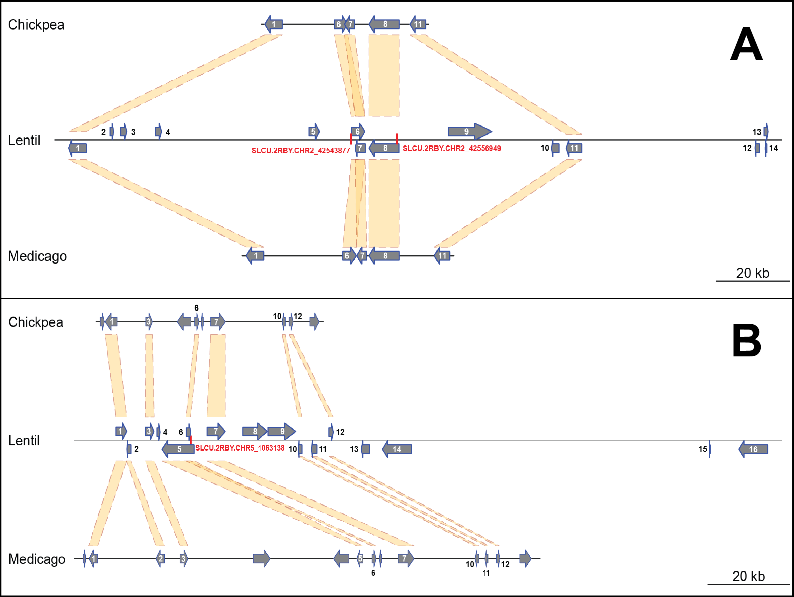

Focusing the GWAS Lens on days to flower using latent variable
phenotypes derived from global multi-environment trials
================
Derek Michael Wright <derek.wright@usask.ca>
07-02-2022

------------------------------------------------------------------------

Derek Wright, Sandesh Neupane, … and Kirstin E. Bett. (2021) **Utilizing
multi-environment trials to improve genome-wide association studies and
our understanding of crop adaptation: a case study with lentil (*Lens
culinaris* Medik.)**.

------------------------------------------------------------------------

[View as
pdf](https://github.com/derekmichaelwright/AGILE_LDP_GWAS_Phenology/raw/master/README.pdf)

[Source Code Vignette
(GWAS_Phenology_Vignette.html)](https://derekmichaelwright.github.io/AGILE_LDP_GWAS_Phenology/GWAS_Phenology_Vignette.html)

# Contents

-   [Figures](#figures)
-   [Supplemental Figures](#supplemental-figures)
-   [Supplemental Tables](#supplemental-tables)
-   [Additional Figures](#additional-figures)

# AGILE Project

## Collaborators

-   Department of Plant Sciences and Crop Development Centre, University
    of Saskatchewan, Saskatoon, Saskatchewan, Canada
-   UTAZ

## Sponsors

-   Saskatchewan Pulse Growers Association
-   Western Grains Research Foundation
-   GenomePrairie
-   GenomeCanada
-   Saskatchewan Ministry of Agriculture

------------------------------------------------------------------------

# Figures

## Figure 1

[Additional/Figure_01_plotly.html](https://derekmichaelwright.github.io/AGILE_LDP_GWAS_Phenology/Additional/Figure_01_plotly.html)

------------------------------------------------------------------------

## Figure 2

------------------------------------------------------------------------

## Figure 3

------------------------------------------------------------------------

## Figure 4

------------------------------------------------------------------------

## Figure 5

[Additional/Figure_05_a\_plotly.html](https://derekmichaelwright.github.io/AGILE_LDP_GWAS_Phenology/Additional/Figure_05_a_plotly.html)

[Additional/Figure_05_b\_plotly.html](https://derekmichaelwright.github.io/AGILE_LDP_GWAS_Phenology/Additional/Figure_05_b_plotly.html)

[Additional/Figure_05_c\_plotly.html](https://derekmichaelwright.github.io/AGILE_LDP_GWAS_Phenology/Additional/Figure_05_c_plotly.html)

------------------------------------------------------------------------

# Supplemental Tables

## Supplemental Table 1

[Supplemental_Table_01.csv](https://github.com/derekmichaelwright/AGILE_LDP_GWAS_Phenology/blob/master/Supplemental_Table_01.csv)

------------------------------------------------------------------------

## Supplemental Table 2

[Supplemental_Table_02.xlsx](https://github.com/derekmichaelwright/AGILE_LDP_GWAS_Phenology/blob/master/Supplemental_Table_02.xlsx)

------------------------------------------------------------------------

# Supplemental Figures

## Supplemental Figure 1

[Additional/Supplemental_Figure_01_plotly.html](https://derekmichaelwright.github.io/AGILE_LDP_GWAS_Phenology/Additional/Supplemental_Figure_01_plotly.html)

------------------------------------------------------------------------

## Supplemental Figure 2

------------------------------------------------------------------------

## Supplemental Figure 3

------------------------------------------------------------------------

## Supplemental Figure 4

------------------------------------------------------------------------

## Supplemental Figure 5

------------------------------------------------------------------------

# Additional Figures

## Phenotype Data

------------------------------------------------------------------------

## Grouped Manhattan Plots

### DTF Temperate

------------------------------------------------------------------------

### DTF South Asia

------------------------------------------------------------------------

### DTF Mediterranean

------------------------------------------------------------------------

### *Tf* and *Tc*

------------------------------------------------------------------------

### *Pf* and *Pc*

------------------------------------------------------------------------

### PCA + abc Coefficients

------------------------------------------------------------------------

## Facetted & Multi-Modeled Manhattan Plots

------------------------------------------------------------------------

© Derek Michael Wright
